# pikachu
## CSRF
### CSRF(get)
点击一下旁边的那个点击一下提示
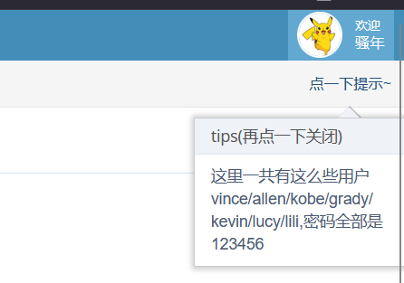
然后就看到了一下账号密码
在修改信息那里将性别修改为girl，打开bp抓包然后点击submit
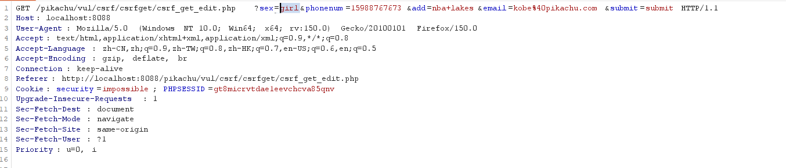

`
?sex=girl&phonenum=15988767673&add=nba+lakes&email=kobe%40pikachu.com&submit=submit
`
对这一行参数改动就可以修改kobe的信息，比如我把手机号修改为12333
```payload
?sex=girl&phonenum=12333&add=nba+lakes&email=kobe%40pikachu.com&submit=submit
```
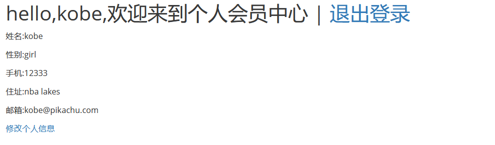

### CSRF(post)
还是登入上kobe的账号抓包
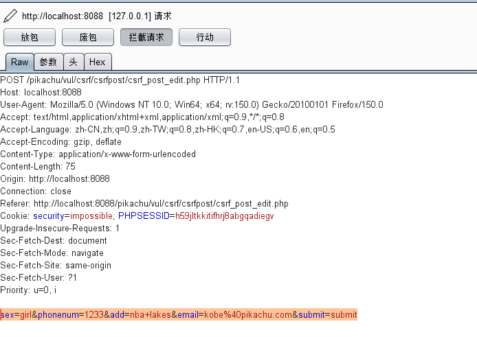
这里是post传参
用bp生成poc
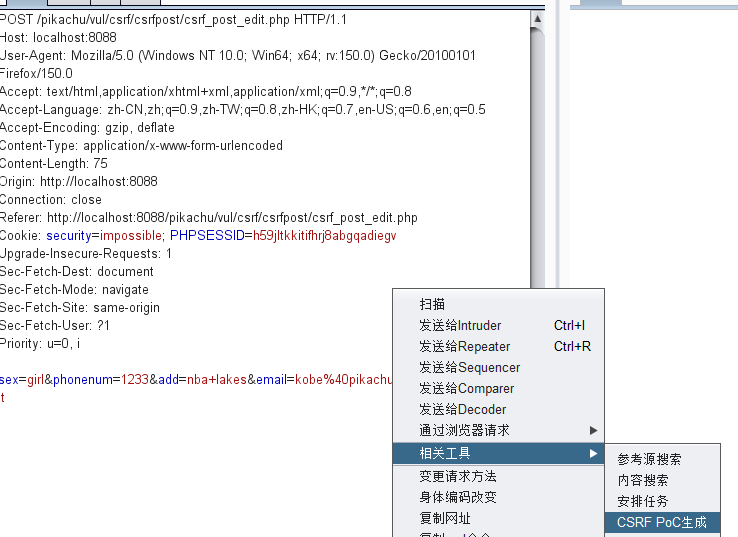
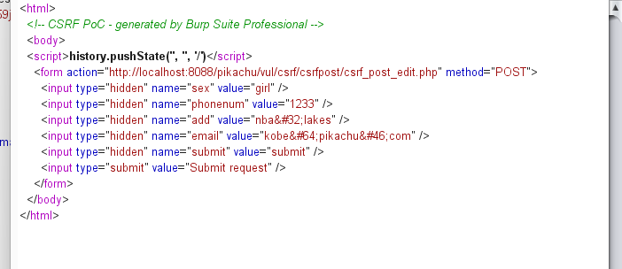
稍加修改一下
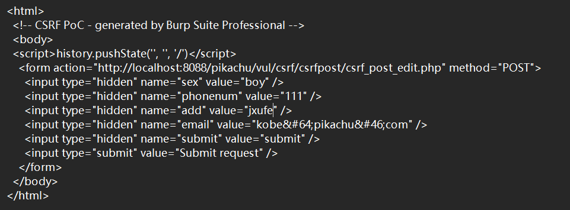
然后在登入了kobe的情况下访问，结果没用
打开看了一下源码
```php
if(isset($_POST['submit'])){          // ① 外层：检查 POST
    if($_GET['sex']!=null && ...){    // ② 内层：检查 GET  ← BUG！应该是 $_POST
        $getdata=escape($link, $_POST); // ③ 实际用 POST 数据更新
```
这里源码显示的还是要用get方法带上参数，在post中修改
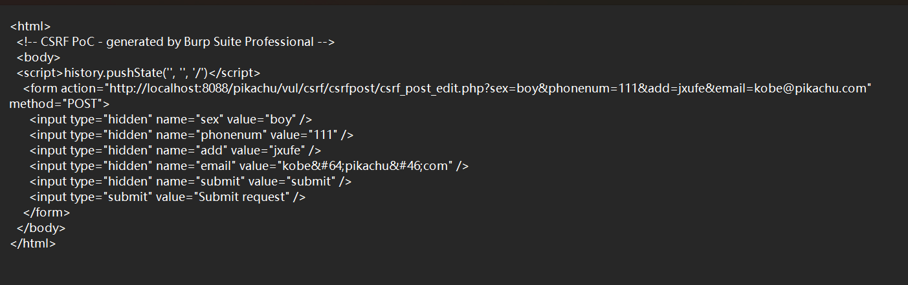
然后访问
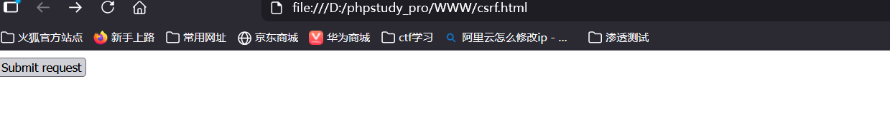
再点击之后信息就被修改了
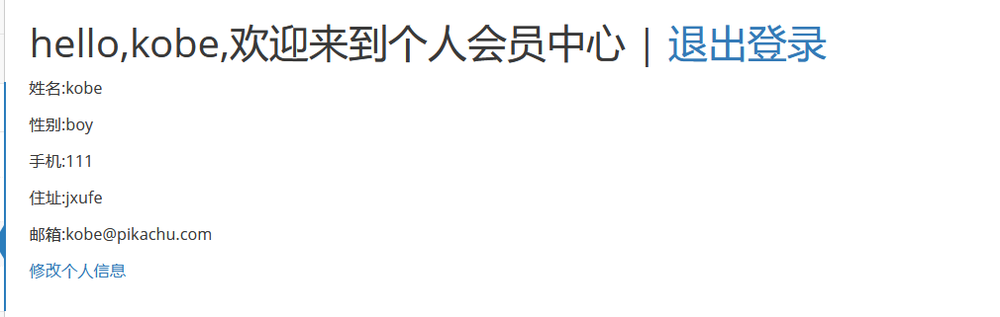

### CSRF(token)
打开kobe的账号抓包，在csrf token tracker里可以看到token
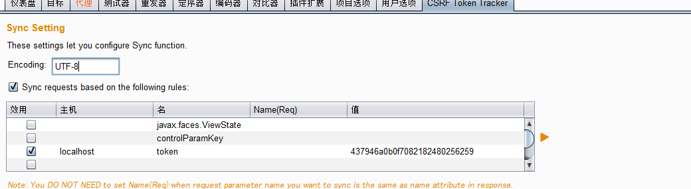
然后在重发器里修改信息，比如修改性别为girl
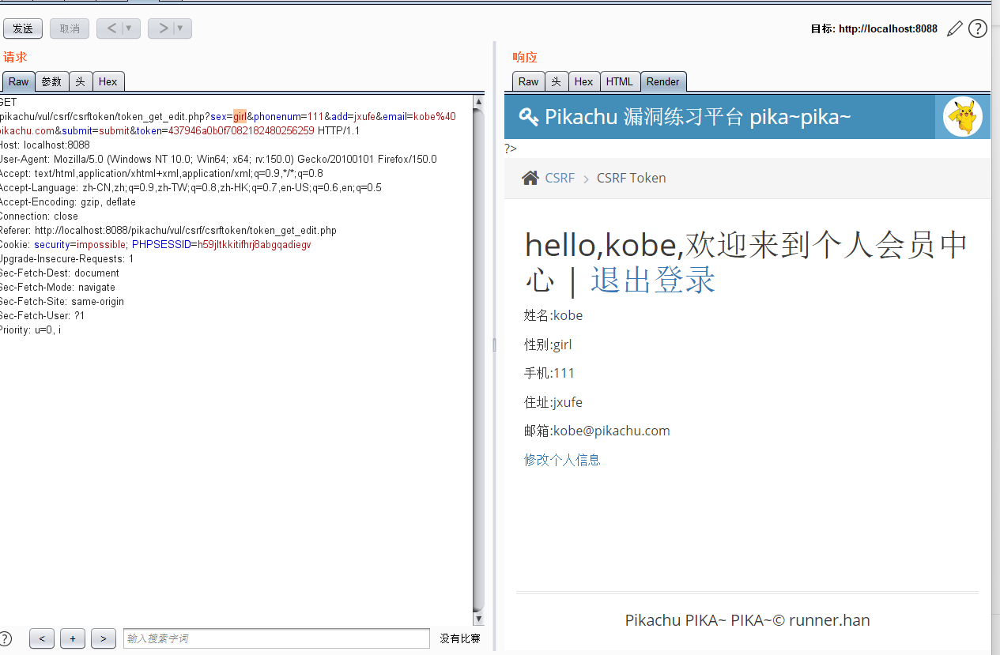