# 动态调试

## 1.当出现未调用的函数

### [BJDCTF 2020]Easy
>题目url：https://www.nssctf.cn/problem/702

查壳，无壳，32位
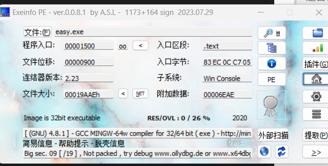
丢进ida
找到一个_ques函数未调用

这个时候基本是动态分析
方法一：在IDA中通过修改eip来使其跳转到ques函数
先记下ques的引用地址，此处为0x00401520
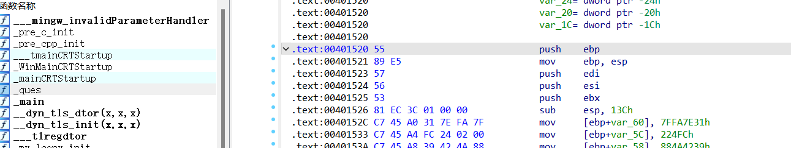
之后主主函数运行的途中随便下一个断点
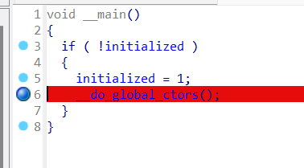
选择调试器后进行动调，然后将对应的EIP修改成ques函数的地址即可：

将此处的eip修改为0x00401520

修改完之后继续进程

得到flag


## 技巧二：获取进程内容数据
当发现题目中涉及到的程序内部值无法查看和获取时，可以通过动调获取内容数值。
### [HUBUCTF 2022 新生赛]help
> url:https://www.nssctf.cn/problem/2594

依旧先查壳，无壳,64位

放进ida
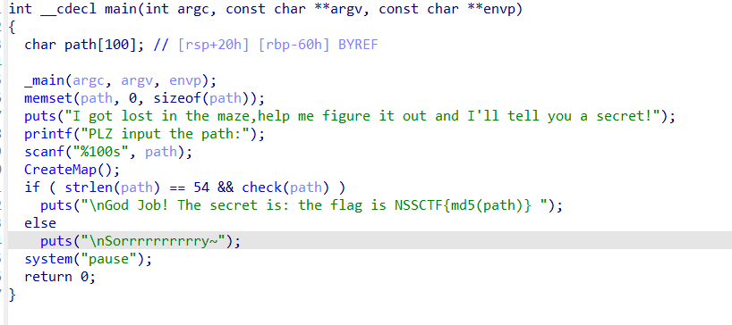
分析main函数
```c
  puts("I got lost in the maze,help me figure it out and I'll tell you a secret!");
  ```
  这句话提示需要解决迷宫问题
  这段代码的核心逻辑是：让用户输入一个长度为 54 的路径字符串，验证该路径是否能走出CreateMap()创建的迷宫（通过check函数）。若验证通过，flag 为该路径的 MD5 哈希值（格式NSSCTF{哈希值}）。用户需要找到满足条件的path才能得到 flag。
  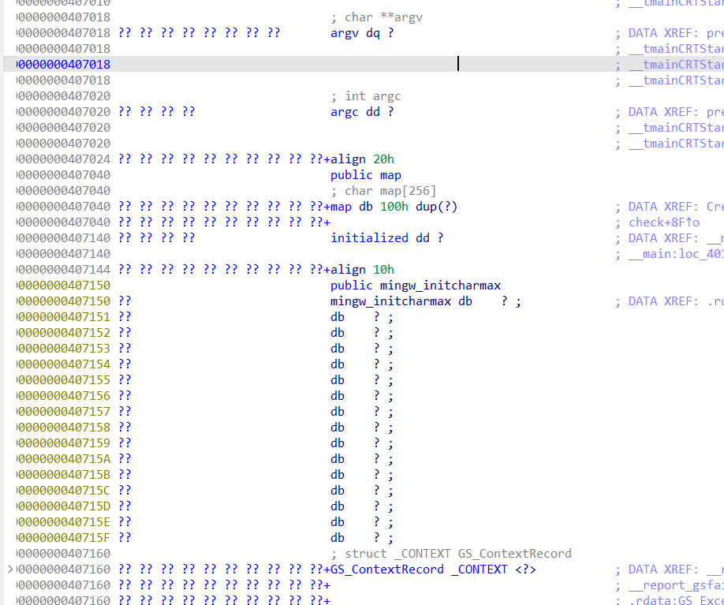
  正常找map找不到，基本就是动态分析
  给CreateMap函数下一个断点
  
  运行之后先随便输
  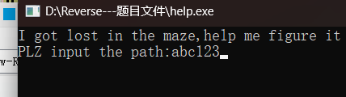
然后按Tab回到伪代码
F7单步调试，进入CreateMap函数

再一直按F7单步调试，直到地图全部出现，自动跳到最开始的main函数页面，点OK

双击进入CreateMap函数，再双击map，再双击map

1, 1, 1, 1, 1, 1, 1, 1, 1, 1, 1, 1, 1, 1, 1, 1, 1, 0, 0, 0, 0, 0, 1, 1, 1, 1, 1, 1, 0, 1, 1, 1, 1,0, 1, 1, 1, 0, 1, 1, 1, 1, 1, 1, 0, 1, 1, 1, 1, 0, 1, 1, 1, 0, 1, 1, 0, 0, 0, 1, 0, 1, 1, 1, 1, 0,1, 1, 1, 0, 1, 1, 0, 1, 0, 1, 0, 1, 1, 1, 1, 0, 1, 1, 1, 0, 0, 0, 0, 1, 0, 1, 0, 1, 1, 1, 1, 0, 1,1, 1, 1, 1, 1, 0, 1, 0, 1, 0, 1, 1, 1, 1, 0, 1, 1, 1, 1, 1, 1, 0, 0, 0, 1, 0, 1, 1, 1, 1, 0, 1, 1,1, 1, 1, 1, 1, 0, 1, 1, 0, 1, 1, 1, 1, 0, 1, 1, 1, 1, 1, 1, 1, 0, 1, 1, 0, 1, 1, 1, 1, 0, 0, 0, 0,1, 1, 0, 0, 0, 0, 1, 0, 0, 0, 1, 1, 1, 1, 1, 0, 1, 1, 1, 1, 0, 1, 1, 0, 1, 0, 1, 1, 1, 1, 1, 0, 1,1, 1, 1, 0, 1, 1, 0, 1, 0, 1, 1, 0, 0, 0, 0, 1, 1, 1, 1, 0, 1, 1, 0, 1, 0, 0, 1, 0, 1, 1, 1, 1, 1,1, 1, 0, 0, 0, 0, 1, 1, 1, 1, 0, 1, 1, 1, 1, 1, 1, 1, 1, 1, 1, 1, 1, 1, 1


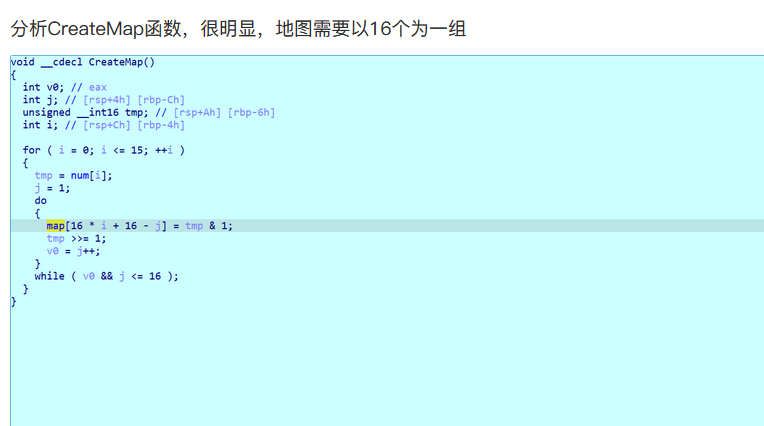
修改为16个一组
1, 1, 1, 1, 1, 1, 1, 1, 1, 1, 1, 1, 1, 1, 1, 1,
1, 0, 0, 0, 0, 0, 1, 1, 1, 1, 1, 1, 0, 1, 1, 1,
1, 0, 1, 1, 1, 0, 1, 1, 1, 1, 1, 1, 0, 1, 1, 1,
1, 0, 1, 1, 1, 0, 1, 1, 0, 0, 0, 1, 0, 1, 1, 1,
1, 0, 1, 1, 1, 0, 1, 1, 0, 1, 0, 1, 0, 1, 1, 1, 
1, 0, 1, 1, 1, 0, 0, 0, 0, 1, 0, 1, 0, 1, 1, 1, 
1, 0, 1, 1, 1, 1, 1, 1, 0, 1, 0, 1, 0, 1, 1, 1,
1, 0, 1, 1, 1, 1, 1, 1, 0, 0, 0, 1, 0, 1, 1, 1, 
1, 0, 1, 1, 1, 1, 1, 1, 1, 0, 1, 1, 0, 1, 1, 1, 
1, 0, 1, 1, 1, 1, 1, 1, 1, 0, 1, 1, 0, 1, 1, 1, 
1, 0, 0, 0, 0, 1, 1, 0, 0, 0, 0, 1, 0, 0, 0, 1, 
1, 1, 1, 1, 0, 1, 1, 1, 1, 0, 1, 1, 0, 1, 0, 1, 
1, 1, 1, 1, 0, 1, 1, 1, 1, 0, 1, 1, 0, 1, 0, 1, 
1, 0, 0, 0, 0, 1, 1, 1, 1, 0, 1, 1, 0, 1, 0, 0, 
1, 0, 1, 1, 1, 1, 1, 1, 1, 0, 0, 0, 0, 1, 1, 1, 
1, 0, 1, 1, 1, 1, 1, 1, 1, 1, 1, 1, 1, 1, 1, 1

根据check函数找到，路径

path：wwdddwwwaaawwwwwwwwwddddssssdddssdsssssssdddwwwwddsssd
md5加密
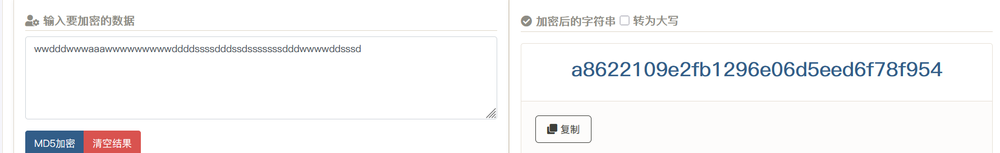

## 技巧三：匹配绕过
当发现有if判断比对时，可通过动调加载获取匹配值
### [HNCTF 2022 Week1]CrackMe
>url:https://www.nssctf.cn/problem/2908

题目的提示是：得到CreakMe的注册码，动态下断点

32位，无壳

在 ExitProcess(0); 处下断点的核心目的是捕获程序 “正常结束” 的关键节点，便于分析程序退出前的状态，尤其是在逆向工程或调试验证逻辑时非常有用。具体原因包括：

    确认程序是否进入 “成功路径”

从代码逻辑看，ExitProcess(0); 仅在 “序列号验证成功” 后被调用（if (lstrcmpA(String1, String2) == 0) 时）。在这里下断点，可直观判断程序是否通过了验证（若断点触发，说明验证成功）。
获取关键数据（如正确的序列号）
程序在退出前，内存中可能还保留着关键数据（例如代码中生成的正确序列号 String2）。在 ExitProcess 处中断后，可通过调试器查看内存或寄存器，直接获取这些数据（比如逆向时想得到 “正确的序列号”，这是常用技巧）。
分析退出前的资源状态
若程序在退出前有未完成的操作（如写入文件、释放资源等），断点可暂停进程，检查此时的资源状态（如句柄、内存分配情况），排查潜在的异常或逻辑问题。

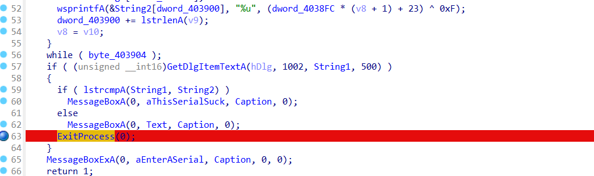

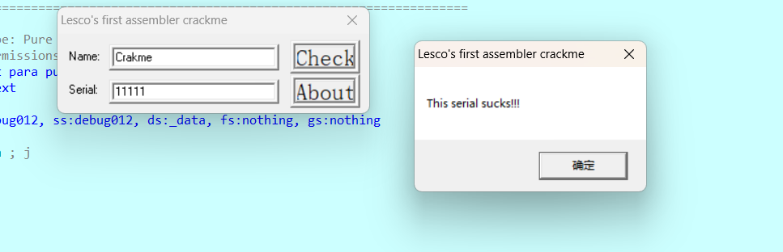
输入之后，回到伪代码，双击string2，按r变为字符，提取出来就是flag

注意将大写字母改为小写

### [Week1] 8086ASM

下载插件得到一个8086.asm文件，放在kali里先转化为8086.o
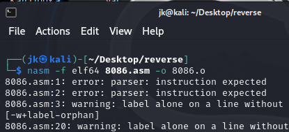


## [BJDCTF 2020]JustRE
>url: https://www.nssctf.cn/problem/703

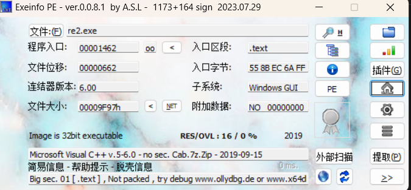
无壳，32位

查找字符串发现一个类似flag的字符串
找到对应伪代码

意思是点击19999下将字符串里的两个%d用19999，和0代替
所以得到flag

## [LitCTF 2023]enbase64
>url:https://www.nssctf.cn/problem/3846


无壳32位
main函数里找到提示
```c
int __cdecl main(int argc, const char **argv, const char **envp)
{
  char v4[61]; // [esp+1Fh] [ebp-81Dh] BYREF
  char v5[4]; // [esp+5Ch] [ebp-7E0h] BYREF
  char v6[4]; // [esp+60h] [ebp-7DCh] BYREF
  char v7[996]; // [esp+64h] [ebp-7D8h] BYREF
  char Str[4]; // [esp+448h] [ebp-3F4h] BYREF
  char v9[996]; // [esp+44Ch] [ebp-3F0h] BYREF

  __main();
  *(_DWORD *)Str = 0;
  memset(v9, 0, sizeof(v9));
  *(_DWORD *)v6 = 0;
  memset(v7, 0, sizeof(v7));
  *(_DWORD *)v4 = *(_DWORD *)"ABCDEFGHIJKLMNOPQRSTUVWXYZabcdefghijklmnopqrstuvwxyz0123456789+/";
  strcpy(v5, "9+/");
  qmemcpy(&v4[1], &aAbcdefghijklmn[-(v4 - &v4[1])], 4 * (((v4 - &v4[1] + 65) & 0xFFFFFFFC) >> 2));
  puts("Please input flag:");
  gets(Str);
  if ( strlen(Str) == 33 )
  {
    base64(v4, Str, v6);
    basecheck(v6);
  }
  return 0;
}
```

1. __*(_DWORD *)Str__ 
    就是 “把 Str 开头的 4 个字节当作一个 32 位整数 来访问”。这种写法在反编译代码中很常见，目的是高效操作连续的多字节内存。
    在上述代码中的运用
    *(_DWORD *)Str = 0;：将Str的前 4 字节清零（初始化输入缓冲区）。
    *(_DWORD *)v4 = *(_DWORD *)"ABCDEFGHIJKLMNOPQRSTUVWXYZabcdefghijklmnopqrstuvwxyz0123456789+/"：
    将标准 Base64 编码表的前 4 个字符（"ABCD"）存入v4的前 4 字节。
2. __memset 函数:__
    原型：
    void *memset(void *ptr, int value, size_t num);
    功能是：
    将 ptr 指向的内存区域的前 num 个字节，全部设置为 value（取低 8 位，即一个字节的值）。
    在代码中的作用：
    这行代码会将 v9 数组的 全部 996 个字节 都设置为 0，相当于对数组进行 “清零初始化”。
3.  strcpy(v5, "9+/");：将字符串 "9+/" 复制到v5（可能是对编码的  补充或修改）。

4. __void qmemcpy(void *dest, const void *src, size_t n);__
    即从 src 指向的内存复制 n 个字节到 dest 指向的内存。
    在代码中的作用：
    qmemcpy(&v4[1], &aAbcdefghijklmn[-(v4 - &v4[1])], 4 * (((v4 - &v4[1] + 65) & 0xFFFFFFFC) >> 2));
    分析这三个参数：
    1. 目标地址：&v4[1]
    2. 源地址：&aAbcdefghijklmn[-(v4 - &v4[1])]
        先算 v4 - &v4[1]：v4 是数组首地址（&v4[0]），&v4[1] 是首地址 + 1（因为 v4 是 char 类型，每个元素占 1 字节）。
        因此 v4 - &v4[1] = &v4[0] - (&v4[0] + 1) = -1。
        再算 - (v4 - &v4[1])：
        即 -(-1) = 1。
        最终源地址：&aAbcdefghijklmn[1]
    3. 复制长度：4 * (((v4 - &v4[1] + 65) & 0xFFFFFFFC) >> 2)
        代入 v4 - &v4[1] = -1，先算括号内：-1 + 65 = 64
        64 & 0xFFFFFFFC：0xFFFFFFFC 是一个掩码（二进制最后两位为 0），作用是 “取 4 的整数倍”（因为 Base64 编码表长度是 64，正好是 4 的倍数）。64 & 0xFFFFFFFC 的结果还是 64。
        \>> 2转化为2进制再右移两位，相当于除以4，所以复制长度是4*16=64
5. __base64(v4, Str, v6);：__
    调用自定义的base64函数，使用v4作为编码表，对输入的Str（flag）进行 Base64 编码，结果存入v6
 这里变化前后v4没变化，明显不可能，所以在题目中要找到其他变化base表的代码
6. basecheck(v6);：调用basecheck函数验证编码后的结果v6是否符合预期（推测此函数会检查编码结果是否为预设的正确值，若正确则可能输出 "正确" 等信息）。

整体代码理解：这段代码是通过*(_DWORD *)Str和qmemcpy(&v4[1], &aAbcdefghijklmn[-(v4 - &v4[1])], 4 * (((v4 - &v4[1] + 65) & 0xFFFFFFFC) >> 2));得到一段新的base64码，用它和输入的flag进行base编码，将得到编码放入basecheck函数验证，点进该函数可以得到v6
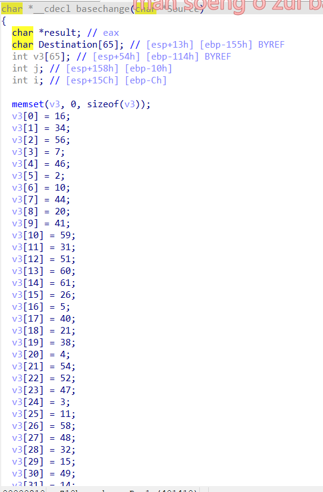
修改一下在运alt text行得到新的编码
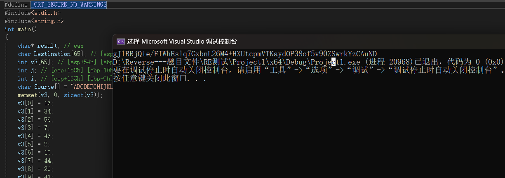
找到一个basechange函数是他变换了base编码

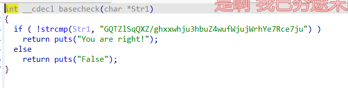

然后用base64换表脚本运行一下

得到falg

## [NISACTF 2022]string
>https://www.nssctf.cn/problem/2042
> 知识点：动态调试


```c
char *__fastcall flag(char *a1)
{
  char *v1; // rax
  char *v2; // rax
  char *v3; // rax
  int v4; // eax
  char *v6; // [rsp+8h] [rbp-38h]
  int i; // [rsp+1Ch] [rbp-24h]
  int j; // [rsp+20h] [rbp-20h]
  int k; // [rsp+20h] [rbp-20h]
  int v10; // [rsp+24h] [rbp-1Ch]
  int m; // [rsp+28h] [rbp-18h]
  int v12; // [rsp+2Ch] [rbp-14h]
  int v13; // [rsp+34h] [rbp-Ch]

  v6 = a1;
  v12 = (_DWORD)a1 + 1;
  if ( (_DWORD)a1 << 30 )
  {
    while ( 1 )
    {
      v1 = v6++;
      if ( !*v1 )
        break;
      if ( !((_DWORD)v6 << 30) )
        goto LABEL_4;
    }
  }
  else
  {
LABEL_4:
    for ( i = (int)v6; ((i - 16843009) & ~i & 0x80808080) == 0; i = v13 )
    {
      v13 = v6[1];
      v6 += 4;
    }
    v2 = v6++;
    for ( j = *v2; j; j = *v3 )
      v3 = v6++;
  }
  puts("This a magic!");
  v10 = (_DWORD)v6 - v12;
  for ( k = 0; (int)v6 - v12 > k; ++k )
    v10 ^= 0x1Au;
  if ( v10 != 13 )
  {
    puts("error!");
    exit(0);
  }
  puts("The length of flag is 13");
  srand(seed);
  printf("NSSCTF{");
  for ( m = 0; m < 13; ++m )
  {
    v4 = rand();
    printf("%d", (unsigned int)(v4 % 8 + 1));
  }
  putchar(125);
  return &v6[-v12];
}
```
这段代码中v4是flag里面的内容
可这里需要先知道flag的内容是不会变的
所以为了使内容不变，seed应该不变，所以要先找到seed
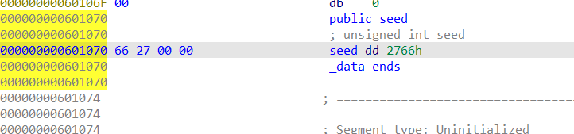
将seed改为10进制数

然后可以写代码了
```c
#include<stdio.h>
#include<stdlib.h>
int main() {
	printf("NSSCTF{");
	srand(10084);
	
	for (int i = 0; i < 13; i++) {
		int v4 = rand();
		printf("%d", (v4%8+1));

	}
	printf("}");
	return 0;
}
```

但是提交失败，看wp说要在linux下运行
得到flag
NSSCTF{5353316611126}

## [CISCN 2022 东北]easycpp
>url: https://www.nssctf.cn/problem/2402
>知识点：动态调试
无壳，64位
 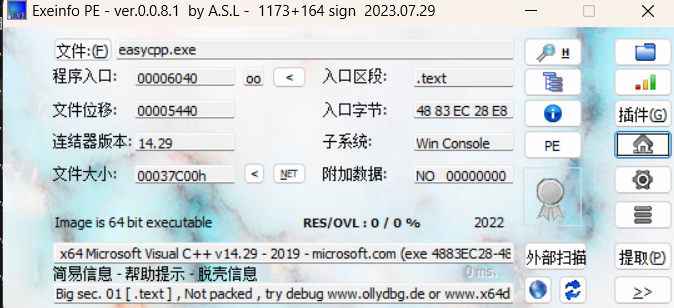

## [HNCTF 2022 Week1]贝斯是什么乐器啊？
>url:https://www.nssctf.cn/problem/2903
64位

```c
int __cdecl main(int argc, const char **argv, const char **envp)
{
  char Str2[160]; // [rsp+20h] [rbp-60h] BYREF
  char Str[124]; // [rsp+C0h] [rbp+40h] BYREF
  int i; // [rsp+13Ch] [rbp+BCh]

  _main(argc, argv, envp);
  puts("please input your flag:");
  scanf("%s", Str);
  for ( i = 0; i < strlen(Str); ++i )
    Str[i] -= i;
  base64_encode(Str2, Str);
  if ( !strcmp(enc, Str2) )
    printf("yes!");
  else
    printf("error");
  return 0;
}
```
根据代码提示，只要找到enc再进行加i就可以得到flag

找到enc之后进行base64解码，然后加i；


得到flag


## [HNCTF 2022 Week1]X0r
>url:https://www.nssctf.cn/problem/2904

64位
```c
int __cdecl main(int argc, const char **argv, const char **envp)
{
  char Str[44]; // [rsp+20h] [rbp-30h] BYREF
  int i; // [rsp+4Ch] [rbp-4h]

  _main(argc, argv, envp);
  puts("please input your flag!");
  scanf("%s", Str);
  if ( strlen(Str) != 22 )
  {
    printf("strlen error!");
    exit(0);
  }
  for ( i = 0; i <= 21; ++i )
  {
    if ( arr[i] != (Str[i] ^ '4') + 900 )
    {
      printf("flag error!");
      exit(0);
    }
  }
  printf("you are right!");
  return 0;
}
```
根据代码，只需将arr[]中的内容进行异或处理在减900就可以得到flag
跟进arr[]

```
unsigned char arr[] =
{
  0xFE, 0x03, 0x00, 0x00, 0xEB, 0x03, 0x00, 0x00, 0xEB, 0x03, 
  0x00, 0x00, 0xFB, 0x03, 0x00, 0x00, 0xE4, 0x03, 0x00, 0x00, 
  0xF6, 0x03, 0x00, 0x00, 0xD3, 0x03, 0x00, 0x00, 0xD0, 0x03, 
  0x00, 0x00, 0x88, 0x03, 0x00, 0x00, 0xCA, 0x03, 0x00, 0x00, 
  0xEF, 0x03, 0x00, 0x00, 0x89, 0x03, 0x00, 0x00, 0xCB, 0x03, 
  0x00, 0x00, 0xEF, 0x03, 0x00, 0x00, 0xCB, 0x03, 0x00, 0x00, 
  0x88, 0x03, 0x00, 0x00, 0xEF, 0x03, 0x00, 0x00, 0xD5, 0x03, 
  0x00, 0x00, 0xD9, 0x03, 0x00, 0x00, 0xCB, 0x03, 0x00, 0x00, 
  0xD1, 0x03, 0x00, 0x00, 0xCD, 0x03, 0x00, 0x00, 0x00, 0x00, 
  0x00, 0x00, 0x00, 0x00, 0x00, 0x00, 0x00, 0x00, 0x00, 0x00, 
  0x00, 0x00, 0x00, 0x00, 0x00, 0x00, 0x00, 0x00, 0x00, 0x00, 
  0x00, 0x00, 0x00, 0x00, 0x00, 0x00, 0x00, 0x00, 0x00, 0x00, 
  0x00, 0x00, 0x00, 0x00, 0x00, 0x00, 0x00, 0x00
};
```
如果直接这样提取，会把3删掉，所以要找到arr的地址
得到arr[]
```
0x3FE,0x3EB, 0x3FB, 0x3E4, 0x3F6, 0x3D3, 0x3D0, 0x388,
0x3CA, 0x3EF, 0x389, 0x3CB, 0x3EF, 0x3CB, 0x388, 0x3EF, 
0x3D5,0x3D9, 0x3CB, 0x3D1, 0x3CD
```
然后进行异或操作
```c
#include<stdio.h>
#include<string.h>
int main() {
	int arr[22] = { 0x3FE,0x3EB, 0x3FB, 0x3E4, 0x3F6, 0x3D3, 0x3D0, 0x388,0x3CA, 0x3EF, 0x389, 0x3CB, 0x3EF, 0x3CB, 0x388, 0x3EF, 0x3D5,0x3D9, 0x3CB, 0x3D1, 0x3CD };
	
	char flag[22];
	for (int i = 0; i < 22; i++) {
		flag[i] = (char)((arr[i] - 900) ^ 0x34);
		printf("%c", flag[i]);
	}

	return 0;
}
```
注意这里是先进行-900再进行异或


## [SWPUCTF 2022 新生赛]xor
>url:https://www.nssctf.cn/problem/2652


64位，无壳
在ida找到伪代码
```c
int __cdecl main(int argc, const char **argv, const char **envp)
{
  _BYTE v4[38]; // [rsp+20h] [rbp-60h] BYREF
  char v5; // [rsp+46h] [rbp-3Ah]
  char v6[44]; // [rsp+50h] [rbp-30h] BYREF
  int i; // [rsp+7Ch] [rbp-4h]

  _main(argc, argv, envp);
  printf_0("----------Welcome to NSSCTF Reverse----------");
  printf_0("\n");
  printf_0("This is the thrid program of the reverse challenge");
  printf_0("\n");
  printf_0("oh, you can't see the flag, but you can see the flag");
  printf_0("\n");
  printf_0("This time, the flag is encrypted by xor");
  printf_0("\n");
  printf_0("And you need to input flag");
  printf_0("\n");
  printf_0("the flag will be encrypted by xor and compare with the encrypted flag");
  printf_0("\n");
  printf_0("so how to get the flag?");
  printf_0("\n");
  printf_0("maybe you need to know ascii and xor");
  printf_0("\n");
  printf_0("Good Luck");
  printf_0("\n");
  printf_0("---------------------------------------------");
  printf_0("\ninput the flag:");
  scanf_s("%s", v6);
  printf_0("\n");
  qmemcpy(v4, "LQQAVDyZMP]3q]emmf]uc{]vm]glap{rv]dnce", sizeof(v4));
  v5 = 127;
  for ( i = 0; i <= 38; ++i )
  {
    if ( ((unsigned __int8)v6[i] ^ 2) != v4[i] )
    {
      printf_0("\nwrong flag");
      return 0;
    }
  }
  printf_0("\nflag is right");
  return 0;
}
```
这里只需要将v4与2进行异或运算一下就好了
```c
#include <stdio.h>
#include <string.h>

int main(void)
{
    /* 与你给出的反编译代码中 qmemcpy 得到的密文一致 */
    const unsigned char encrypted[] = "LQQAVDyZMP]3q]emmf]uc{]vm]glap{rv]dnce";
    size_t n = strlen((const char*)encrypted);

    /* 输出缓冲，记得 +1 放置终止符 */
    char flag[256];
    if (n + 1 > sizeof(flag)) {
        fprintf(stderr, "input too long\n");
        return 1;
    }

    for (size_t i = 0; i < n; ++i) {
        /* 还原：原字符 = encrypted[i] ^ 2 */
        flag[i] = (char)(encrypted[i] ^ 2u);
    }
    flag[n] = '\0';

    printf("Recovered flag: %s\n", flag);
    return 0;
}

```


## [MoeCTF 2022]chicken_soup
>url:https://www.nssctf.cn/problem/3323
>知识点：花指令


32位，无壳


找到标红的地方，根据jz和jnz，不管是不是0都跳到loc_40100D+1，只需要将这个花指令去除就可以正常f5

按D将这个地方变为数据

这个东西无作用，也就是我们要去除的地方
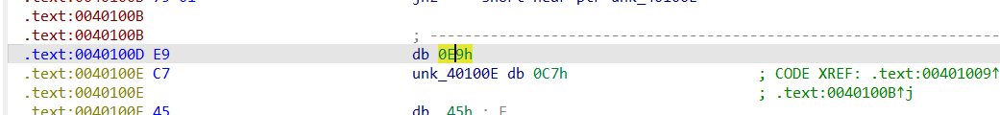

## [MoeCTF 2022]chicken_soup
>url:https://www.nssctf.cn/problem/3323

## [GDOUCTF 2023]Tea
>url:https://www.nssctf.cn/problem/3688
>知识点：动态调试


无壳，64位

找到一个假的flag
```c
int __fastcall main_0(int argc, const char **argv, const char **envp)
{
  char *v3; // rdi
  __int64 i; // rcx
  char v6; // [rsp+20h] [rbp+0h] BYREF
  int v7; // [rsp+24h] [rbp+4h]
  int v8; // [rsp+44h] [rbp+24h]
  int v9[12]; // [rsp+68h] [rbp+48h] BYREF
  _DWORD v10[16]; // [rsp+98h] [rbp+78h] BYREF
  int v11[31]; // [rsp+D8h] [rbp+B8h] BYREF
  int j; // [rsp+154h] [rbp+134h]
  int k; // [rsp+174h] [rbp+154h]
  int m; // [rsp+194h] [rbp+174h]

  v3 = &v6;
  for ( i = 102i64; i; --i )
  {
    *(_DWORD *)v3 = -858993460;
    v3 += 4;
  }
  j___CheckForDebuggerJustMyCode(&unk_140023009, argv, envp);
  v7 = 32;
  v8 = 0;
  v9[0] = 1234;
  v9[1] = 5678;
  v9[2] = 9012;
  v9[3] = 3456;
  memset(v10, 0, 0x28ui64);
  v11[15] = 0;
  v11[23] = 0;
  sub_1400113E8();
  for ( j = 0; j < 10; ++j )
    sub_1400111FE("%x", &v10[j]);
  sub_140011339(v9);
  sub_140011145(v10, v11);
  sub_1400112B7(v10, v9);
  v8 = sub_140011352(v10);
  if ( v8 )
  {
    sub_140011195("you are right\n");
    for ( k = 0; k < 10; ++k )
    {
      for ( m = 3; m >= 0; --m )
        sub_140011195("%c", (unsigned __int8)((unsigned int)v11[k] >> (8 * m)));
    }
  }
  else
  {
    sub_140011195("fault!\nYou can go online and learn the tea algorithm!");
  }
  return 0;
}
```
分析一下里面的每个函数
1. 首先是sub_1400113E8();
```c
__int64 __fastcall sub_140011B00(__int64 a1, __int64 a2, __int64 a3)
{
  j___CheckForDebuggerJustMyCode(&unk_140023009, a2, a3);
  sub_140011195("This is the input format for you geting of flag hex \n");
  sub_140011195("0x12345678 0x12345678 0x12345678 0x12345678 0x12345678 0x12345678 0x12345678\n");
  sub_140011195("The end of flag:\nHZCTF{This_is_the_fake_flag}\n");
  return sub_140011195("input your get the flag:\n");
```
这个函数就是打印了一段东西

3. sub_1400111FE("%x", &v10[j]);根据这句化就可以知道这是输入函数
4. sub_140011195("you are right\n");输出函数

5. sub_140011339(v9);
```c
__int64 __fastcall sub_1400117D0(_DWORD *a1, __int64 a2, __int64 a3)
{
  char *v3; // rdi
  __int64 i; // rcx
  __int64 result; // rax
  char v6; // [rsp+20h] [rbp+0h] BYREF
  int v7; // [rsp+2Ch] [rbp+Ch]
  int v8; // [rsp+30h] [rbp+10h]
  unsigned int v9; // [rsp+34h] [rbp+14h]

  v3 = &v6;
  for ( i = 14i64; i; --i )
  {
    *(_DWORD *)v3 = 3435973836;
    v3 += 4;
  }
  j___CheckForDebuggerJustMyCode(&unk_140023009, a2, a3);
  v7 = 4455;
  v8 = 6677;
  v9 = 8899;
  *a1 = 2233;
  a1[1] = v7;
  a1[2] = v8;
  result = v9;
  a1[3] = v9;
  return result;
}
```

传入的参数为v9，但是在函数内部通过指针被改变了值
原来的v9值为1234,5678,9012,3456
改变后的v9值为2233,4455,6677,8899

6. sub_140011145(v10, v11);
```c
__int64 __fastcall sub_140012030(__int64 a1, __int64 a2, __int64 a3)
{
  __int64 result; // rax
  int i; // [rsp+24h] [rbp+4h]

  result = j___CheckForDebuggerJustMyCode(&unk_140023009, a2, a3);
  for ( i = 0; i < 10; ++i )
  {
    *(_DWORD *)(a2 + 4i64 * i) = *(_DWORD *)(a1 + 4i64 * i);
    result = (unsigned int)(i + 1);
  }
  return result;
}
```

    核心功能：将 a1 指向的数组中前 10 个 4 字节元素（_DWORD 类型）复制到 a2 指向的数组中。
        a1 + 4i64 * i：计算源数组第 i 个元素的地址（每个元素 4 字节，所以偏移量为 4*i）。
        a2 + 4i64 * i：计算目标数组第 i 个元素的地址。
        赋值操作：将源数组第 i 个元素的值复制到目标数组第 i 个元素。
    循环计数：i 从 0 到 9（共 10 次循环），每次循环后 result 被更新为 i+1（即复制的元素个数），循环结束后 result 的值为 10。
7.  sub_1400112B7(v10, v9);
```c
__int64 __fastcall sub_140011900(__int64 a1, __int64 a2, __int64 a3)
{
  __int64 result; // rax
  int v4; // [rsp+44h] [rbp+24h]
  int i; // [rsp+64h] [rbp+44h]
  unsigned int v6; // [rsp+84h] [rbp+64h]
  unsigned int v7; // [rsp+C4h] [rbp+A4h]

  result = j___CheckForDebuggerJustMyCode((__int64)&unk_140023009, a2, a3);
  for ( i = 0; i <= 8; ++i )
  {
    v6 = 0;
    v7 = 256256256 * i;
    v4 = i + 1;
    do
    {
      ++v6;
      *(_DWORD *)(a1 + 4i64 * i) += v7 ^ (*(_DWORD *)(a1 + 4i64 * v4)
                                        + ((*(_DWORD *)(a1 + 4i64 * v4) >> 5) ^ (16 * *(_DWORD *)(a1 + 4i64 * v4)))) ^ (v7 + *(_DWORD *)(a2 + 4i64 * (v7 & 3)));
      *(_DWORD *)(a1 + 4i64 * v4) += (v7 + *(_DWORD *)(a2 + 4i64 * ((v7 >> 11) & 3))) ^ (*(_DWORD *)(a1 + 4i64 * i)
                                                                                       + ((*(_DWORD *)(a1 + 4i64 * i) >> 5) ^ (16 * *(_DWORD *)(a1 + 4i64 * i))));
      v7 += 256256256;
    }
    while ( v6 <= 0x20 );
    result = (unsigned int)(i + 1);
  }
  return result;
}
```
实际上这里的XTEA算法，就是对密文一共10组，每二组进行一次加密。加密轮次为33轮，常数为0xF462900.
8.   v8 = sub_140011352(v10);
```c
_BOOL8 __fastcall sub_140011B60(__int64 a1, __int64 a2, __int64 a3)
{
  char *v3; // rdi
  __int64 i; // rcx
  char v6; // [rsp+20h] [rbp+0h] BYREF
  BOOL v7; // [rsp+24h] [rbp+4h]
  int v8[15]; // [rsp+48h] [rbp+28h]
  int j; // [rsp+84h] [rbp+64h]

  v3 = &v6;
  for ( i = 34i64; i; --i )
  {
    *(_DWORD *)v3 = -858993460;
    v3 += 4;
  }
  j___CheckForDebuggerJustMyCode(&unk_140023009, a2, a3);
  v7 = 0;
  v8[0] = 444599258;
  v8[1] = -140107365;
  v8[2] = 1226314200;
  v8[3] = -234802392;
  v8[4] = 359413339;
  v8[5] = 1013885656;
  v8[6] = -2066432216;
  v8[7] = -249921817;
  v8[8] = 856928850;
  v8[9] = -576724359;
  for ( j = 0; j < 10; ++j )
    v7 = *(_DWORD *)(a1 + 4i64 * j) == v8[j];
  return v7;
}
```

循环10次，v8[j] == a1[j]
```
密文如下:

v8[0] = 0x1A800BDA;
v8[1] = 0xF7A6219B;
v8[2] = 0x491811D8;
v8[3] = 0xF2013328;
v8[4] = 0x156C365B;
v8[5] = 0x3C6EAAD8;
v8[6] = 0x84D4BF28;
v8[7] = 0xF11A7EE7;
v8[8] = 0x3313B252;
v8[9] = 0xDD9FE279;
```
然后可以写脚本
```c
#include <stdio.h>
#include <stdint.h>
#define delta 0xF462900

int main()
{
    uint32_t key[4] = {2233,4455,6677,8899};
    uint32_t Data[10] = { 0x1A800BDA ,0xF7A6219B ,0x491811D8,0xF2013328,0x156C365B, 0x3C6EAAD8,0x84D4BF28,0xF11A7EE7,0x3313B252,0xDD9FE279 };
    unsigned int j;
    int i;
    unsigned int sum;
    for (i = 8; i >= 0; i--)
    {
        j = 33;
        sum = delta * (i + j);
        while(j--)
        { 
            sum -= delta;
            Data[i + 1] -= (sum + key[(sum >> 11) & 3]) ^ ((Data[i] + ((Data[i] >> 5) ^ (Data[i] << 4))));
            Data[i] -= sum ^ (Data[i + 1] + ((Data[i + 1] >> 5) ^ (Data[i + 1] << 4))) ^ (sum + key[sum & 3]);
        }

    }

    for (int i = 0; i < 10; i++)
    {
        printf("%x", Data[i]);
    }


    return 0;
}
```

解16进制得到flag

## [NSSRound#3 Team]jump_by_jump_revenge
>url:https://www.nssctf.cn/problem/2316
>知识点：花指令


无壳，32位

找到标红的地方
按D回复数据

Ctrl+N nop掉
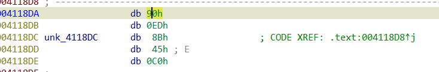
按c变回汇编

把所有红色text部分快捷键p变为函数，然后f5进入伪代码
```c
cint __cdecl main_0(int argc, const char **argv, const char **envp)
{
  int i; // [esp+D0h] [ebp-40h]
  char Str1[36]; // [esp+E8h] [ebp-28h] BYREF

  sub_411037("%s", (char)Str1);
  for ( i = 0; i < 29; ++i )
    Str1[i] = (Str1[i] + Str1[(i * i + 123) % 21]) % 96 + 32;
  if ( !j_strcmp(Str1, "~4G~M:=WV7iX,zlViGmu4?hJ0H-Q*") )
    puts("right!");
  else
    puts("nope!");
  return 0;
```
然后写脚本得到flag

## [AFCTF 2018]欢迎光临
>url: https://www.nssctf.cn/problem/1110


32位
在ida打开可以直接看到flag

## [羊城杯 2020]easyre
>url:https://www.nssctf.cn/problem/1416


64位

```c
int __fastcall main(int argc, const char **argv, const char **envp)
{
  int v3; // eax
  int v4; // eax
  int v5; // eax
  char Str[48]; // [rsp+20h] [rbp-60h] BYREF
  char Str1[64]; // [rsp+50h] [rbp-30h] BYREF
  char v9[64]; // [rsp+90h] [rbp+10h] BYREF
  char v10[64]; // [rsp+D0h] [rbp+50h] BYREF
  char Str2[60]; // [rsp+110h] [rbp+90h] BYREF
  int v12; // [rsp+14Ch] [rbp+CCh] BYREF

  _main(argc, argv, envp);
  strcpy(Str2, "EmBmP5Pmn7QcPU4gLYKv5QcMmB3PWHcP5YkPq3=cT6QckkPckoRG");
  puts("Hello, please input your flag and I will tell you whether it is right or not.");
  scanf("%38s", Str);
  if ( strlen(Str) != 38
    || (v3 = strlen(Str), (unsigned int)encode_one(Str, v3, v10, &v12))
    || (v4 = strlen(v10), (unsigned int)encode_two(v10, v4, v9, &v12))
    || (v5 = strlen(v9), (unsigned int)encode_three(v9, v5, Str1, &v12))
    || strcmp(Str1, Str2) )
  {
    printf("Something wrong. Keep going.");
    return 0;
  }
  else
  {
    puts("you are right!");
    return 0;
  }
}
```
进ida找到关键函数

把所有代码丢给ai可以得到flag
