# 动态调试

## 1.当出现未调用的函数

### [BJDCTF 2020]Easy
>题目url：https://www.nssctf.cn/problem/702

查壳，无壳，32位
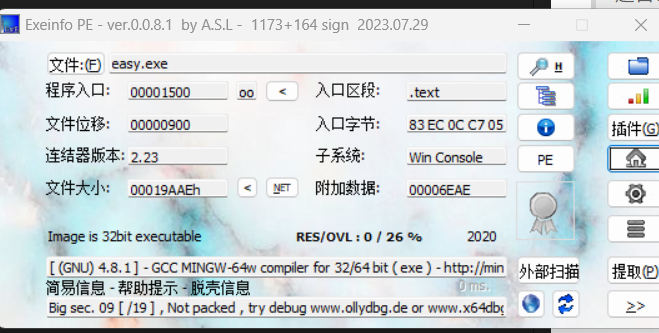
丢进ida
找到一个_ques函数未调用
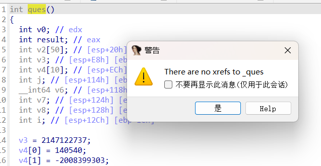
这个时候基本是动态分析
方法一：在IDA中通过修改eip来使其跳转到ques函数
先记下ques的引用地址，此处为0x00401520
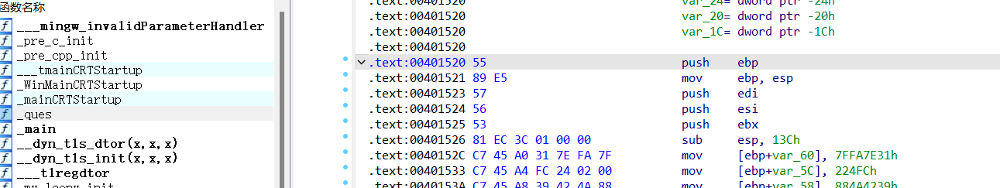
之后主主函数运行的途中随便下一个断点
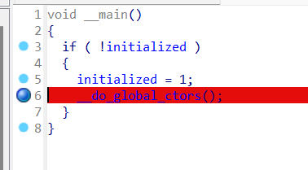
选择调试器后进行动调，然后将对应的EIP修改成ques函数的地址即可：
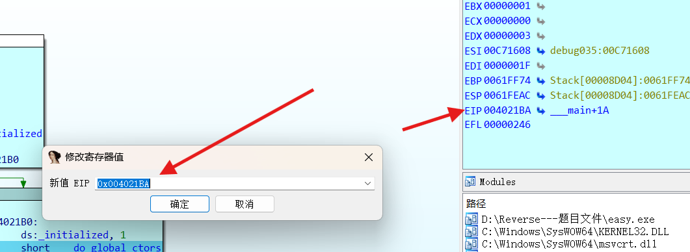
将此处的eip修改为0x00401520
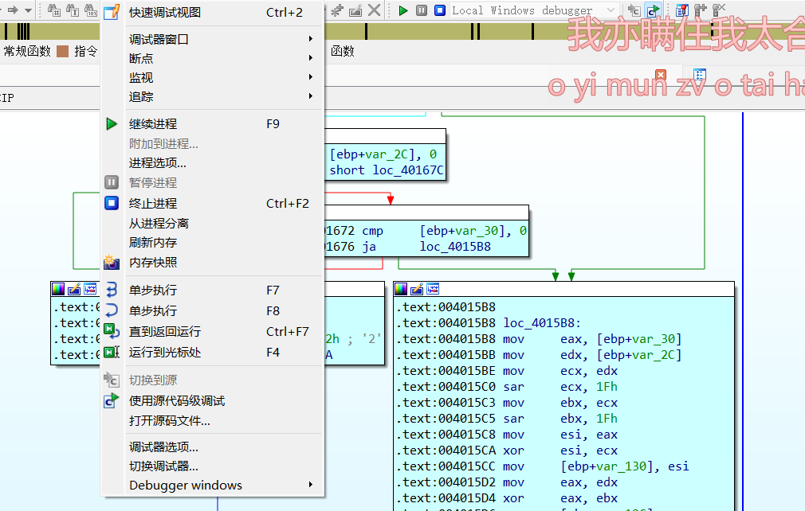
修改完之后继续进程

得到flag
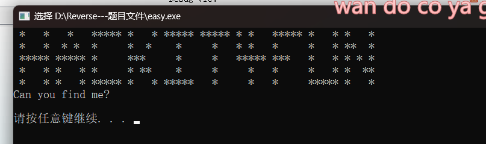

## 技巧二：获取进程内容数据
当发现题目中涉及到的程序内部值无法查看和获取时，可以通过动调获取内容数值。
### [HUBUCTF 2022 新生赛]help
> url:https://www.nssctf.cn/problem/2594

依旧先查壳，无壳,64位
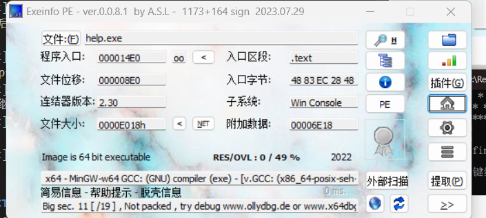
放进ida
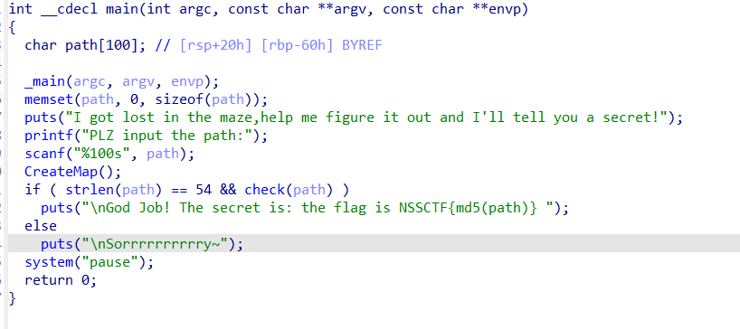
分析main函数
```c
  puts("I got lost in the maze,help me figure it out and I'll tell you a secret!");
  ```
  这句话提示需要解决迷宫问题
  这段代码的核心逻辑是：让用户输入一个长度为 54 的路径字符串，验证该路径是否能走出CreateMap()创建的迷宫（通过check函数）。若验证通过，flag 为该路径的 MD5 哈希值（格式NSSCTF{哈希值}）。用户需要找到满足条件的path才能得到 flag。
  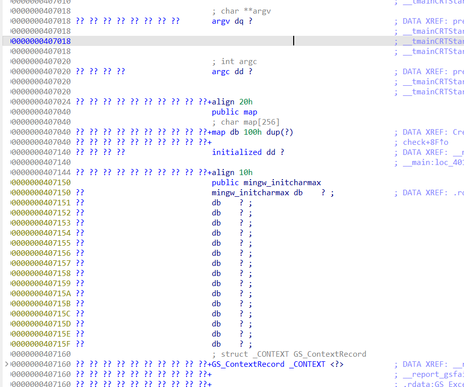
  正常找map找不到，基本就是动态分析
  给CreateMap函数下一个断点
  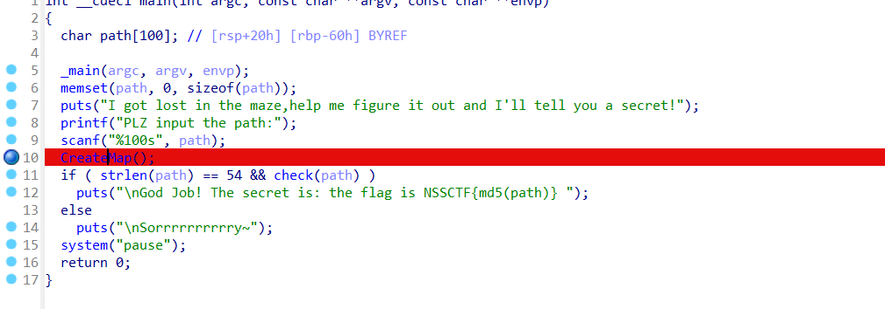
  运行之后先随便输
  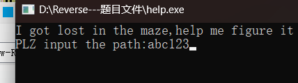
然后按Tab回到伪代码
F7单步调试，进入CreateMap函数
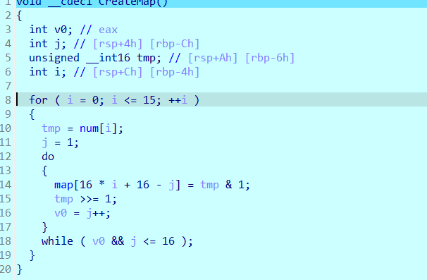
再一直按F7单步调试，直到地图全部出现，自动跳到最开始的main函数页面，点OK

双击进入CreateMap函数，再双击map，再双击map

1, 1, 1, 1, 1, 1, 1, 1, 1, 1, 1, 1, 1, 1, 1, 1, 1, 0, 0, 0, 0, 0, 1, 1, 1, 1, 1, 1, 0, 1, 1, 1, 1,0, 1, 1, 1, 0, 1, 1, 1, 1, 1, 1, 0, 1, 1, 1, 1, 0, 1, 1, 1, 0, 1, 1, 0, 0, 0, 1, 0, 1, 1, 1, 1, 0,1, 1, 1, 0, 1, 1, 0, 1, 0, 1, 0, 1, 1, 1, 1, 0, 1, 1, 1, 0, 0, 0, 0, 1, 0, 1, 0, 1, 1, 1, 1, 0, 1,1, 1, 1, 1, 1, 0, 1, 0, 1, 0, 1, 1, 1, 1, 0, 1, 1, 1, 1, 1, 1, 0, 0, 0, 1, 0, 1, 1, 1, 1, 0, 1, 1,1, 1, 1, 1, 1, 0, 1, 1, 0, 1, 1, 1, 1, 0, 1, 1, 1, 1, 1, 1, 1, 0, 1, 1, 0, 1, 1, 1, 1, 0, 0, 0, 0,1, 1, 0, 0, 0, 0, 1, 0, 0, 0, 1, 1, 1, 1, 1, 0, 1, 1, 1, 1, 0, 1, 1, 0, 1, 0, 1, 1, 1, 1, 1, 0, 1,1, 1, 1, 0, 1, 1, 0, 1, 0, 1, 1, 0, 0, 0, 0, 1, 1, 1, 1, 0, 1, 1, 0, 1, 0, 0, 1, 0, 1, 1, 1, 1, 1,1, 1, 0, 0, 0, 0, 1, 1, 1, 1, 0, 1, 1, 1, 1, 1, 1, 1, 1, 1, 1, 1, 1, 1, 1


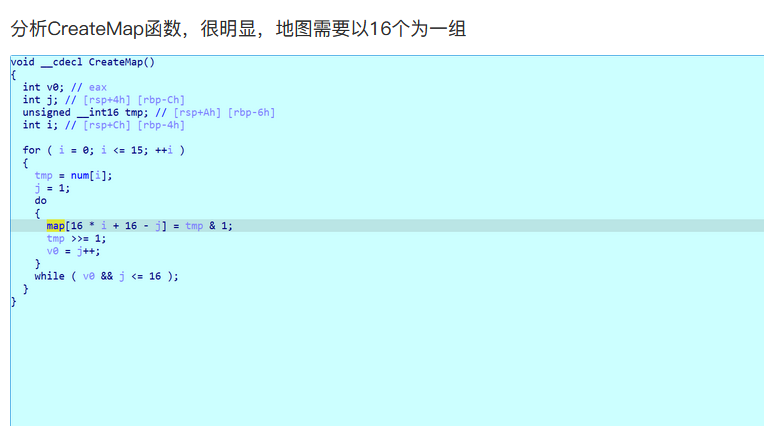
修改为16个一组
1, 1, 1, 1, 1, 1, 1, 1, 1, 1, 1, 1, 1, 1, 1, 1,
1, 0, 0, 0, 0, 0, 1, 1, 1, 1, 1, 1, 0, 1, 1, 1,
1, 0, 1, 1, 1, 0, 1, 1, 1, 1, 1, 1, 0, 1, 1, 1,
1, 0, 1, 1, 1, 0, 1, 1, 0, 0, 0, 1, 0, 1, 1, 1,
1, 0, 1, 1, 1, 0, 1, 1, 0, 1, 0, 1, 0, 1, 1, 1, 
1, 0, 1, 1, 1, 0, 0, 0, 0, 1, 0, 1, 0, 1, 1, 1, 
1, 0, 1, 1, 1, 1, 1, 1, 0, 1, 0, 1, 0, 1, 1, 1,
1, 0, 1, 1, 1, 1, 1, 1, 0, 0, 0, 1, 0, 1, 1, 1, 
1, 0, 1, 1, 1, 1, 1, 1, 1, 0, 1, 1, 0, 1, 1, 1, 
1, 0, 1, 1, 1, 1, 1, 1, 1, 0, 1, 1, 0, 1, 1, 1, 
1, 0, 0, 0, 0, 1, 1, 0, 0, 0, 0, 1, 0, 0, 0, 1, 
1, 1, 1, 1, 0, 1, 1, 1, 1, 0, 1, 1, 0, 1, 0, 1, 
1, 1, 1, 1, 0, 1, 1, 1, 1, 0, 1, 1, 0, 1, 0, 1, 
1, 0, 0, 0, 0, 1, 1, 1, 1, 0, 1, 1, 0, 1, 0, 0, 
1, 0, 1, 1, 1, 1, 1, 1, 1, 0, 0, 0, 0, 1, 1, 1, 
1, 0, 1, 1, 1, 1, 1, 1, 1, 1, 1, 1, 1, 1, 1, 1
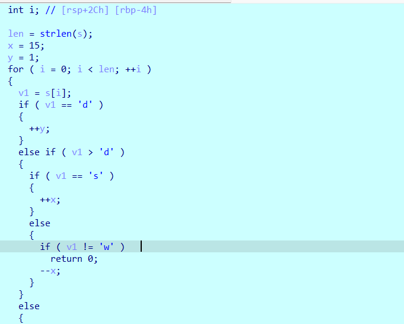
根据check函数找到，路径
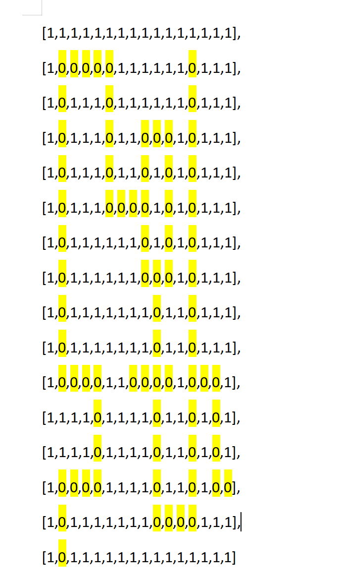
path：wwdddwwwaaawwwwwwwwwddddssssdddssdsssssssdddwwwwddsssd
md5加密
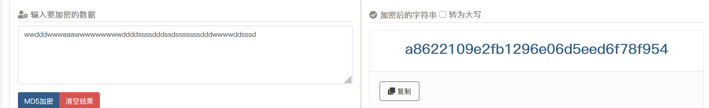
