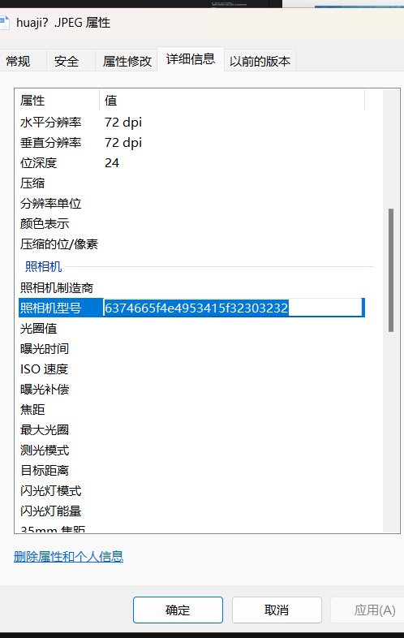
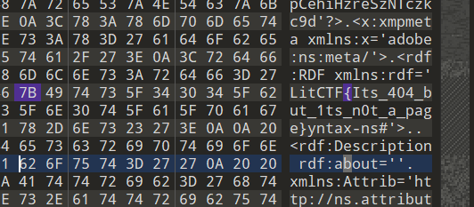

# misc
## [陇剑杯 2021]webshell（问1）
>题目url：https://www.nssctf.cn/problem/278

打开题目下载好压缩包直接放进wireshark
Ctrl+F搜索passwaord

得到username=test
    passward=Admin123!@#
密码就是flag
## [陇剑杯 2021]jwt（问1）
> 题目url：https://www.nssctf.cn/problem/272

注意题目所问：
```
昨天，单位流量系统捕获了黑客攻击流量，请您分析流量后进行回答：
该网站使用了______认证方式。（如有字母请全部使用小写）。得到的flag请使用NSSCTF{}格式提交。
```

下载好插件直接放在wieershak

Token是服务端生成的一串字符串，以客户端进行请求的一个令牌，当第一次登录后，服务器生成一个Token便将此Token返回给客户端，以后客户端只需要带上这个Token青睐请求数据即可，无需再次带上用户名和密码

Ctrl+f搜索token，然后显示分组字节流，是一段bsae64代码

解码之后，说明使用的认证方式为jwt
所以提交的flag为NSSCTF{jwt}


## [陇剑杯 2021]jwt（问2）
>题目url：https://www.nssctf.cn/problem/273


问题：
```
黑客绕过验证使用的jwt中，id和username是______。（中间使用#号隔开，例如1#admin）。得到的flag请使用NSSCTF{}格式提交。
```

在上面的解码里已经知道了
```
{"alg":"HS256","typ":"JWT"}{"id":10086,"MapClaims":{"aud":"admin","username":"admin"}}
```
这样直接提交是错的
使用命令
```
http contains "whoami"
```

在post请求那一栏显示分组字节流

就可以得到flag


## [陇剑杯 2021]jwt（问3）
>题目url：https://www.nssctf.cn/problem/274

问题：
```
单位流量系统捕获了黑客攻击流量，请您分析流量后进行回答：
黑客获取webshell之后，权限是______？
```
同样输入命令 
`
http contains whoami
`
然后追踪tcp流，可以看到alert：root

即权限为root

## [陇剑杯 2021]jwt（问4）
>题目url：https://www.nssctf.cn/problem/275

可以直接找到有一个1.c的文件交上去就是答案

## [SWPU 2019]神奇的二维码
>https://www.nssctf.cn/problem/39

下载好图片之后放进QR检查一下

类似有个flag，但不正确
拖到kail里面用binwalk找到四个压缩包

-e将其分离出来
分离后拖出来

在18394.rar里找到一个音频
所以想办法解压这个压缩包
先看一下encode.txt这个文件

在线解码一下

这个是没用的密码，用来解压新出来的一张图片的
在看一下flag.doc，打开是一段超长的base64代码
在在线解码网站里解码了20次得到

估计这就是密码
`
comEON_YOuAreSOSoS0great
`
把密码输进去解压成功了

然后把音频放入audisity

看别人的wp说这是一段摩斯密码
将音频的粗细用- .代替后就是摩斯密码
`
-- --- .-. ... . .. ... ...- . .-. -.-- ...- . .-. -.-- . .- ... -.--
`

然后去解码

这就是flag，提交的时候改为小写

## [LitCTF 2023]这羽毛球怎么只有一半啊（恼 (初级)
> 题目url：https://www.nssctf.cn/problem/3883

打开题目下载好压缩包
解压之后是一张图片，题意就是修改宽高，直接丢进一把梭软件里
生成了flag830.pang
里面包含flag


## [NISACTF 2022]huaji？
> 题目url:https://www.nssctf.cn/problem/2049

下载好插件放在kali里面可以看到是一张图片
直接binwalk看一下能不能分离出来一些东西

分离出来一个压缩包，拖出来解压一下

解压的时候需要密码
看别人的wp说，在kali的时候（或者在010里）看到图片是JPEG，可以把文件名修改为JPEG然后再属性里看到神秘数字

这是16进制字符

得到的就是密码，输入密码到压缩包里，得到flag


## [LitCTF 2023]404notfound (初级)
>题目url：https://www.nssctf.cn/problem/3881

拖到010里就可以直接找到flag


## [SWPUCTF 2021 新生赛]gif好像有点大
>题目url：https://www.nssctf.cn/problem/401

下载好压缩包解压，果然用来很大内存
丢进010里面没有找到什么
用stegslove逐帧分析一下gif图片

找到一张有二维码的图片，把这张图片丢经QR

直接得到falg

## [NISACTF 2022]为什么我什么都看不见
>url:https://www.nssctf.cn/problem/1991

这里要先补充一下常见的文件头或者文件尾

把下载好的插件放进010里面看一下

看到文件头只有4E 47，基本就是png图片修改了文件头

修改好文件头然后把文件后缀改为png，就可以看到图片

把图片放进010里面没有发现有压缩包
修改图片宽高也没有用
那就放进stegslove看一下
逐帧分析也没有用，然后分析lsb
介绍一下LSB隐写
```
LSB隐写的图片，我们用StegSolve打开模块，由于是RGB三原色的最低位隐写
所以在stegslove里面将三原色全选为0
```


找到falg
