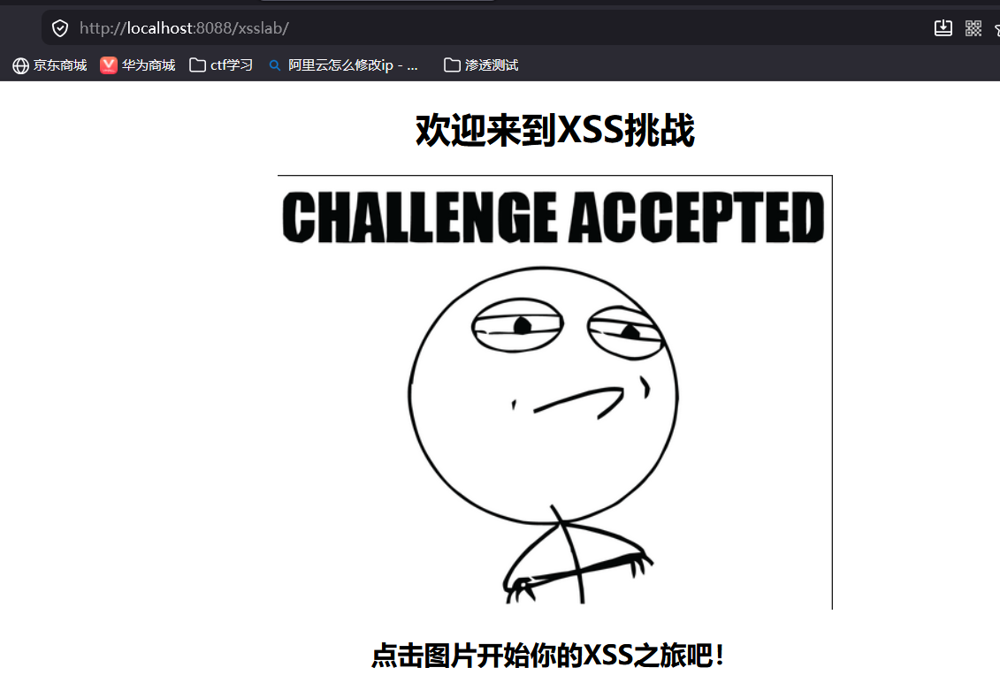
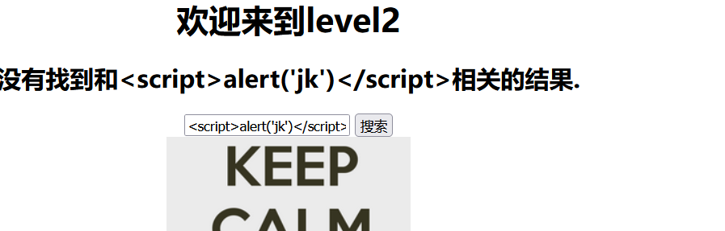
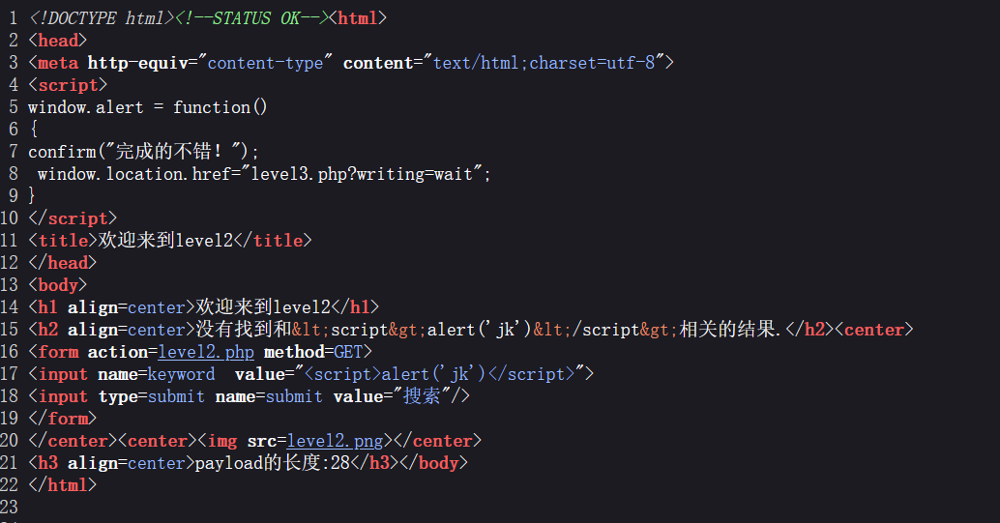
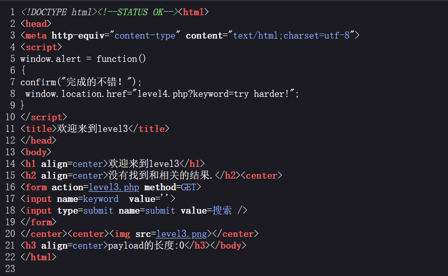
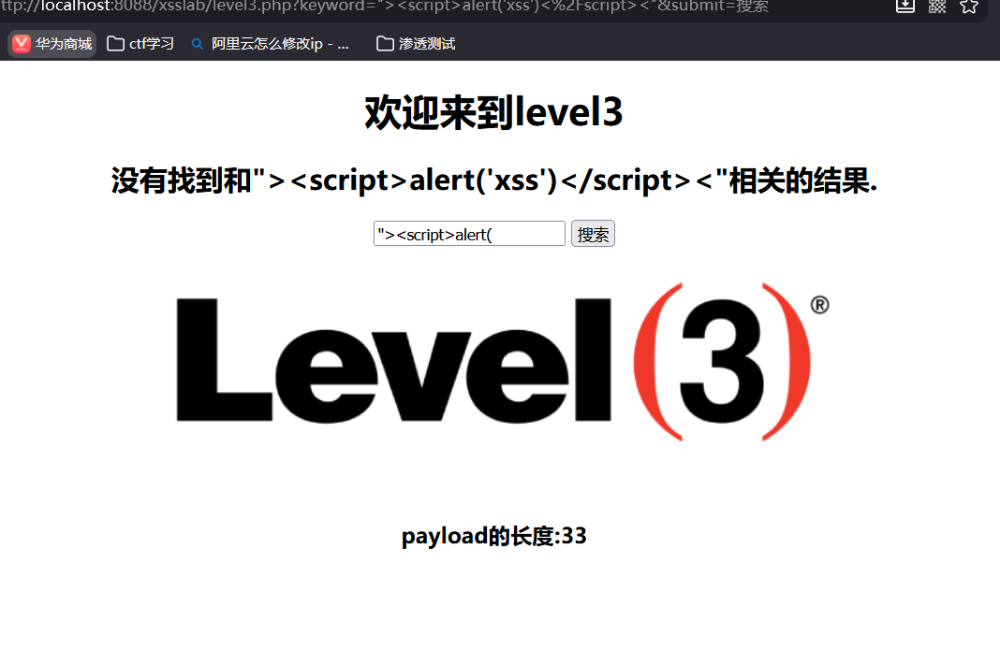

# XSS_lab通关
## 部署
直接将下载的xsslab文件上传到服务器上，即可访问。

### 第一关

直在浏览器中输入``，即可触发xss攻击,参数是name。

### 第二关

这里直接输入js代码没用

看一下源码

看源码这里，需要先将引号给闭合掉再输入js代码，这种情况下js代码被当作value属性的值，而不是可执行的代码
`"><"`这样闭合就可以触发xss攻击

### 第三关

看源代码，这里需要单引号闭合

