## [NSSRound#3 Team]jump_by_jump
>题目url：https://www.nssctf.cn/problem/2313

下载好插件之后查壳
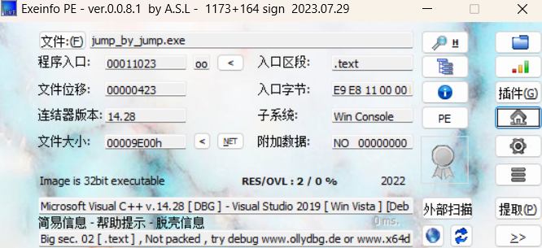
无壳，且是32伟，丢进idea
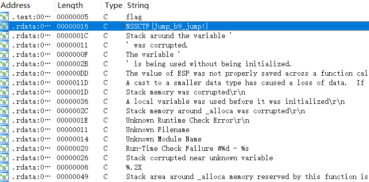
shift+F12，找到一个flag
直接就提交成功了，不知道和花指令有什么关系
下面用花指令的方法解一下
找到标红的一段代码
，注意有jz和jnz，这就是有关花指令
找到loc_41188c函数，按u，变成一个函数
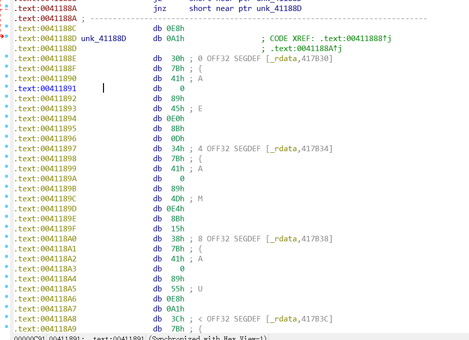
把这个新生成的函数全选出来再按c，选择分析
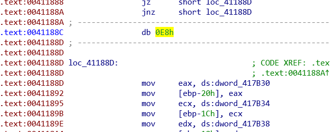
再调用插件将0e8h给nop掉
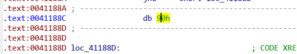
变成1这样就是已经nop了，在按c变回汇编语言
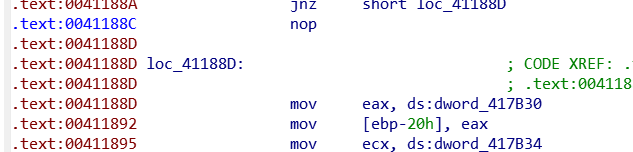
再fn+f5查看伪代码
这样就可以找到flag

## [LitCTF 2023]ez_XOR
> url:https://www.nssctf.cn/problem/3860

先查壳
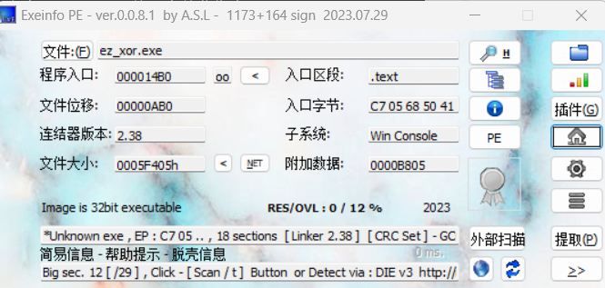
无壳，32位，丢进idea
发现两串可疑字符串
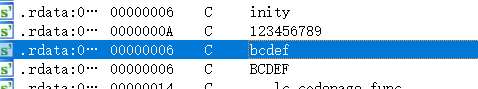
跟进去
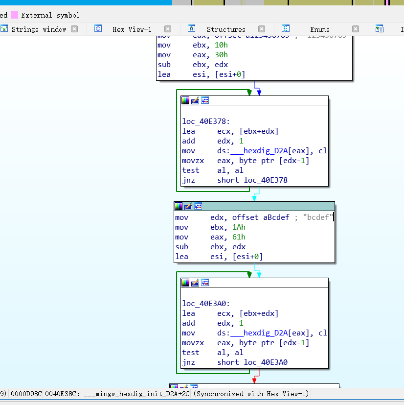
查看伪代码
没看出什么东西，直接看main函数吧
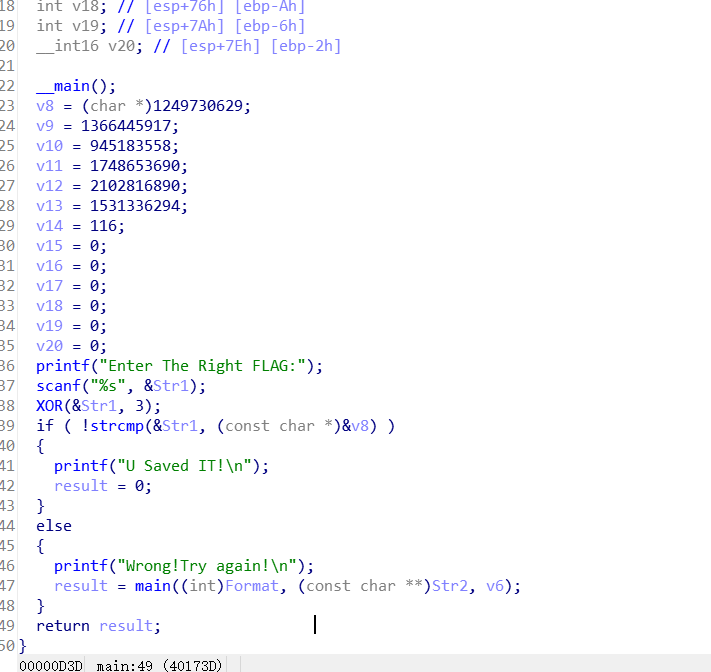
main函数里面
`
XOR(&Str1, 3);
`
这一句就是异或运算，将flag的asci码与3进行异或运算
```c
#include <stdio.h>
#include <string.h>


int main()
{
    int a2 = 3;
    char str2[] = "E`}J]OrQF[V8zV:hzpV}fVF[t";
    int l, i, result;
    l = strlen(str2);
    for (i = 0; ; ++i)
    {
        result = l;
        if (i >= result)
            break;
        str2[i] ^= 3 * a2;
    }
    puts(str2);

    return 0;
}

```
逆行攻击代码
```c
#include <stdio.h>
#include <string.h>
#include <stdlib.h>

int main() {
    // 已知的Str2内容
    char Str2[] = "E`}J]OrQF[V8zV:hzpV}fVF[t";
    int len = strlen(Str2);

    // 动态分配内存
    char* flag = (char*)malloc(len + 1);
    if (flag == NULL) {
        printf("内存分配失败\n");
        return 1;
    }

    // 使用正确的密钥9进行异或运算
    for (int i = 0; i < len; i++) {
        flag[i] = Str2[i] ^ 9;  // 这里将3改为9
    }
    flag[len] = '\0';

    printf("正确的FLAG是: %s\n", flag);

    free(flag);
    return 0;
}
```
得到falg

## [SWPUCTF 2022 新生赛]babyre
>题目url：https://www.nssctf.cn/problem/2650

下再好插件，解压查壳
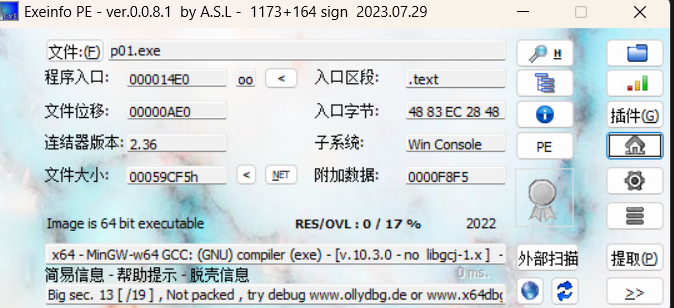
无壳，64位拖进ida
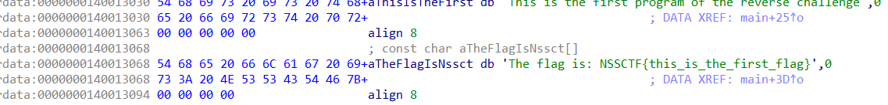
直接找到flag

## [UTCTF 2020]Basics(RE)
> url:https://www.nssctf.cn/problem/214


64位，拖进ida
f12直接就可以看到flag
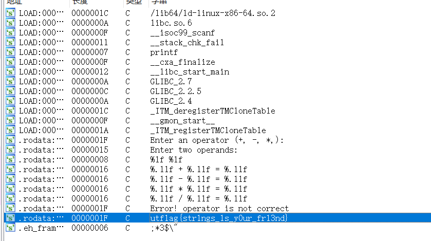

## [SWPUCTF 2022 新生赛]upx
>题目url：[SWPUCTF 2022 新生赛]upx

查壳
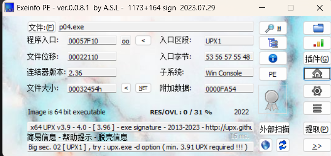
upx壳，64位
拖进linux脱壳
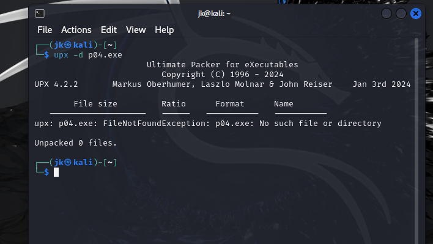
然后拖出来放进ida
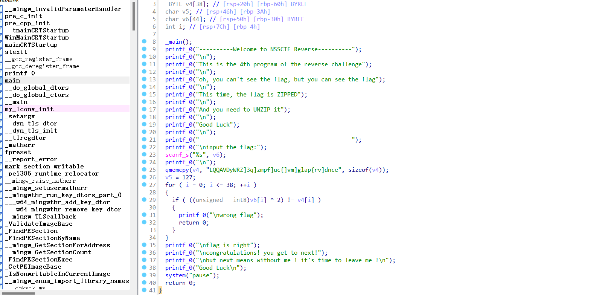
找到主函数
```
将LQQAVDyWRZ]3q]zmpf]uc{]vm]glap{rv]dnce与2经行异或操作
```
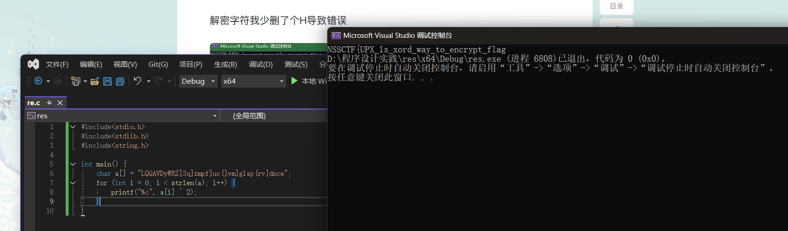
得到flag
