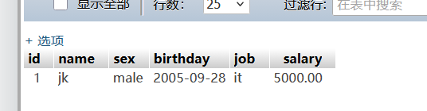
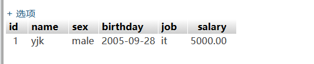
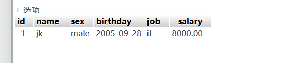
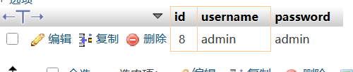
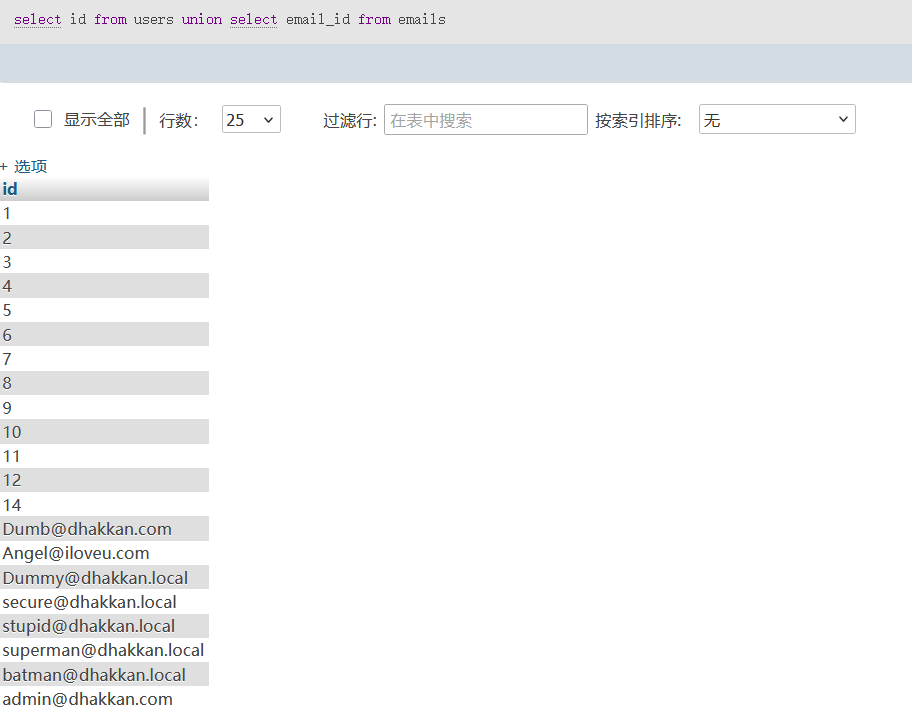
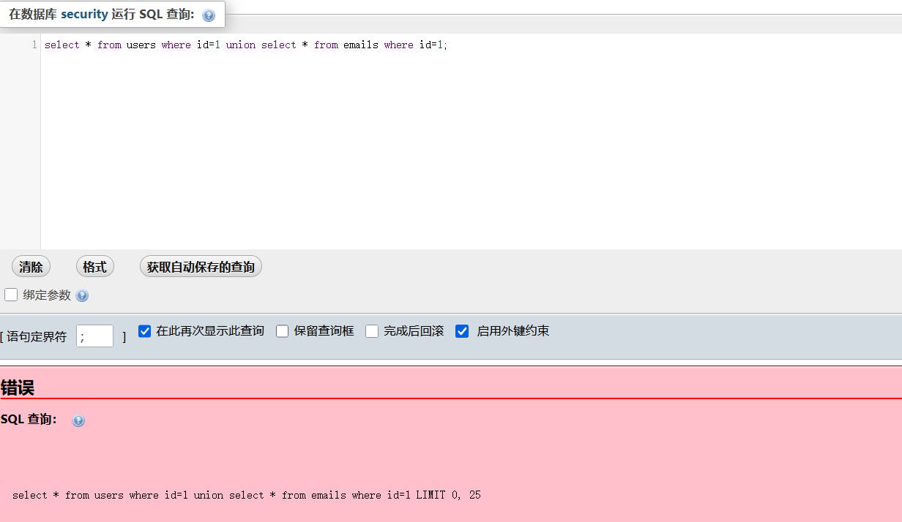
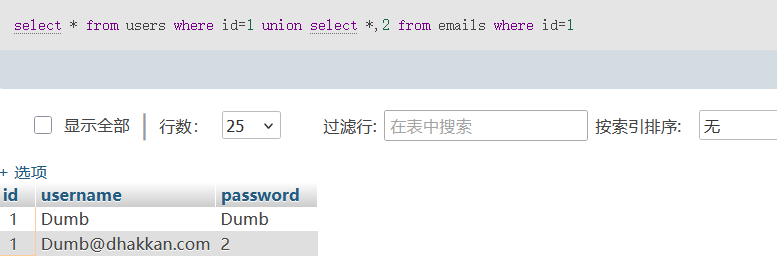

# sql注入
##  msql语句 

1：将user中的id，name等写入内容
```sql
insert into user(id,name,sex,birthday,job)
values(1,'jk','male',2005-09-28','it');
```
2：新增加一列内容，比如在user表中加一列salary最大8位小数点后面5位
```sql
alter table user add salary decimal(8,2);
```

3：修改内容，比如刚加入的列项salary没有内容


4：修改id=1行的name改为yjk
```sql
update user set name='yjk' where id=1;
```


4.修改回id=1的name为jk，同时修改salary为9000
```sql
update user set name='jk',salary=8000 where id=1;
```


5：删除列,例如删除slary这一列
```sql
alter  table user drop salary;
```

6：删除行
```sql
delete from user where job='it';
```

## 基本语句查询

1:select +列名（*代表所有）from 表名 where 条件

```sql
select *from users where id=3;
```

2:从users表格中查询所有包含id为3的，效果和上一条查询语句一样
```sql
select * from users where id in ('3');
```

3.如果有括号括号里面的内容先查询，比如我通过id查admin的信息，但是记不起来admin的id可以通过名字找到这一行，虽然看起来多此一举，但有的之后特别有用
```sql
select * from users where id=(select id from users where username='admin');
```


4：联合查询
查询合并数据显示，例如先查询users中的id信息然后再查询email_id的信息
```sql
select id from users union select email_id from emails;
```

注意联合查询是两边列数要相同
```sql
select * from users where id=1 union select * from emails where id=1;
```

因为users的所有列项有3列，但是emalis只有两列
为了解决这个问题可以**在列数少的那添加列**
```sql
select * from users where id=1 union select *,2 from emails where id=1;
```
此处在*后面加了,2表示加了一列且值为2，这样两遍都是3
列就可以查询了


5:group by分组还可以用来判断列数


### 什么是注入
说为sql注入就是把sql命令插入到web表单提交或输入域名或页面请求的查询字符串，最终达到欺骗服务器执行恶意sql命令以获得重要信息

### 注入分类：
1. 按照查询字符型与数字型
2. 按照注入方式分类：union注入，报错注入，布尔注入，时间注入等

### 什么是注入点

实行注入的地方，例如通过post,get,cookie等地方

### 闭合
手动提交闭合符号例如“ ' " '# ”等，结束前一段查询语句即可加入其他语句，查询需要的参数不需要的语句可以用注释符号“--+ 或%23”注释掉

### 步骤
1. 先判断闭合方式' " '#等
2. 判断列数
    原因：unioun注入需要知道每个表的列数，不然会出现错误，所以要用group by或order by 来判断列数
例如：
>id=1'group by 4 --+
group的原理是分组，超过了组数就报错
>id=1'order by 3--+
order的原理是从第i列排序，超过i列就会报错
3. 查看回显位
>id=-1'union select 1,2,3,--+

注意这里现在是-1' 而不是1'了，因为页面又是只会回显第一行数据，为了显示其他数据要将1改为负数或0.

这种情况2，3就是回显位
所以3可以在3这里加一个database（）

这样就回显内容了，改1是不会回显的

sql注入