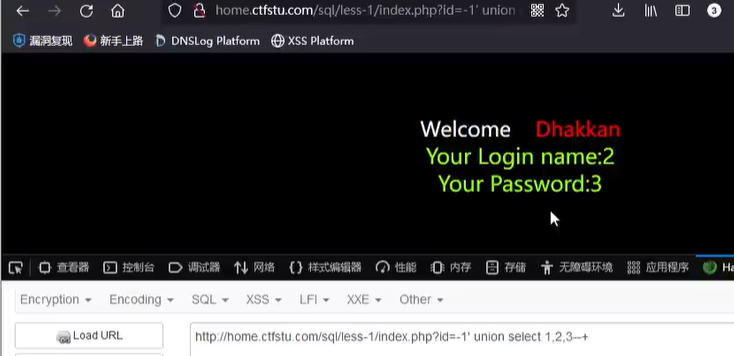
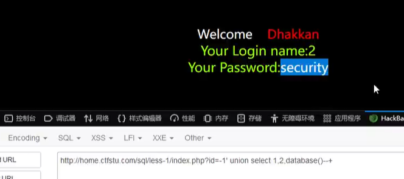

# sql注入

## 什么是注入
说为sql注入就是把sql命令插入到web表单提交或输入域名或页面请求的查询字符串，最终达到欺骗服务器执行恶意sql命令以获得重要信息

### 注入分类：
1. 按照查询字符型与数字型
2. 按照注入方式分类：union注入，报错注入，布尔注入，时间注入等

### 什么是注入点

实行注入的地方，例如通过post,get,cookie等地方

### 闭合
手动提交闭合符号例如“ ' " '# ”等，结束前一段查询语句即可加入其他语句，查询需要的参数不需要的语句可以用注释符号“--+ 或%23”注释掉

### 步骤
1. 先判断闭合方式' " '#等
2. 判断列数
    原因：unioun注入需要知道每个表的列数，不然会出现错误，所以要用group by或order by 来判断列数
例如：
>id=1'group by 4 --+
group的原理是分组，超过了组数就报错
>id=1'order by 3--+
order的原理是从第i列排序，超过i列就会报错
3. 查看回显位
>id=-1'union select 1,2,3,--+

注意这里现在是-1' 而不是1'了，因为页面又是只会回显第一行数据，为了显示其他数据要将1改为负数或0.

这种情况2，3就是回显位
所以3可以在3这里加一个database（）

这样就回显内容了，改1是不会回显的

sql注入