# XSS_lab通关
## 部署
直接将下载的xsslab文件上传到服务器上，即可访问。

### 第一关
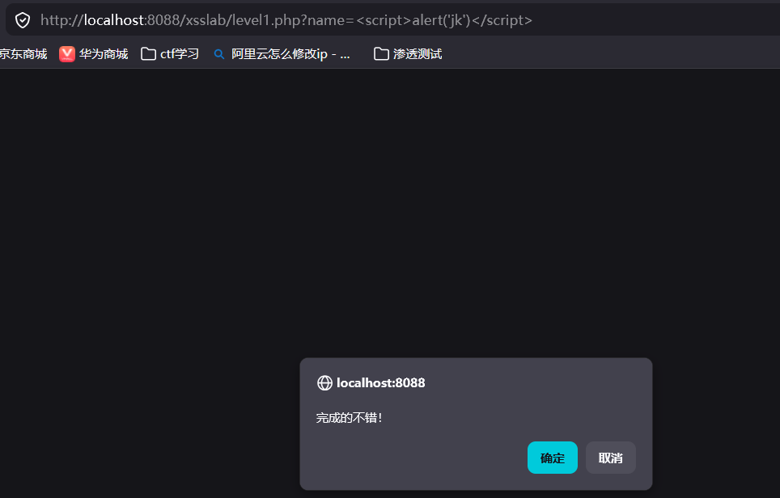
直在浏览器中输入``，即可触发xss攻击,参数是name。

### 第二关
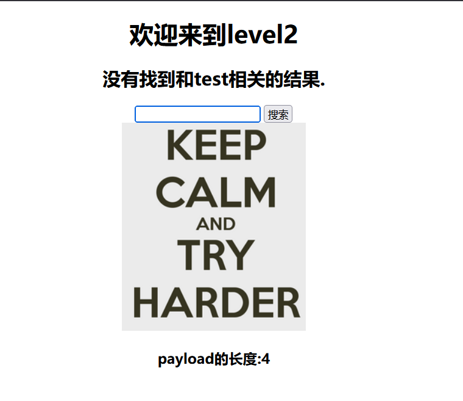
这里直接输入js代码没用

看一下源码

看源码这里，需要先将引号给闭合掉再输入js代码，这种情况下js代码被当作value属性的值，而不是可执行的代码
`"><"`这样闭合就可以触发xss攻击
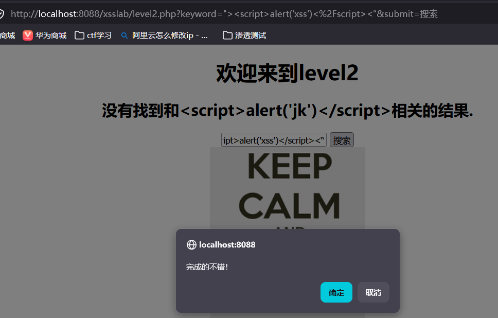

### 第三关

看源代码，这里需要单引号闭合
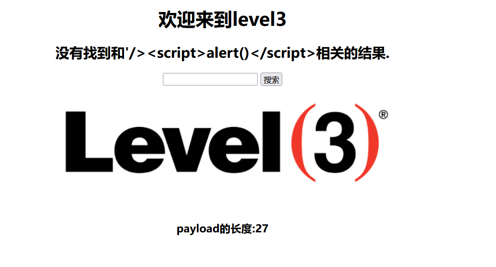
直接单引号没用
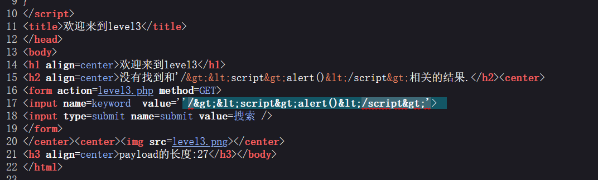
看源码这里< >被html实体化了，所以换一种方式
onfocus 是 HTML 原生事件属性，当标签获得焦点（被点击 / 选中）时，执行后面的代码
`' onfocus=javascript:alert(/xss/) '`
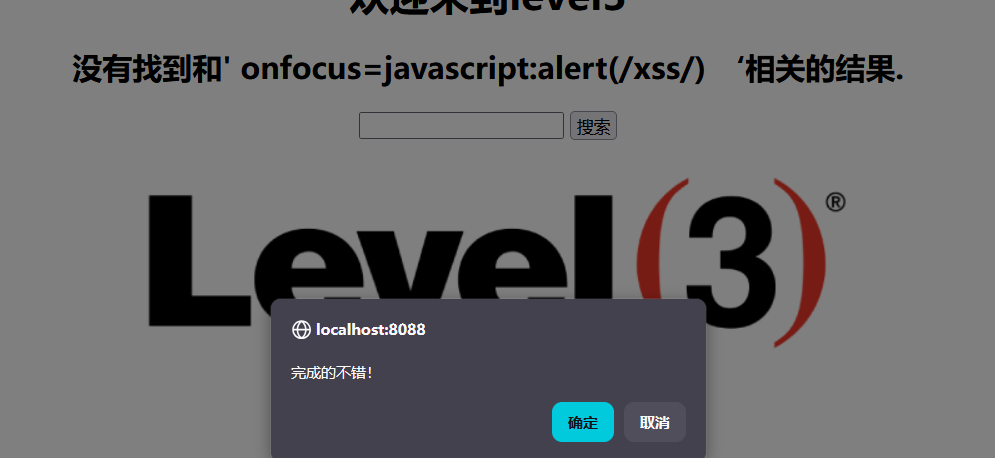

### 第四关
看源码这里还是先试一下闭合双引号
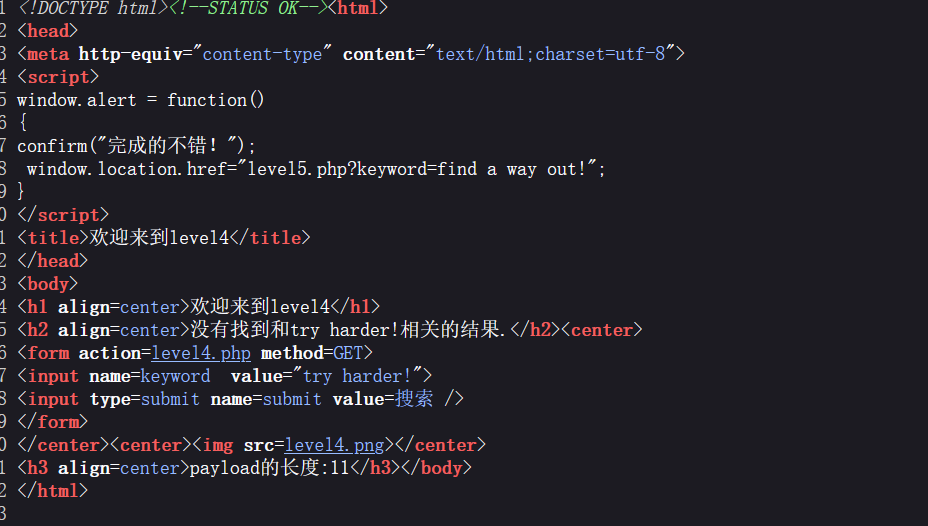
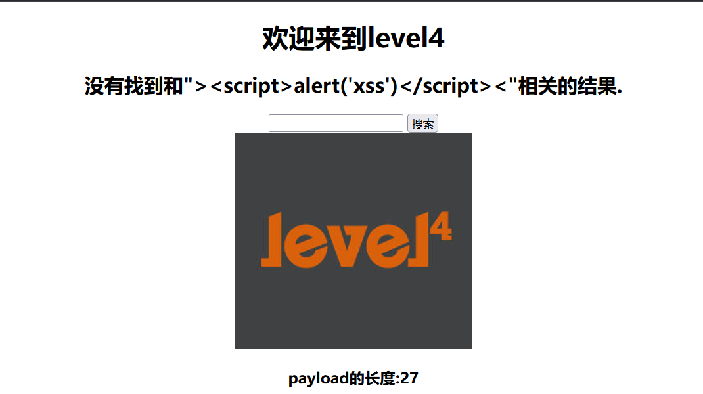
看源码这里还是>被过滤了，还是和上一题一样用onfocus事件属性，只不过改成双引号
`" onfocus=javascript:alert(/xss/) "`
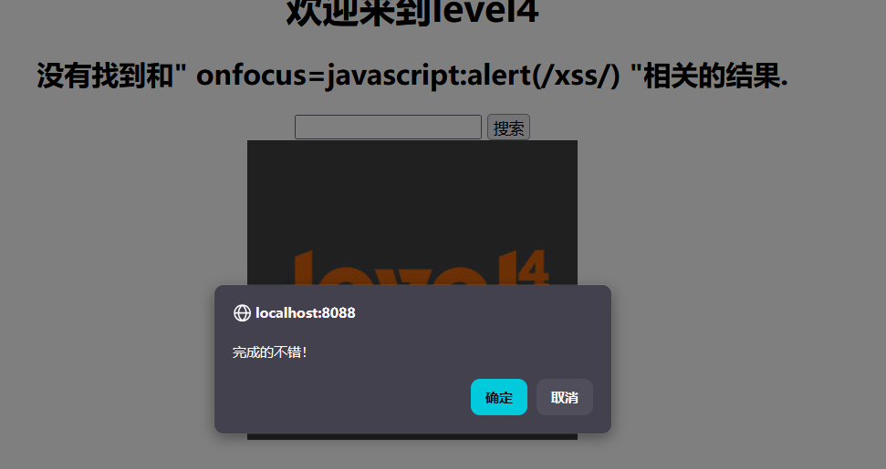

### 第五关
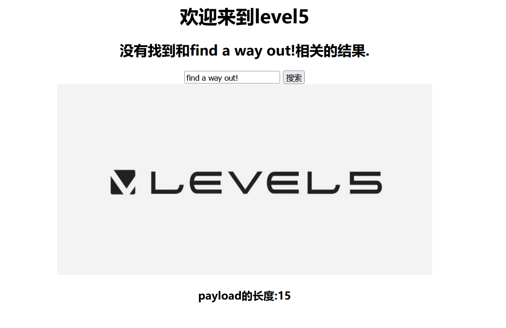
还是直接看源码，先将双引号给闭合掉再输入js代码
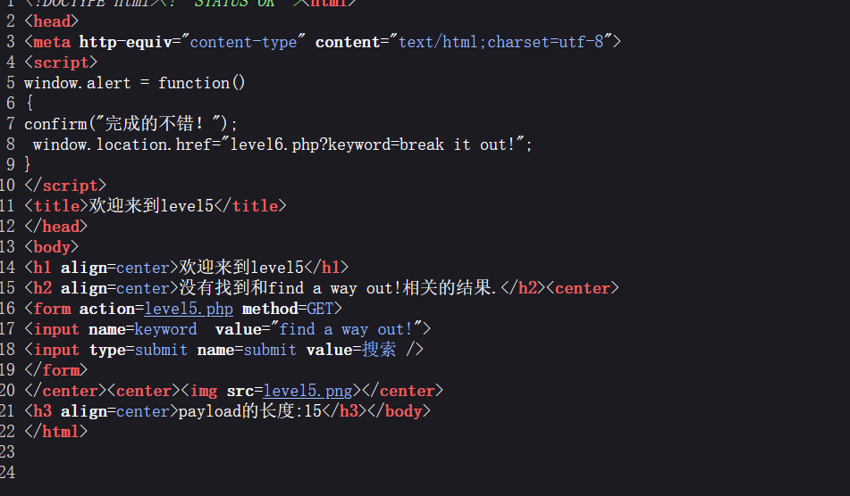
结果果然是没用的
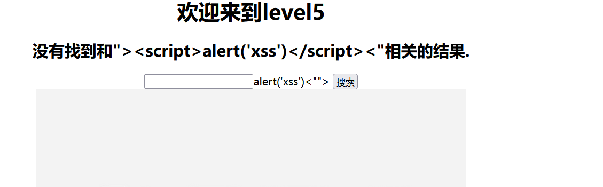
这里估计是把script用空代替了，试一下双写绕过
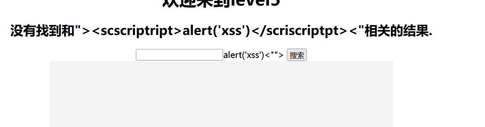
还是没用，换一种标签
`"><a href=javascript:alert(/xss/)>a-alert</a><"`
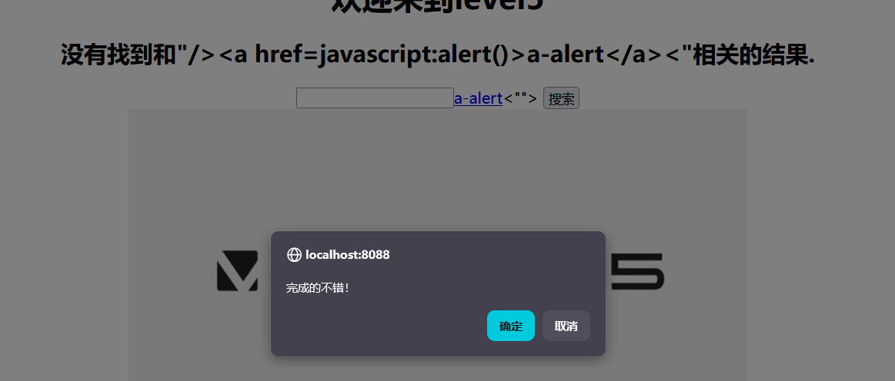

### 第六关
看源码这里是要先把双引号给闭合掉，再输入js代码
直接输入js代码没用，先试一下双写绕过可不可以
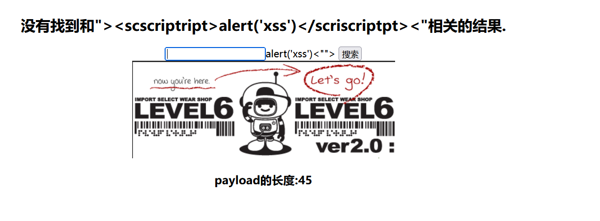
没用，再试一下大小写绕过
`"/>`
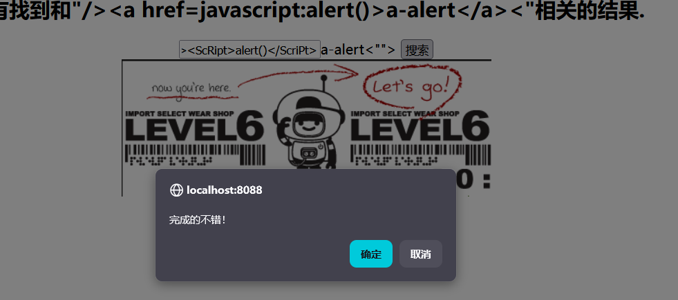s